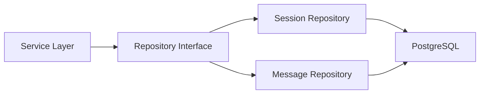
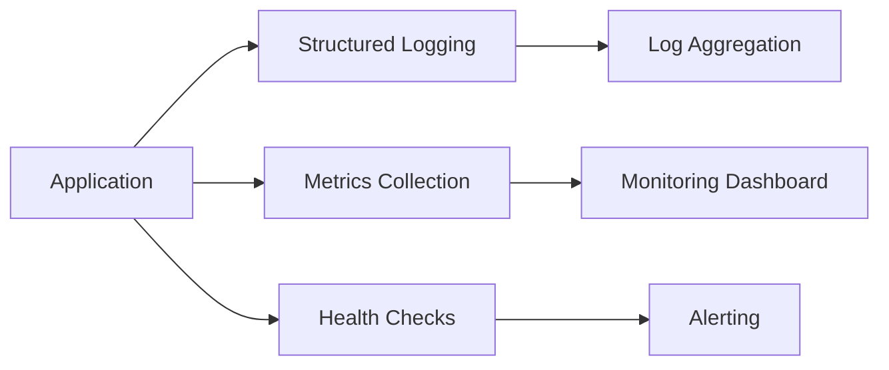
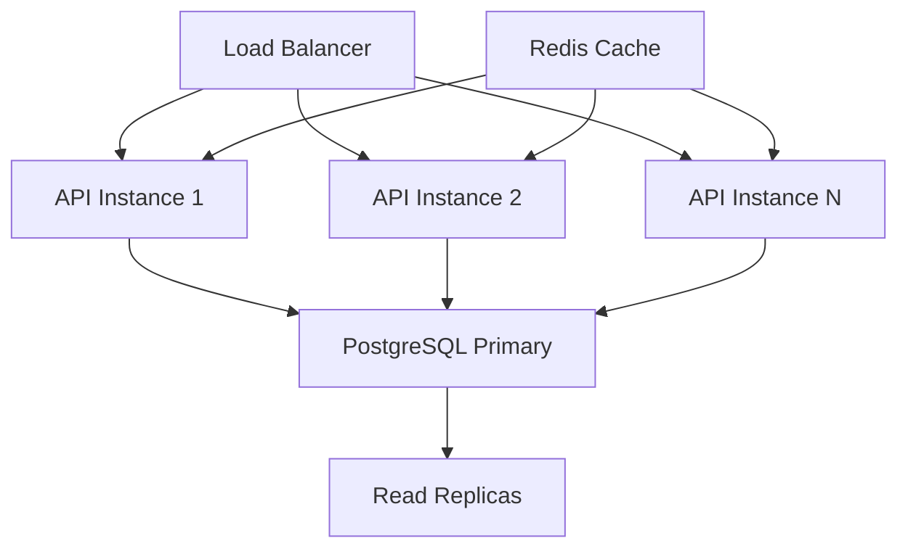

# Avaliação da Arquitetura - Projeto Zemeow

## Visão Geral

O Zemeow é um sistema de integração com WhatsApp desenvolvido em Go, oferecendo uma API REST robusta para gerenciamento de sessões, mensagens e webhooks. O projeto demonstra uma arquitetura bem estruturada e modular, seguindo boas práticas de desenvolvimento backend.

## Pontos Fortes da Arquitetura

### 1. Organização Modular Clara

```
graph TD
    A[Zemeow] --> B[internal]
    A --> C[wuzapi]
    B --> D[api]
    B --> E[config]
    B --> F[db]
    B --> G[logger]
    B --> H[service]
    
    D --> I[handlers]
    D --> J[middleware]
    D --> K[routes]
    D --> L[dto]
    D --> M[validators]
    
    F --> N[models]
    F --> O[repositories]
    F --> P[migrations]
    
    H --> Q[session]
    H --> R[message]
    H --> S[webhook]
    H --> T[media]
    H --> U[meow]
```

**Avaliação**: ✅ **Excelente**
- Separação clara de responsabilidades entre camadas
- Arquitetura em camadas bem definida (API, Service, Repository)
- Organização que facilita manutenção e testes

### 2. Stack Tecnológica Moderna

**Linguagem e Framework**:
- Go 1.24.0 com toolchain 1.24.4
- Fiber v2 como framework web (alta performance)
- whatsmeow para integração WhatsApp

**Persistência e Cache**:
- PostgreSQL como banco principal
- SQLite como alternativa
- MinIO para armazenamento de mídia

**Avaliação**: ✅ **Muito Bom**
- Escolha adequada de tecnologias para alta performance
- Stack bem estabelecida e confiável
- Suporte a diferentes ambientes (dev/prod)

### 3. Padrões Arquiteturais Implementados

#### Repository Pattern


#### Dependency Injection
- Injeção de dependências bem implementada
- Interfaces claramente definidas
- Facilita testes unitários

**Avaliação**: ✅ **Excelente**

### 4. Configuração Centralizada

```go
type Config struct {
    Database DatabaseConfig
    Server   ServerConfig
    Auth     AuthConfig
    WhatsApp WhatsAppConfig
    Logging  LoggingConfig
    Webhook  WebhookConfig
    MinIO    MinIOConfig
}
```

**Avaliação**: ✅ **Muito Bom**
- Configuração centralizada e tipada
- Suporte a variáveis de ambiente
- Validação de configurações

### 5. Modelos de Dados Robustos

#### Session Model
- Estado da sessão bem modelado
- Suporte a proxy e webhooks
- Metadados flexíveis com JSONB

#### Message Model
- Cobertura completa de tipos de mensagem WhatsApp
- Suporte a mídia e localização
- Relacionamentos bem definidos

**Avaliação**: ✅ **Excelente**

## Áreas de Melhoria

### 1. Reorganização da Estrutura de Pastas (Versão Simplificada)

**Situação Atual**: Estrutura já bem organizada no `internal/`, apenas necessita pequenos ajustes

#### Estrutura Atual (Boa base)
```
zemeow/
├── internal/
│   ├── api/
│   │   ├── handlers/
│   │   ├── middleware/
│   │   ├── routes/
│   │   ├── dto/
│   │   └── validators/
│   ├── service/
│   │   ├── session/
│   │   ├── message/
│   │   ├── webhook/
│   │   ├── media/
│   │   └── meow/
│   ├── db/
│   │   ├── models/
│   │   ├── repositories/
│   │   └── migrations/
│   ├── config/
│   └── logger/
```

#### Arquitetura Proposta (Organizada)
```
zemeow/
├── cmd/
│   └── main.go                   # Ponto de entrada único
├── internal/
│   ├── handlers/                 # HTTP handlers por domínio
│   │   ├── session.go
│   │   ├── message.go
│   │   ├── webhook.go
│   │   ├── media.go
│   │   └── group.go
│   ├── services/                 # Lógica de negócio
│   │   ├── session/
│   │   │   ├── service.go
│   │   │   ├── manager.go
│   │   │   └── types.go
│   │   ├── message/
│   │   │   └── service.go
│   │   ├── webhook/
│   │   │   └── service.go
│   │   ├── media/
│   │   │   └── service.go
│   │   └── whatsapp/             # Cliente WhatsApp (meow)
│   │       ├── client.go
│   │       └── manager.go
│   ├── models/                   # Entidades de dados
│   │   ├── session.go
│   │   ├── message.go
│   │   └── common.go
│   ├── repositories/             # Acesso a dados
│   │   ├── session.go
│   │   ├── message.go
│   │   └── interfaces.go
│   ├── middleware/               # Middlewares HTTP
│   │   ├── auth.go
│   │   ├── logging.go
│   │   └── validation.go
│   ├── dto/                      # Data Transfer Objects
│   │   ├── session.go
│   │   ├── message.go
│   │   ├── webhook.go
│   │   └── common.go
│   ├── config/                   # Configurações
│   │   └── config.go
│   ├── database/                 # Database e migrations
│   │   ├── connection.go
│   │   ├── migrations/
│   │   └── migrate.go
│   └── logger/                   # Logging
│       └── logger.go
```

#### Benefícios da Organização
- ✅ **Estrutura simples e clara** - Fácil de navegar
- ✅ **Handlers organizados** - Um arquivo por domínio (session, message, etc)
- ✅ **Services bem agrupados** - Mantém estrutura interna existente
- ✅ **Separação de responsabilidades** - Cada pasta tem propósito claro
- ✅ **Ponto de entrada único** - cmd/main.go orquestra tudo

#### Movimentações Práticas
```bash
# 1. Criar estrutura
mkdir -p cmd
mv wuzapi/main.go cmd/main.go  # Se existir

# 2. Reorganizar handlers
mv internal/api/handlers/* internal/handlers/

# 3. Renomear services
mv internal/service internal/services

# 4. Mover modelos
mv internal/db/models/* internal/models/

# 5. Mover repositórios
mv internal/db/repositories/* internal/repositories/

# 6. Consolidar outros
mv internal/api/middleware/* internal/middleware/
mv internal/api/dto/* internal/dto/

# 7. Renomear database
mv internal/db internal/database
```

**Prioridade**: 🟡 **Média** - Melhoria incremental

### 2. Melhorar Nomes de Arquivos

**Problema**: Alguns nomes muito genéricos (`helpers.go`, `utils.go`)

**Solução**: Nomes mais específicos

```
# Antes
helpers.go
utils.go

# Depois
phone_validator.go
auth_utils.go
response_helpers.go
```

**Prioridade**: 🟡 **Média**

### 3. Observabilidade

**Limitações Identificadas**:
- Logging presente mas poderia ser mais estruturado
- Falta de métricas de performance
- Ausência de tracing distribuído

**Recomendações**:


**Prioridade**: 🟡 **Média**

### 4. Tratamento de Erros

**Atual**: Tratamento básico de erros
**Melhorias Sugeridas**:
- Códigos de erro padronizados
- Wrap de erros com contexto
- Error boundary para recuperação

**Prioridade**: 🟡 **Média**

### 5. Cache Strategy

**Limitação**: Ausência de cache para operações frequentes
**Sugestões**:
- Cache de sessões ativas
- Cache de metadados de grupos
- Cache de configurações webhook

**Prioridade**: 🟡 **Média**

## Segurança

### Pontos Positivos
- Autenticação via API Key
- Middleware de autenticação implementado
- Configuração de CORS

### Melhorias Recomendadas
- Rate limiting nos endpoints
- Rotação automática de API keys
- Audit log para operações críticas
- Criptografia de dados sensíveis

**Prioridade**: 🔴 **Alta**

## Performance e Escalabilidade

### Pontos Fortes
- Framework Fiber (alta performance)
- Connection pooling configurado
- Timeouts configurados adequadamente

### Oportunidades


**Recomendações**:
- Implementar cache distribuído (Redis)
- Preparar para scaling horizontal
- Otimizar queries do banco
- Background jobs para processamento pesado

**Prioridade**: 🟢 **Baixa** (para volume atual)

## Containerização e Deploy

### Pontos Positivos
- Dockerfile configurado
- docker-compose para desenvolvimento
- Configuração de ambiente flexível

### Melhorias
- Multi-stage build para otimizar imagem
- Health checks no container
- CI/CD pipeline automatizado

**Prioridade**: 🟡 **Média**

## Resumo da Avaliação

| Aspecto | Nota | Comentário |
|---------|------|------------|
| **Arquitetura Geral** | 9/10 | Muito bem estruturada e modular |
| **Código Quality** | 8/10 | Código limpo, bem organizado |
| **Configuração** | 9/10 | Configuração centralizada e flexível |
| **Modelos de Dados** | 9/10 | Modelos robustos e bem relacionados |
| **Segurança** | 6/10 | Básica implementada, precisa melhorar |
| **Observabilidade** | 5/10 | Logging básico, falta métricas |
| **Performance** | 8/10 | Boa base, otimizações possíveis |

## Recomendações Prioritárias

### 🔴 Prioridade Alta
1. **Melhorar segurança**
   - Rate limiting
   - Audit logging
   - Rotação de API keys

### 🟡 Prioridade Média
2. **Reorganizar estrutura de pastas**
   - Estrutura mais plana e fácil de navegar
   - Nomes mais diretos e claros

3. **Expandir observabilidade**
   - Métricas de aplicação
   - Health checks robustos

4. **Otimizar performance**
   - Cache de sessões ativas
   - Otimizar queries críticas

### 🟢 Prioridade Baixa
5. **Otimizar cache**
   - Cache de configurações webhook
   - Background job processing

## Conclusão

O projeto Zemeow apresenta uma **arquitetura sólida e bem estruturada**, seguindo boas práticas de desenvolvimento em Go. A organização modular, choice de tecnologias e implementação de padrões arquiteturais demonstram maturidade técnica.

**Pontos destacados:**
- Arquitetura limpa e escalável
- Separação clara de responsabilidades
- Código bem organizado e legível
- Base sólida para crescimento

**Principais oportunidades:**
- Expandir cobertura de testes
- Melhorar aspectos de segurança
- Implementar observabilidade completa
- Otimizar para alta escala

A arquitetura está **bem preparada para produção** com as melhorias de segurança e testes implementadas.