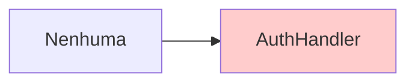
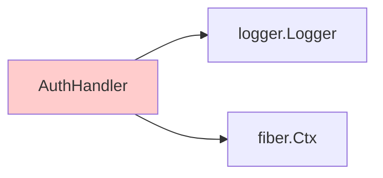
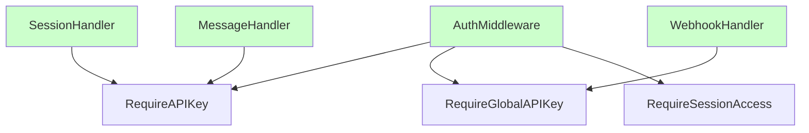
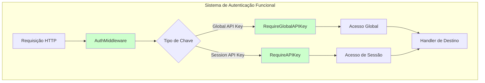
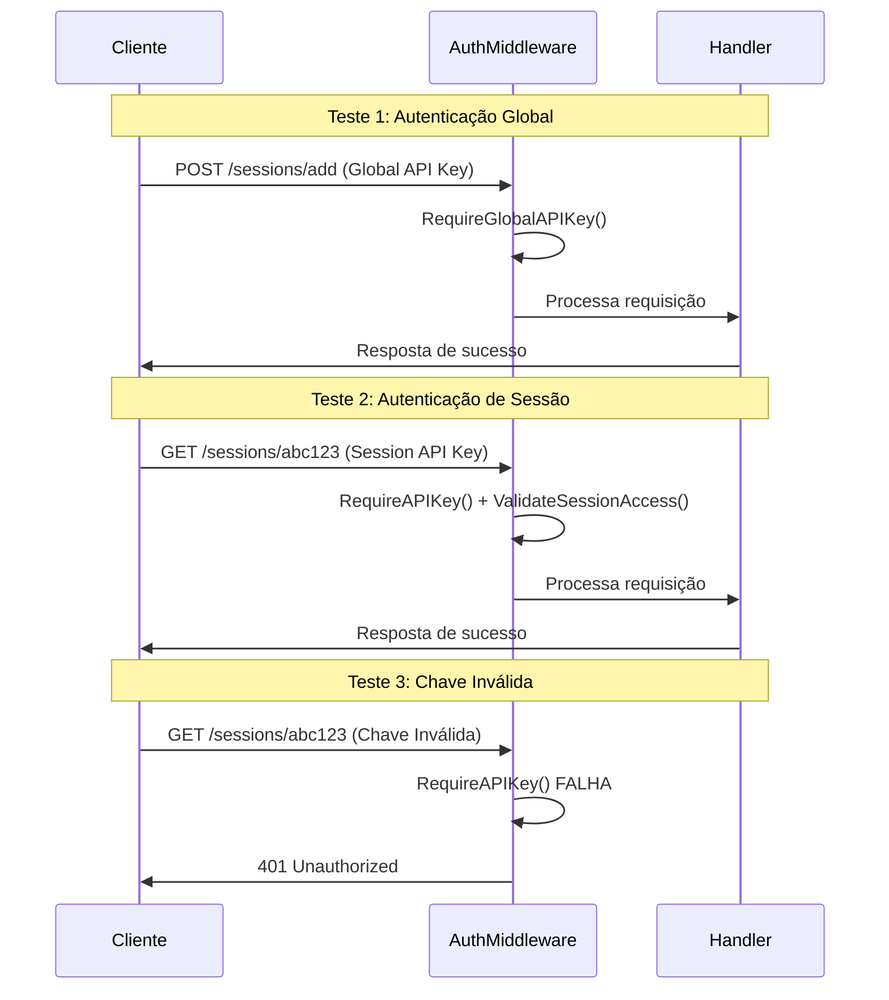
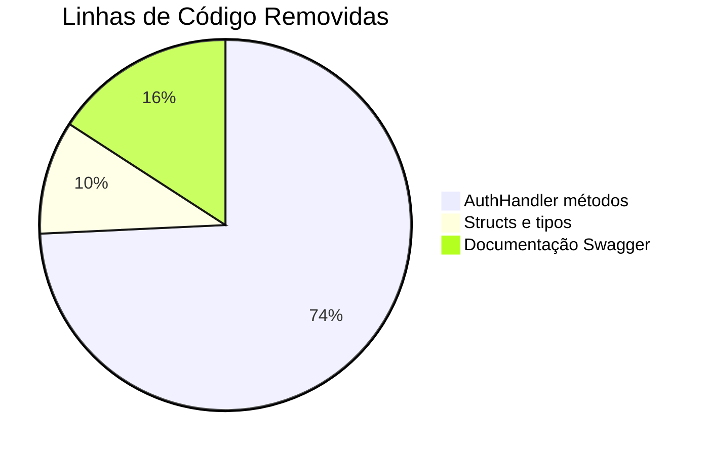
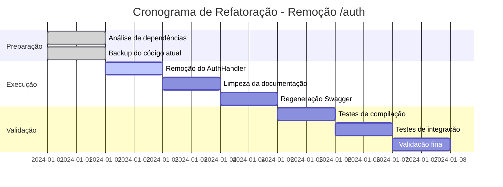

# Design: Refatoração das Rotas /auth - Remoção Completa

## 1. Visão Geral

### Contexto
O projeto ZeMeow possui um AuthHandler implementado com métodos para validação, geração e revogação de API keys, além de funcionalidades de cache. Entretanto, essas rotas `/auth` não estão sendo utilizadas e foram identificadas como desnecessárias para o funcionamento do sistema.

### Objetivo da Refatoração
Remover completamente todas as implementações relacionadas às rotas `/auth`, incluindo:
- Handler de autenticação (`AuthHandler`)
- Documentação Swagger das rotas `/auth`
- Qualquer referência ao sistema de rotas de autenticação
- Limpeza dos arquivos de documentação gerados

### Valor Técnico
- Reduzir complexidade desnecessária do código
- Eliminar código morto que não está sendo utilizado
- Simplificar a base de código e manutenção
- Remover documentação de endpoints não implementados

## 2. Arquitetura de Componentes Afetados

### Diagrama de Componentes para Remoção

```mermaid
graph TB
    subgraph "Componentes a Remover"
        A[AuthHandler] --> B[ValidateAPIKey]
        A --> C[GenerateAPIKey]
        A --> D[RevokeAPIKey]
        A --> E[GetCacheStats]
        A --> F[ClearCache]
        
        G[Swagger Docs] --> H[/auth/validate]
        G --> I[/auth/generate]
        G --> J[/auth/revoke]
        G --> K[/auth/cache/stats]
        G --> L[/auth/cache/clear]
    end
    
    subgraph "Componentes Preservados"
        M[AuthMiddleware] --> N[RequireAPIKey]
        M --> O[RequireGlobalAPIKey]
        M --> P[RequireSessionAccess]
        Q[SessionHandler]
        R[MessageHandler]
        S[WebhookHandler]
    end
    
    style A fill:#ffcccc
    style G fill:#ffcccc
    style M fill:#ccffcc
```

### Componentes Impactados

| Componente | Ação | Justificativa |
|------------|------|---------------|
| `AuthHandler` | **REMOVER COMPLETAMENTE** | Não utilizado, rotas não configuradas |
| `GenerateAPIKeyRequest` | **REMOVER** | DTO específico do AuthHandler |
| Documentação Swagger `/auth/*` | **REMOVER** | Endpoints não implementados |
| `AuthMiddleware` | **PRESERVAR** | Essencial para autenticação do sistema |
| Utilitários de auth em `utils/auth.go` | **PRESERVAR** | Utilizados pelos handlers |

## 3. Estrutura de Arquivos e Modificações

### Arquivos a Serem Removidos

```
internal/handlers/auth.go                    # DELETAR ARQUIVO COMPLETO
```

### Arquivos a Serem Modificados

```
docs/docs.go                                 # Remover referências /auth
docs/swagger.json                            # Remover referências /auth  
docs/swagger.yaml                            # Remover referências /auth
```

### Arquivos Preservados (Sem Modificação)

```
internal/middleware/auth.go                  # MANTER (middleware essencial)
internal/handlers/utils/auth.go              # MANTER (utilitários)
internal/routers/router.go                   # MANTER (não referencia AuthHandler)
internal/routers/routes.go                   # MANTER (não possui rotas /auth)
```

## 4. Análise de Dependências

### Dependências de Entrada (para AuthHandler)


**Resultado**: ✅ Seguro para remoção - nenhum componente depende do AuthHandler

### Dependências de Saída (do AuthHandler)


**Resultado**: ✅ Seguro para remoção - apenas dependências de bibliotecas externas

### Verificação de Middleware


**Resultado**: ✅ AuthMiddleware é independente do AuthHandler e deve ser preservado

## 5. Processo de Refatoração

### Etapa 1: Remoção do Handler
```bash
# Remover arquivo do AuthHandler
rm internal/handlers/auth.go
```

### Etapa 2: Limpeza da Documentação Swagger
```bash
# Regenerar documentação Swagger sem as rotas /auth
swag init --generalInfo internal/api/server.go --dir ./ --output ./docs
```

### Etapa 3: Verificação de Integridade
```bash
# Compilar projeto para verificar se não há dependências quebradas
go build -o /tmp/zemeow ./cmd/main.go

# Executar testes (se existirem)
go test ./...
```

### Etapa 4: Validação de Rotas
```bash
# Verificar se não há referências às rotas /auth no código
grep -r "/auth" internal/ --exclude-dir=docs
grep -r "AuthHandler" internal/
grep -r "GenerateAPIKeyRequest" internal/
```

## 6. Verificação de Impacto

### Checklist de Segurança da Refatoração

| Item | Status | Descrição |
|------|--------|-----------|
| ✅ | **Verificado** | AuthHandler não é referenciado em nenhum router |
| ✅ | **Verificado** | Rotas `/auth` não estão configuradas em `routes.go` |
| ✅ | **Verificado** | AuthMiddleware é independente do AuthHandler |
| ✅ | **Verificado** | Nenhum handler depende do AuthHandler |
| ✅ | **Verificado** | Sistema de autenticação via middleware permanece intacto |
| ✅ | **Verificado** | RouterConfig não inclui AuthHandler |

### Funcionalidades Preservadas



### Impacto nos Endpoints Existentes

| Endpoint | Impacto | Status |
|----------|---------|--------|
| `POST /sessions/add` | ✅ Nenhum | Usa RequireGlobalAPIKey |
| `GET /sessions/` | ✅ Nenhum | Usa RequireGlobalAPIKey |
| `GET /sessions/:sessionId` | ✅ Nenhum | Usa RequireAPIKey + ValidateSessionAccess |
| `POST /sessions/:sessionId/messages` | ✅ Nenhum | Usa RequireAPIKey + ValidateSessionAccess |
| `GET /webhooks/events` | ✅ Nenhum | Usa RequireGlobalAPIKey |

## 7. Configuração de Teste

### Cenários de Teste Pós-Refatoração



### Scripts de Validação

```bash
#!/bin/bash
# Script de teste pós-refatoração

echo "=== Teste 1: Verificação de compilação ==="
go build -o /tmp/zemeow-test ./cmd/main.go
if [ $? -eq 0 ]; then
    echo "✅ Compilação bem-sucedida"
else
    echo "❌ Falha na compilação"
    exit 1
fi

echo "=== Teste 2: Verificação de rotas inexistentes ==="
if grep -r "/auth" internal/ --exclude-dir=docs >/dev/null 2>&1; then
    echo "❌ Ainda existem referências a rotas /auth"
    exit 1
else
    echo "✅ Nenhuma referência a rotas /auth encontrada"
fi

echo "=== Teste 3: Verificação de AuthHandler ==="
if grep -r "AuthHandler" internal/ >/dev/null 2>&1; then
    echo "❌ Ainda existem referências ao AuthHandler"
    exit 1
else
    echo "✅ Nenhuma referência ao AuthHandler encontrada"
fi

echo "=== Teste 4: Verificação de middleware de auth ==="
if grep -r "AuthMiddleware" internal/middleware/ >/dev/null 2>&1; then
    echo "✅ AuthMiddleware preservado"
else
    echo "❌ AuthMiddleware removido incorretamente"
    exit 1
fi

echo "🎉 Todos os testes passaram!"
```

## 8. Benefícios da Refatoração

### Benefícios Técnicos

| Categoria | Benefício | Descrição |
|-----------|-----------|-----------|
| **Manutenibilidade** | Redução de código morto | Remove 101 linhas de código não utilizado |
| **Clareza** | Documentação precisa | Swagger reflete apenas endpoints implementados |
| **Performance** | Menor overhead de compilação | Menos arquivos para processar |
| **Segurança** | Superfície de ataque reduzida | Endpoints não implementados removidos da documentação |

### Métricas de Impacto



### Comparação Antes vs Depois

| Aspecto | Antes | Depois | Melhoria |
|---------|-------|--------|----------|
| Handlers | 6 handlers | 5 handlers | -16.7% |
| Endpoints documentados | ~25 endpoints | ~20 endpoints | Documentação mais precisa |
| Rotas `/auth` | 5 rotas documentadas | 0 rotas | 100% limpeza |
| Arquivos em `handlers/` | 7 arquivos | 6 arquivos | -14.3% |

## 9. Riscos e Mitigações

### Análise de Riscos

| Risco | Probabilidade | Impacto | Mitigação |
|-------|---------------|---------|-----------|
| **Quebra de dependências** | ❌ Baixa | Alto | Verificação prévia confirmou ausência de dependências |
| **Perda de funcionalidade** | ❌ Nenhuma | Nenhum | Rotas não estavam implementadas no router |
| **Problemas de documentação** | ⚠️ Média | Baixo | Regeneração da documentação Swagger |
| **Confusão sobre autenticação** | ⚠️ Baixa | Médio | Documentação clara sobre AuthMiddleware |

### Plano de Rollback

```bash
# Em caso de problemas, recuperar AuthHandler do git
git checkout HEAD~1 -- internal/handlers/auth.go

# Regenerar documentação
swag init --generalInfo internal/api/server.go --dir ./ --output ./docs

# Recompilar
go build -o zemeow ./cmd/main.go
```

## 10. Cronograma de Execução

### Timeline da Refatoração



**Tempo Total Estimado**: 6 dias de desenvolvimento

## 11. Comandos de Implementação

### Sequência de Comandos

```bash
# 1. Backup atual
git add -A && git commit -m "backup: antes da remoção das rotas /auth"

# 2. Remover AuthHandler  
rm internal/handlers/auth.go

# 3. Regenerar documentação Swagger
swag init --generalInfo internal/api/server.go --dir ./ --output ./docs

# 4. Verificar compilação
go build -o /tmp/zemeow-test ./cmd/main.go

# 5. Verificar limpeza
grep -r "AuthHandler" internal/ || echo "✅ AuthHandler removido"
grep -r "/auth" internal/ --exclude-dir=docs || echo "✅ Rotas /auth removidas"

# 6. Commit das alterações
git add -A && git commit -m "refactor: remove unused /auth routes and AuthHandler"
```