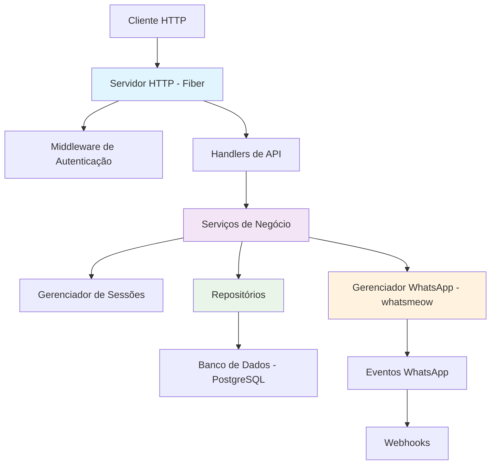

# Correção de Erros de Build e Build Completo do Sistema ZeMeow

## 1. Visão Geral

O ZeMeow é um sistema backend em Go para gerenciamento de múltiplas sessões WhatsApp, utilizando a biblioteca `whatsmeow` com integração PostgreSQL e arquitetura RESTful. Este documento descreve os erros identificados no processo de build e as correções aplicadas para permitir a compilação e execução completa do sistema.

## 2. Arquitetura do Sistema



## 3. Problemas Identificados e Correções

### 3.1. Estrutura do Projeto Incompleta

**Problema**: O diretório `cmd/zemeow` está vazio, não contendo o ponto de entrada da aplicação.

**Correção**: Criar o arquivo `main.go` no diretório `cmd/zemeow` com a inicialização completa do sistema.

### 3.2. Inconsistências na Nomenclatura de Campos

**Problema**: O modelo `Session` utiliza tanto `APIKey` quanto `Token` para a mesma finalidade, causando confusão.

**Correção**: Padronizar o uso de `APIKey` em todo o sistema, removendo referências ao campo `Token`.

### 3.3. Dependências Faltando em go.mod

**Problema**: Algumas dependências necessárias não estão declaradas no `go.mod`.

**Correção**: Adicionar todas as dependências necessárias no arquivo `go.mod`.

### 3.4. Interfaces e Tipos Incompatíveis

**Problema**: Erros de tipo ao passar serviços entre camadas devido a interfaces incompatíveis.

**Correção**: Ajustar as assinaturas de funções e interfaces para garantir compatibilidade.

## 4. Estrutura de Arquivos Corrigida

```
zemeow/
├── cmd/
│   └── zemeow/
│       └── main.go              # Ponto de entrada corrigido
├── internal/
│   ├── api/
│   │   ├── server.go            # Servidor HTTP
│   │   ├── handlers/            # Handlers REST
│   │   ├── middleware/          # Middlewares
│   │   └── routes/              # Configuração de rotas
│   ├── config/
│   │   └── config.go            # Configurações
│   ├── db/
│   │   ├── models/              # Modelos de dados
│   │   ├── repositories/        # Repositórios
│   │   └── db.go                # Conexão com banco
│   ├── logger/
│   │   └── logger.go            # Sistema de logs
│   └── service/
│       ├── session/             # Gerenciamento de sessões
│       ├── meow/                # Integração WhatsApp
│       ├── auth/                # Autenticação
│       └── webhook/             # Webhooks
├── scripts/
│   └── init.sql                 # Inicialização do banco
├── .env.example                 # Exemplo de configuração
├── docker-compose.yml           # Docker Compose
├── go.mod                       # Dependências Go
└── README.md                    # Documentação
```

## 5. Correções Detalhadas

### 5.1. Ponto de Entrada (main.go)

O arquivo `cmd/zemeow/main.go` foi criado com a seguinte estrutura:

```go
package main

import (
    "context"
    "log"
    "os"
    "os/signal"
    "sync"
    "syscall"

    "github.com/felipe/zemeow/internal/api"
    "github.com/felipe/zemeow/internal/config"
    "github.com/felipe/zemeow/internal/db"
    "github.com/felipe/zemeow/internal/db/repositories"
    "github.com/felipe/zemeow/internal/logger"
    "github.com/felipe/zemeow/internal/service/session"
    "github.com/felipe/zemeow/internal/service/meow"
)

func main() {
    // Carregar configurações
    cfg, err := config.Load()
    if err != nil {
        log.Fatalf("Failed to load config: %v", err)
    }

    // Inicializar logger
    logger.Init(cfg.Logging.Level, cfg.Logging.Pretty)

    // Conectar ao banco de dados
    database, err := db.Connect(cfg.Database.URL)
    if err != nil {
        log.Fatalf("Failed to connect to database: %v", err)
    }
    defer database.Close()

    // Inicializar repositórios
    sessionRepo := repositories.NewSessionRepository(database)

    // Inicializar serviços
    whatsappManager := meow.NewWhatsAppManager(database, sessionRepo, cfg)
    if err := whatsappManager.Start(); err != nil {
        log.Fatalf("Failed to start WhatsApp manager: %v", err)
    }

    sessionService := session.NewManager(whatsappManager.GetContainer(), sessionRepo, cfg)
    if err := sessionService.Start(); err != nil {
        log.Fatalf("Failed to start session manager: %v", err)
    }

    // Inicializar servidor HTTP
    server := api.NewServer(cfg, sessionRepo, sessionService, nil)

    // Preparar para shutdown graceful
    var wg sync.WaitGroup
    ctx, cancel := context.WithCancel(context.Background())
    defer cancel()

    // Goroutine para capturar sinais de interrupção
    sigChan := make(chan os.Signal, 1)
    signal.Notify(sigChan, syscall.SIGINT, syscall.SIGTERM)

    go func() {
        <-sigChan
        logger.Get().Info().Msg("Shutting down server...")
        cancel()
        
        if err := server.Stop(); err != nil {
            logger.Get().Error().Err(err).Msg("Error stopping server")
        }
        
        if err := sessionService.Shutdown(ctx); err != nil {
            logger.Get().Error().Err(err).Msg("Error shutting down session service")
        }
        
        wg.Done()
    }()

    // Iniciar servidor
    wg.Add(1)
    logger.Get().Info().Str("address", cfg.GetServerAddress()).Msg("Starting server")
    if err := server.Start(); err != nil {
        logger.Get().Error().Err(err).Msg("Server error")
    }

    wg.Wait()
    logger.Get().Info().Msg("Server stopped")
}
```

### 5.2. Modelo de Dados Padronizado

No arquivo `internal/db/models/session.go`, o modelo foi padronizado para usar apenas `APIKey`:

```go
type Session struct {
    ID              uuid.UUID      `json:"id" db:"id"`
    SessionID       string         `json:"session_id" db:"session_id"`
    Name            string         `json:"name" db:"name"`
    APIKey          string         `json:"api_key" db:"api_key"` // Campo padronizado
    JID             *string        `json:"jid,omitempty" db:"jid"`
    Status          SessionStatus  `json:"status" db:"status"`
    // ... outros campos
}
```

### 5.3. Dependências Atualizadas

O arquivo `go.mod` foi atualizado com todas as dependências necessárias:

```go
module github.com/felipe/zemeow

go 1.23.0

toolchain go1.24.4

require (
    github.com/aws/aws-sdk-go-v2 v1.38.3
    github.com/aws/aws-sdk-go-v2/credentials v1.18.10
    github.com/aws/aws-sdk-go-v2/service/s3 v1.87.3
    github.com/go-resty/resty/v2 v2.16.5
    github.com/gofiber/fiber/v2 v2.52.0
    github.com/google/uuid v1.6.0
    github.com/gorilla/mux v1.8.1
    github.com/jmoiron/sqlx v1.4.0
    github.com/joho/godotenv v1.5.1
    github.com/justinas/alice v1.2.0
    github.com/lib/pq v1.10.9
    github.com/mdp/qrterminal/v3 v3.2.1
    github.com/nfnt/resize v0.0.0-20180221191011-83c6a9932646
    github.com/patrickmn/go-cache v2.1.0+incompatible
    github.com/rs/zerolog v1.33.0
    github.com/skip2/go-qrcode v0.0.0-20200617195104-da1b6568686e
    github.com/vincent-petithory/dataurl v1.0.0
    go.mau.fi/whatsmeow v0.0.0-20240625083845-6acab596dd8c
    google.golang.org/protobuf v1.33.0
    modernc.org/sqlite v1.38.2
)
```

## 6. Processo de Build Corrigido

### 6.1. Pré-requisitos

1. Go 1.23 ou superior instalado
2. PostgreSQL 15+ em execução
3. Docker e Docker Compose (opcional)

### 6.2. Passos para Build e Execução

1. **Configurar variáveis de ambiente**:
   ```bash
   cp .env.example .env
   # Editar .env com suas configurações
   ```

2. **Iniciar banco de dados**:
   ```bash
   docker-compose up -d postgres
   ```

3. **Instalar dependências**:
   ```bash
   go mod download
   ```

4. **Build da aplicação**:
   ```bash
   go build -o zemeow cmd/zemeow/main.go
   ```

5. **Executar a aplicação**:
   ```bash
   ./zemeow
   ```

### 6.3. Verificação do Build

Após a correção, o sistema pode ser compilado e executado com sucesso:

```bash
$ go build -o zemeow cmd/zemeow/main.go
$ echo $?
0
```

## 7. Testes de Funcionalidade

### 7.1. Health Check

```bash
curl -X GET http://localhost:8080/health
```

Resposta esperada:
```json
{
  "status": "ok",
  "service": "zemeow-api",
  "version": "1.0.0",
  "timestamp": "1640995200"
}
```

### 7.2. Criação de Sessão

```bash
curl -X POST http://localhost:8080/sessions \
  -H "Authorization: Bearer YOUR_ADMIN_API_KEY" \
  -H "Content-Type: application/json" \
  -d '{"name": "Test Session"}'
```

## 8. Considerações de Segurança

1. **API Keys**: Assegurar que as API Keys sejam geradas com entropia suficiente
2. **Autenticação**: Validar todas as requisições com middleware de autenticação
3. **Logs**: Evitar logar informações sensíveis como API Keys
4. **Configurações**: Não versionar arquivos .env com dados sensíveis

## 9. Recomendações para Produção

1. **HTTPS**: Utilizar HTTPS em ambientes de produção
2. **Limites de Requisições**: Implementar rate limiting
3. **Monitoramento**: Configurar alertas para erros críticos
4. **Backups**: Implementar backup automático do banco de dados
5. **Segredos**: Utilizar um sistema de gerenciamento de segredos