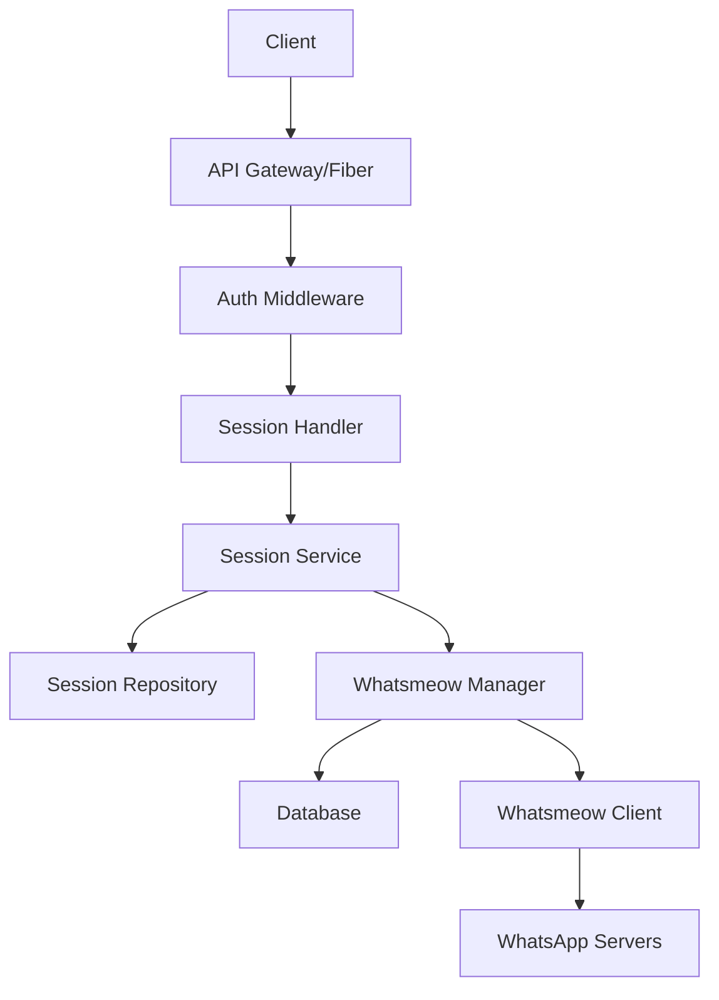
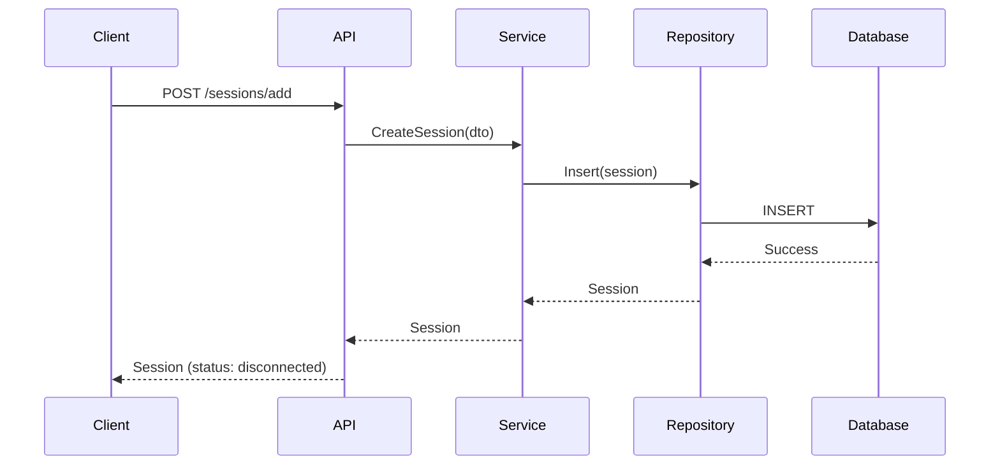
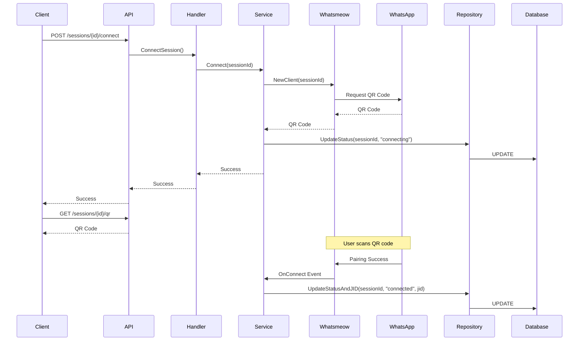

# Design: Create Session and Connect Flow

## 1. Overview

This document describes the design and flow for creating a WhatsApp session and connecting it through QR code pairing in the ZeMeow system. The process involves two main steps:
1. Creating a session with initial "disconnected" status
2. Connecting the session by scanning a QR code and transitioning to "connected" status with JID binding

## 2. Architecture

The session creation and connection flow follows this architectural pattern:



### Component Responsibilities

| Component | Responsibility |
|-----------|----------------|
| Session Handler | Exposes REST endpoints and handles HTTP requests/responses |
| Session Service | Implements business logic for session management |
| Session Repository | Manages database operations for session persistence |
| Whatsmeow Manager | Handles WhatsApp client lifecycle and operations |
| Auth Middleware | Validates API keys and handles authentication |

## 3. API Endpoints Reference

### 3.1 Create Session
```
POST /sessions/add
```

**Authentication**: Requires Global API Key

**Request Body**:
```json
{
  "name": "string",
  "description": "string",
  "webhook_url": "string",
  "proxy_url": "string"
}
```

**Response**:
```json
{
  "id": "string",
  "name": "string",
  "status": "disconnected",
  "created_at": "timestamp",
  "updated_at": "timestamp"
}
```

### 3.2 Connect Session
```
POST /sessions/{sessionId}/connect
```

**Authentication**: Requires Session or Global API Key

**Response**:
```json
{
  "status": "connecting",
  "message": "QR code generated successfully"
}
```

### 3.3 Get QR Code
```
GET /sessions/{sessionId}/qr
```

**Authentication**: Requires Session or Global API Key

**Response**:
```json
{
  "qr_code": "base64_encoded_image",
  "code": "string"
}
```

### 3.4 Session Status
```
GET /sessions/{sessionId}/status
```

**Authentication**: Requires Session or Global API Key

**Response**:
```json
{
  "status": "connected",
  "jid": "string",
  "connected_at": "timestamp"
}
```

## 4. Data Models & ORM Mapping

### 4.1 Session Model

```go
type Session struct {
    ID          string    `db:"id"`
    Name        string    `db:"name"`
    Description string    `db:"description"`
    Status      string    `db:"status"`
    JID         *string   `db:"jid"`
    APIKey      string    `db:"api_key"`
    WebhookURL  *string   `db:"webhook_url"`
    ProxyURL    *string   `db:"proxy_url"`
    CreatedAt   time.Time `db:"created_at"`
    UpdatedAt   time.Time `db:"updated_at"`
}
```

### 4.2 Status Transitions

| Status | Description |
|--------|-------------|
| disconnected | Initial state, no connection attempt made |
| connecting | QR code generated, waiting for scan |
| connected | Successfully paired with WhatsApp |
| disconnected | Intentionally disconnected by user |
| failed | Connection failed or timed out |

## 5. Business Logic Layer

### 5.1 Session Creation Flow



### 5.2 Session Connection Flow



### 5.3 Key Business Rules

1. **Session Creation**:
   - Generate unique session ID
   - Set initial status to "disconnected"
   - Generate unique API key for session
   - Store in database with all provided metadata

2. **Connection Process**:
   - Only "disconnected" sessions can be connected
   - Generate new QR code for each connection attempt
   - QR code expires after configurable timeout (default: 300s)
   - On successful pairing, update status to "connected" and store JID

3. **State Transitions**:
   - disconnected → connecting (on connect request)
   - connecting → connected (on successful pairing)
   - connecting → failed (on timeout or error)
   - connected → disconnected (on logout/disconnect)

## 6. Middleware & Interceptors

### 6.1 Authentication Middleware

- Validates Global API Key for session creation
- Validates Session or Global API Key for session operations
- Supports multiple header formats: `apikey`, `X-API-Key`, `Authorization`

### 6.2 Validation Middleware

- Validates JSON request bodies against DTO schemas
- Validates session ID parameter format (UUID)
- Ensures session exists before operations
- Checks authorization to access session

## 7. Testing

### 7.1 Unit Tests

1. **Session Creation**:
   - Test valid session creation with all fields
   - Test creation with minimal fields
   - Test duplicate session name handling
   - Test invalid API key rejection

2. **Session Connection**:
   - Test connection of valid disconnected session
   - Test connection rejection of already connected session
   - Test QR code generation and retrieval
   - Test status updates through connection flow

3. **State Transitions**:
   - Test all valid state transitions
   - Test invalid state transitions are rejected
   - Test timeout scenarios
   - Test error handling in connection process

### 7.2 Integration Tests

1. **End-to-End Flow**:
   - Create session → Connect → Verify status → Get QR → Simulate pairing
   - Test session persistence across application restarts
   - Test concurrent session operations

2. **Error Scenarios**:
   - Database connection failures
   - Invalid session IDs
   - Expired QR codes
   - WhatsApp server connectivity issues