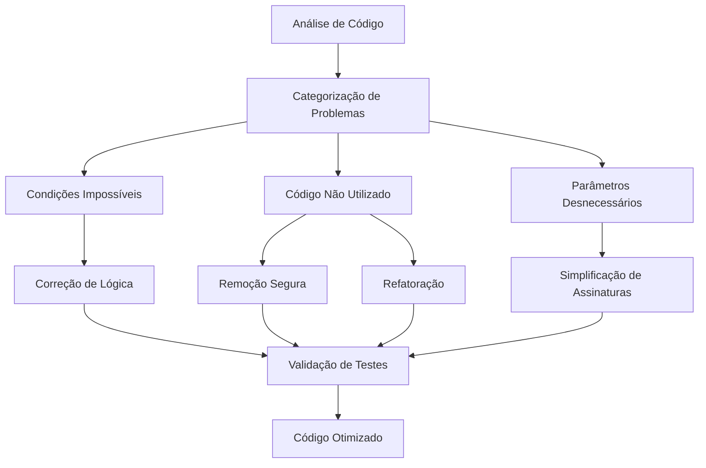
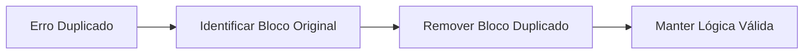
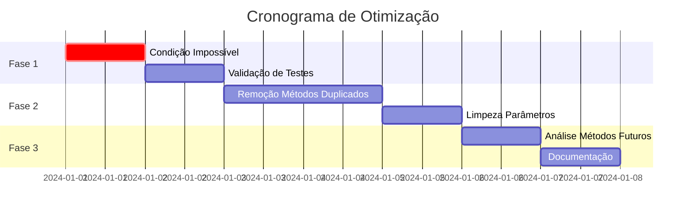
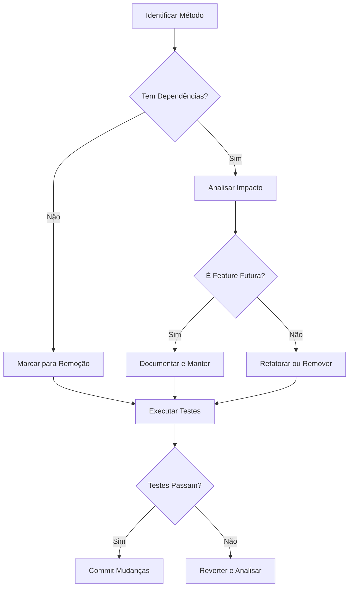
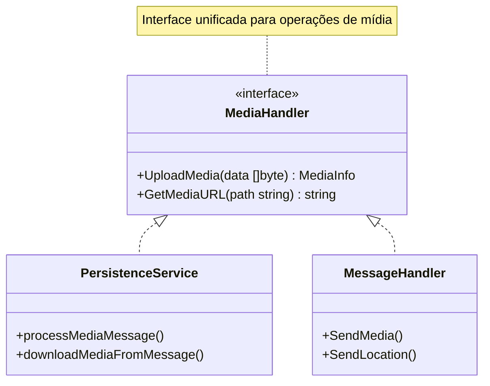
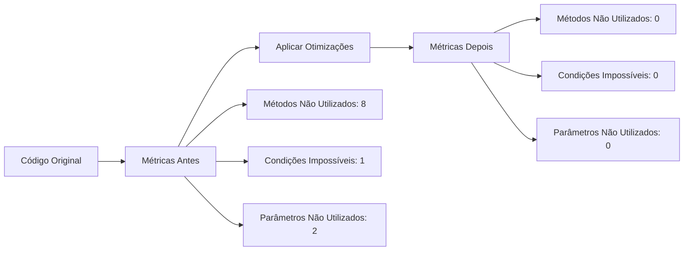
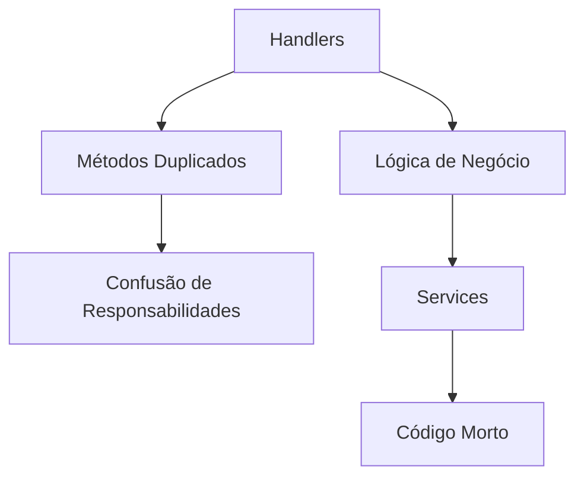
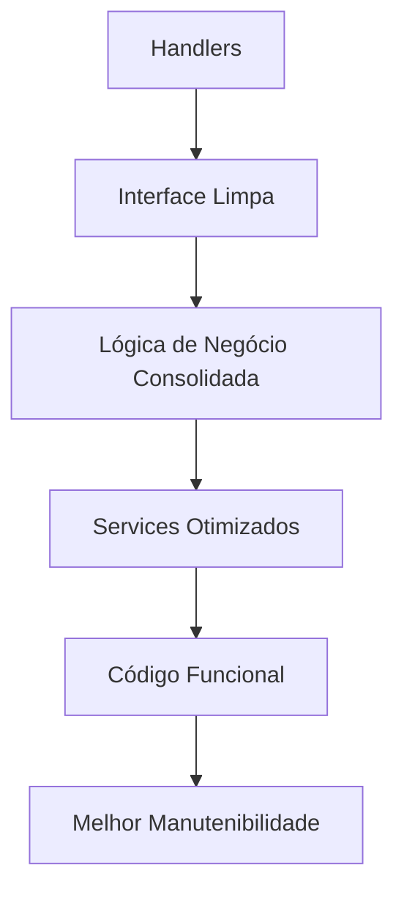

# Design: Análise e Otimização de Código Go para Projeto Zemeow

## Visão Geral

Este design aborda a análise e otimização de problemas de código identificados pelo analisador estático Go no projeto zemeow. Os problemas incluem condições impossíveis, métodos e funções não utilizados, parâmetros não utilizados e código morto. O objetivo é melhorar a qualidade do código, eliminar redundâncias e aumentar a manutenibilidade.

### Problemas Identificados

1. **Condição Impossível**: `nil != nil` no arquivo `persistence_service.go`
2. **Métodos Não Utilizados**: 8 métodos em diferentes arquivos
3. **Parâmetros Não Utilizados**: 2 parâmetros em `message.go`
4. **Código Redundante**: Lógica duplicada e métodos obsoletos

## Arquitetura de Limpeza de Código



## Estratégia de Refatoração

### 1. Condição Impossível (persistence_service.go:558)

**Problema**: Condição `nil != nil` que nunca pode ser verdadeira.

**Localização**: 
- Arquivo: `internal/services/message/persistence_service.go`
- Linha: 558
- Contexto: Bloco de verificação de erro duplicado

**Solução**:


### 2. Métodos Não Utilizados

#### 2.1 Handler de Autenticação

**Método**: `extractAPIKey` em `internal/handlers/auth.go`
- **Status**: Método duplicado (existe implementação similar no middleware)
- **Ação**: Remover e utilizar implementação do middleware

#### 2.2 Handler de Mensagens

**Métodos**:
- `saveMediaToMinIO` (linha 115)
- `sendMediaMessage` (linha 1641)

**Análise**:
- Métodos duplicados com funcionalidade já implementada no `PersistenceService`
- Parâmetros não utilizados: `chatJID`, `senderJID`

#### 2.3 Serviços Meow

**Métodos**:
- `handleEventWithMode` em `client.go`
- `handleQREvents` em `manager.go`
- `ensureJIDsUpdated` em `manager.go`

**Análise**:
- Funcionalidades preparadas para features futuras
- Podem ser mantidos com documentação adequada ou removidos

#### 2.4 Outros Serviços

**Métodos**:
- `generateSessionID` em `session/service.go`
- `sendHTTPRawWebhook` em `webhook/service.go`

## Plano de Otimização

### Fase 1: Correção de Bugs Críticos



### Fase 2: Limpeza de Código Não Utilizado

#### Estratégia de Remoção Segura



### Fase 3: Refatoração e Documentação

#### Padronização de Interfaces



## Detalhamento das Correções

### 1. Correção da Condição Impossível

**Localização**: `internal/services/message/persistence_service.go:558`

**Problema Atual**:
```go
if err != nil {
    // Primeiro bloco de erro
}
if err != nil {  // ← Condição impossível se o primeiro bloco já tratou o erro
    // Segundo bloco de erro idêntico
}
```

**Solução**:
- Identificar qual bloco de erro é o correto
- Remover o bloco duplicado
- Garantir que a lógica de erro está correta

### 2. Limpeza de Métodos Duplicados

#### MessageHandler.saveMediaToMinIO
**Justificativa para Remoção**:
- Funcionalidade já implementada no `PersistenceService`
- Parâmetros `chatJID` e `senderJID` não utilizados
- Duplicação de código desnecessária

#### AuthHandler.extractAPIKey
**Justificativa para Remoção**:
- Método similar já existe no middleware de autenticação
- Mantém consistência na camada de middleware

### 3. Análise de Métodos para Features Futuras

#### Métodos do Serviço Meow
- `handleEventWithMode`: Suporte a diferentes modos de webhook
- `handleQREvents`: Gestão avançada de eventos QR
- `ensureJIDsUpdated`: Sincronização de JIDs

**Recomendação**: Manter com documentação adequada se forem features planejadas, ou remover se não há roadmap definido.

## Critérios de Qualidade

### Métricas de Código



### Validação de Qualidade

1. **Testes Unitários**: Garantir que todos os testes continuam passando
2. **Cobertura de Código**: Manter ou melhorar a cobertura existente
3. **Análise Estática**: Eliminar todos os warnings identificados
4. **Performance**: Verificar que não há regressão de performance

## Impacto na Arquitetura

### Antes da Otimização



### Depois da Otimização



## Benefícios Esperados

1. **Redução de Complexidade**: Eliminação de código morto e duplicado
2. **Melhor Manutenibilidade**: Código mais claro e focado
3. **Performance**: Redução de overhead de métodos não utilizados
4. **Qualidade**: Eliminação de warnings de análise estática
5. **Clareza**: Interfaces mais limpas e responsabilidades bem definidas

## Considerações de Implementação

### Ordem de Execução

1. **Correção de Bugs**: Condições impossíveis primeiro
2. **Remoção Segura**: Métodos claramente não utilizados
3. **Análise Cuidadosa**: Métodos que podem ser features futuras
4. **Validação**: Testes e verificações de regressão

### Riscos e Mitigações

| Risco | Probabilidade | Impacto | Mitigação |
|-------|---------------|---------|-----------|
| Remoção de código necessário | Baixa | Alto | Análise de dependências detalhada |
| Quebra de testes | Média | Médio | Execução completa de testes antes do commit |
| Impacto em features futuras | Baixa | Médio | Documentação de decisões e reversibilidade |
