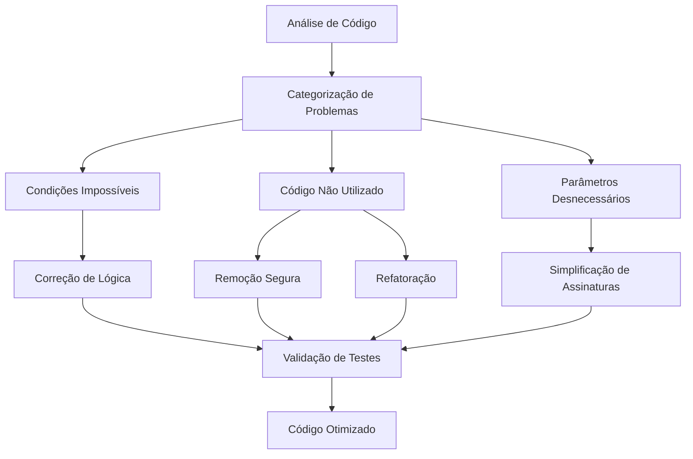

# Design: Análise e Otimização de Código Go para Projeto Zemeow

## Visão Geral

Este design aborda a análise e otimização de problemas de código identificados pelo analisador estático Go no projeto zemeow. Os problemas incluem condições impossíveis, métodos e funções não utilizados, parâmetros não utilizados e código morto. O objetivo é melhorar a qualidade do código, eliminar redundâncias e aumentar a manutenibilidade.

### Problemas Identificados

1. **Condição Impossível**: `nil != nil` no arquivo `persistence_service.go`
2. **Métodos Não Utilizados**: 8 métodos em diferentes arquivos
3. **Parâmetros Não Utilizados**: 2 parâmetros em `message.go`
4. **Código Redundante**: Lógica duplicada e métodos obsoletos

## Arquitetura de Limpeza de Código

## Estratégia de Refatoração

