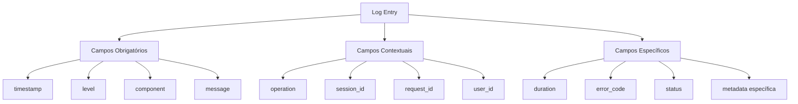
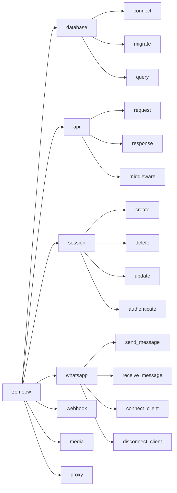
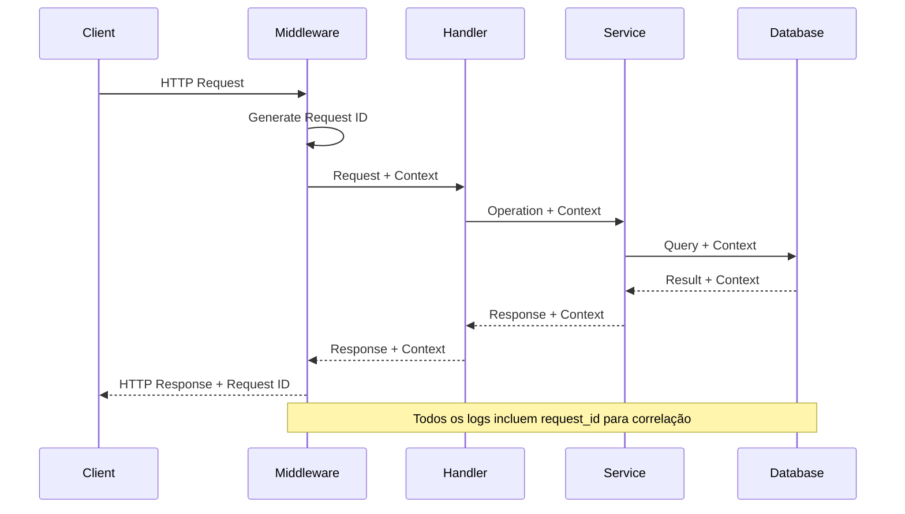
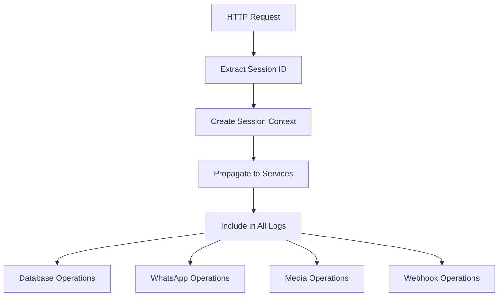
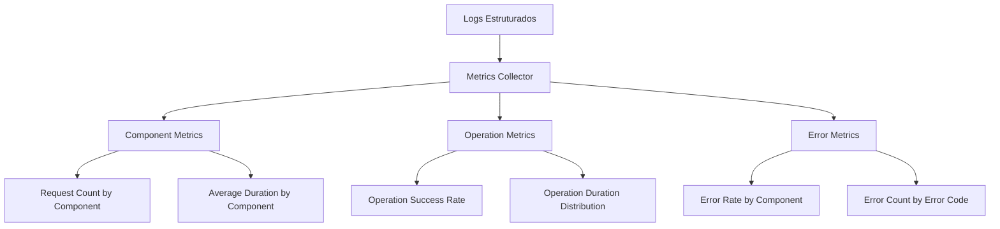

# Melhoria da Padronização de Logs

## Visão Geral

Este documento especifica as melhorias necessárias para padronizar o sistema de logging do zemeow, abordando inconsistências identificadas nos logs atuais e estabelecendo padrões estruturados para todos os componentes da aplicação.

### Problema Atual

Análise dos logs atuais revela inconsistências significativas:

- **Campos Despadronizados**: `database=zemeow host=localhost` vs `session_id=api_server`
- **Mensagens Inconsistentes**: Variação na estrutura e verbos utilizados
- **Falta de Correlação**: Ausência de identificadores para rastrear operações relacionadas
- **Contexto Insuficiente**: Logs sem informações suficientes para debugging efetivo

### Objetivos

1. **Estrutura Padronizada**: Definir campos obrigatórios e opcionais
2. **Correlação de Logs**: Implementar rastreamento de operações end-to-end
3. **Consistência de Mensagens**: Estabelecer convenções para todas as mensagens
4. **Facilitar Monitoramento**: Melhorar observabilidade e alertas

## Arquitetura de Logging Padronizada

### Estrutura de Campos Obrigatórios



### Componentes do Sistema de Logging

| Campo | Tipo | Obrigatório | Descrição |
|-------|------|-------------|-----------|
| `timestamp` | ISO8601 | Sim | Momento exato do evento |
| `level` | String | Sim | Nível do log (debug, info, warn, error, fatal) |
| `component` | String | Sim | Módulo/serviço origem (database, api, session, whatsapp) |
| `message` | String | Sim | Descrição clara e concisa do evento |
| `operation` | String | Condicional | Ação sendo executada (connect, create_session, send_message) |
| `session_id` | String | Condicional | Identificador da sessão WhatsApp |
| `request_id` | String | Condicional | Identificador da requisição HTTP |
| `user_id` | String | Condicional | Identificador do usuário quando aplicável |
| `duration` | Duration | Opcional | Tempo de execução da operação |
| `error_code` | String | Opcional | Código de erro padronizado |
| `status` | String | Opcional | Status da operação (success, failed, pending) |

### Mapeamento de Componentes



## Extensões do Logger

### ComponentLogger

Estrutura para logs com contexto de componente fixo:

```go
type ComponentLogger struct {
    logger zerolog.Logger
    component string
}

func (l *ComponentLogger) ForOperation(operation string) *OperationLogger
func (l *ComponentLogger) WithSession(sessionID string) *ComponentLogger
func (l *ComponentLogger) WithRequest(requestID string) *ComponentLogger
```

### OperationLogger

Logger para rastreamento de operações com duração:

```go
type OperationLogger struct {
    logger zerolog.Logger
    component string
    operation string
    startTime time.Time
}

func (l *OperationLogger) Success() *zerolog.Event
func (l *OperationLogger) Failed(errorCode string) *zerolog.Event
func (l *OperationLogger) WithDuration() *zerolog.Event
```

### RequestLogger

Logger com contexto completo de requisição:

```go
type RequestLogger struct {
    logger zerolog.Logger
    component string
    sessionID string
    requestID string
}

func (l *RequestLogger) ForOperation(operation string) *OperationLogger
func (l *RequestLogger) WithUser(userID string) *RequestLogger
```

## Padrões de Mensagens

### Convenções de Nomenclatura

| Padrão | Formato | Exemplo |
|--------|---------|---------|
| **Operações de Início** | `[Component] [Operation] starting` | `Database connection starting` |
| **Operações Bem-sucedidas** | `[Component] [Operation] completed successfully` | `Session creation completed successfully` |
| **Operações com Falha** | `[Component] [Operation] failed` | `Message sending failed` |
| **Operações em Progresso** | `[Component] [Operation] in progress` | `Migration application in progress` |

### Exemplos de Logs Padronizados

#### Database Operations
```json
{
  "timestamp": "2024-01-15T19:19:10Z",
  "level": "info",
  "component": "database",
  "operation": "connect",
  "message": "Database connection starting",
  "database": "zemeow",
  "host": "localhost",
  "port": 5432
}

{
  "timestamp": "2024-01-15T19:19:10Z",
  "level": "info",
  "component": "database",
  "operation": "connect",
  "message": "Database connection completed successfully",
  "duration": "50ms",
  "status": "success"
}
```

#### API Operations
```json
{
  "timestamp": "2024-01-15T19:19:10Z",
  "level": "info",
  "component": "api",
  "operation": "request",
  "message": "HTTP request processed",
  "method": "POST",
  "path": "/sessions",
  "status": 201,
  "duration": "25ms",
  "request_id": "req_20240115_001",
  "session_id": "sess_abc123"
}
```

#### WhatsApp Operations
```json
{
  "timestamp": "2024-01-15T19:19:10Z",
  "level": "info",
  "component": "whatsapp",
  "operation": "send_message",
  "message": "Message sent successfully",
  "session_id": "sess_abc123",
  "message_id": "msg_xyz789",
  "recipient": "+5511999999999",
  "duration": "150ms",
  "status": "delivered"
}
```

## Implementação por Componente

### Database Component

**Operações Padronizadas:**
- `connect`: Estabelecimento de conexão
- `migrate`: Aplicação de migrações
- `query`: Execução de consultas
- `optimize`: Aplicação de otimizações
- `verify`: Verificação de integridade

**Campos Específicos:**
- `database`: Nome do banco
- `host`: Host de conexão
- `port`: Porta de conexão
- `migration_version`: Versão da migração
- `query_type`: Tipo de consulta (SELECT, INSERT, UPDATE, DELETE)

### API Component

**Operações Padronizadas:**
- `request`: Processamento de requisição HTTP
- `response`: Envio de resposta
- `middleware`: Execução de middleware
- `validation`: Validação de entrada
- `authentication`: Processo de autenticação

**Campos Específicos:**
- `method`: Método HTTP
- `path`: Caminho da requisição
- `status`: Código de status HTTP
- `user_agent`: Agent do cliente
- `ip`: Endereço IP do cliente

### Session Component

**Operações Padronizadas:**
- `create`: Criação de sessão
- `delete`: Remoção de sessão
- `update`: Atualização de sessão
- `authenticate`: Autenticação de sessão
- `validate`: Validação de sessão

**Campos Específicos:**
- `session_name`: Nome da sessão
- `session_status`: Status da sessão (active, inactive, expired)
- `qr_generated`: Indicador de geração de QR code
- `phone_number`: Número do telefone conectado

### WhatsApp Component

**Operações Padronizadas:**
- `connect_client`: Conexão do cliente WhatsApp
- `disconnect_client`: Desconexão do cliente
- `send_message`: Envio de mensagem
- `receive_message`: Recebimento de mensagem
- `send_media`: Envio de mídia
- `receive_media`: Recebimento de mídia

**Campos Específicos:**
- `message_id`: ID da mensagem
- `message_type`: Tipo de mensagem (text, image, document, etc.)
- `recipient`: Destinatário da mensagem
- `sender`: Remetente da mensagem
- `chat_id`: ID do chat/grupo
- `media_type`: Tipo de mídia quando aplicável

## Correlação e Rastreamento

### Request ID Generation



### Session Context Propagation



## Configuração e Variáveis de Ambiente

### Variáveis de Logging Estendidas

| Variável | Tipo | Padrão | Descrição |
|----------|------|--------|-----------|
| `LOG_LEVEL` | String | "info" | Nível mínimo de log |
| `LOG_PRETTY` | Boolean | true | Formatação console colorida |
| `LOG_COLOR` | Boolean | true | Cores nos logs |
| `LOG_CONSOLE` | Boolean | true | Saída para console |
| `LOG_FORMAT` | String | "console" | Formato de saída (console/json) |
| `LOG_COMPONENT_FILTER` | String | "" | Filtro por componente |
| `LOG_INCLUDE_CALLER` | Boolean | true | Incluir informações do caller |
| `LOG_REQUEST_ID_HEADER` | String | "X-Request-ID" | Header do request ID |

### Configuração Estruturada

```go
type LoggingConfig struct {
    Level             string `env:"LOG_LEVEL" default:"info"`
    Pretty            bool   `env:"LOG_PRETTY" default:"true"`
    Color             bool   `env:"LOG_COLOR" default:"true"`
    Console           bool   `env:"LOG_CONSOLE" default:"true"`
    Format            string `env:"LOG_FORMAT" default:"console"`
    ComponentFilter   string `env:"LOG_COMPONENT_FILTER" default:""`
    IncludeCaller     bool   `env:"LOG_INCLUDE_CALLER" default:"true"`
    RequestIDHeader   string `env:"LOG_REQUEST_ID_HEADER" default:"X-Request-ID"`
}
```

## Middleware de Logging Aprimorado

### Enhanced Request Logging

```go
type EnhancedLoggingMiddleware struct {
    logger           zerolog.Logger
    config          *LoggingConfig
    componentFilter map[string]bool
}

func (m *EnhancedLoggingMiddleware) RequestLogger() fiber.Handler {
    return func(c *fiber.Ctx) error {
        // Generate request ID
        requestID := m.generateRequestID()
        c.Locals("request_id", requestID)
        c.Set(m.config.RequestIDHeader, requestID)
        
        // Extract session context
        sessionID := m.extractSessionID(c)
        
        // Create request logger
        reqLogger := m.logger.With().
            Str("component", "api").
            Str("operation", "request").
            Str("request_id", requestID).
            Str("session_id", sessionID).
            Logger()
        
        // Log request start
        start := time.Now()
        reqLogger.Info().
            Str("method", c.Method()).
            Str("path", c.Path()).
            Str("ip", c.IP()).
            Str("user_agent", c.Get("User-Agent")).
            Msg("HTTP request started")
        
        // Process request
        err := c.Next()
        
        // Log request completion
        duration := time.Since(start)
        status := c.Response().StatusCode()
        
        logEvent := reqLogger.Info()
        if status >= 400 && status < 500 {
            logEvent = reqLogger.Warn()
        } else if status >= 500 {
            logEvent = reqLogger.Error()
        }
        
        logEvent.
            Str("method", c.Method()).
            Str("path", c.Path()).
            Int("status", status).
            Dur("duration", duration).
            Str("status_text", m.getStatusText(status)).
            Msg("HTTP request completed")
        
        return err
    }
}
```

## Métricas e Monitoramento

### Log Metrics Collection



### Alertas Baseados em Logs

| Métrica | Threshold | Ação |
|---------|-----------|------|
| Error Rate > 5% | 5 minutos | Alert: High Error Rate |
| Database Duration > 1s | Sustained 2 minutes | Alert: Slow Database |
| WhatsApp Connection Lost | Immediate | Alert: WhatsApp Down |
| Session Creation Failure > 10% | 3 minutes | Alert: Session Issues |

## Migração e Implementação

### Fase 1: Extensão do Logger (Semana 1)

1. **Implementar novas estruturas de logger**
   - ComponentLogger
   - OperationLogger  
   - RequestLogger

2. **Adicionar métodos de conveniência**
   - ForComponent()
   - ForOperation()
   - WithSession()
   - WithRequest()

3. **Manter compatibilidade total com código existente**

### Fase 2: Refatoração por Componente (Semanas 2-3)

1. **Database Component**
   - Migrar logs de conexão
   - Padronizar logs de migração
   - Adicionar correlação de operações

2. **API Component**
   - Aprimorar middleware de logging
   - Implementar request correlation
   - Padronizar logs de handlers

3. **Session Component**
   - Padronizar logs de ciclo de vida
   - Adicionar contexto de session em logs relacionados

### Fase 3: WhatsApp e Serviços (Semana 4)

1. **WhatsApp Component**
   - Padronizar logs de cliente WhatsApp
   - Implementar correlação de mensagens
   - Adicionar contexto de sessão

2. **Webhook e Media Components**
   - Padronizar logs de webhook
   - Implementar rastreamento de mídia
   - Correlação com operações de origem

### Fase 4: Validação e Métricas (Semana 5)

1. **Implementar validação de conformidade**
2. **Adicionar coleta de métricas**
3. **Configurar alertas**
4. **Documentação e treinamento**

## Benefícios Esperados

### Observabilidade Melhorada

- **Correlação End-to-End**: Rastreamento completo de operações através de request_id e session_id
- **Debugging Eficiente**: Informações estruturadas facilitam identificação de problemas
- **Monitoramento Proativo**: Métricas automáticas baseadas em logs estruturados

### Operações Simplificadas

- **Alertas Inteligentes**: Baseados em padrões de log estruturados
- **Dashboards Automáticos**: Visualização de métricas por componente e operação
- **Troubleshooting Rápido**: Busca e filtros eficientes

### Manutenibilidade

- **Padrões Consistentes**: Facilita onboarding de novos desenvolvedores
- **Código Limpo**: Separação clara entre logging e lógica de negócio
- **Evolução Controlada**: Framework extensível para novos componentes