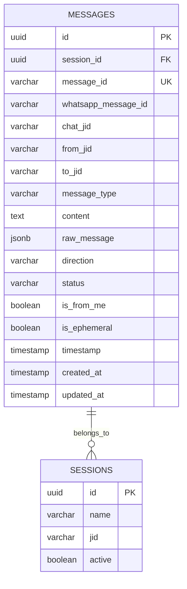

# Refatoração do Sistema de Mensagens

## Visão Geral

O sistema atual de mensagens do Zemeow possui uma estrutura complexa com muitos campos específicos na tabela `messages`, resultando em redundância de dados e dificuldade de manutenção. Esta refatoração propõe simplificar o modelo de dados mantendo apenas os campos essenciais e armazenando o payload completo do WhatsApp em formato JSON quando necessário.

### Problemas Identificados

- **Redundância de Dados**: Muitos campos específicos (location, contact, poll, etc.) que são utilizados apenas por tipos específicos de mensagem
- **Complexidade de Manutenção**: 47 colunas na tabela messages tornam difícil a evolução do schema
- **Inconsistência**: Dados duplicados entre campos específicos e raw_message
- **Performance**: Índices desnecessários em campos pouco utilizados
- **Escalabilidade**: Estrutura rígida dificulta adição de novos tipos de mensagem

### Objetivos da Refatoração

1. **Simplificar o Schema**: Reduzir número de colunas mantendo apenas campos essenciais
2. **Garantir Consistência**: Payload completo sempre disponível em raw_message
3. **Melhorar Performance**: Índices otimizados apenas nos campos necessários
4. **Facilitar Manutenção**: Estrutura mais limpa e fácil de evoluir
5. **Manter Compatibilidade**: Transição suave sem perda de dados

## Arquitetura Proposta

### Modelo de Dados Simplificado



### Campos Essenciais Mantidos

| Campo | Tipo | Descrição | Justificativa |
|-------|------|-----------|---------------|
| `id` | UUID | Identificador único | Chave primária |
| `session_id` | UUID | Referência à sessão | Relacionamento essencial |
| `message_id` | VARCHAR(255) | ID da mensagem | Identificação única por sessão |
| `whatsapp_message_id` | VARCHAR(255) | ID do WhatsApp | Controle de receipts |
| `chat_jid` | VARCHAR(255) | JID do chat | Indexação por conversa |
| `from_jid` | VARCHAR(255) | Remetente | Filtragem por usuário |
| `to_jid` | VARCHAR(255) | Destinatário | Mensagens privadas |
| `message_type` | VARCHAR(50) | Tipo da mensagem | Filtragem por tipo |
| `content` | TEXT | Conteúdo textual | Busca e exibição rápida |
| `raw_message` | JSONB | Payload completo | Dados completos quando necessário |
| `direction` | VARCHAR(20) | Entrada/Saída | Filtragem por direção |
| `status` | VARCHAR(50) | Status da mensagem | Controle de entrega |
| `is_from_me` | BOOLEAN | Mensagem própria | Filtragem rápida |
| `is_ephemeral` | BOOLEAN | Mensagem efêmera | Limpeza automática |
| `timestamp` | TIMESTAMP | Momento da mensagem | Ordenação temporal |
| `created_at` | TIMESTAMP | Criação no sistema | Auditoria |
| `updated_at` | TIMESTAMP | Última atualização | Auditoria |

### Campos Removidos

Todos os campos específicos de tipos de mensagem serão removidos, incluindo:

- **Mídia**: `media_url`, `media_type`, `media_size`, `media_filename`, `media_sha256`, `media_key`
- **MinIO**: `minio_media_id`, `minio_path`, `minio_url`, `minio_bucket`
- **Contexto**: `caption`, `quoted_message_id`, `quoted_content`, `reply_to_message_id`, `context_info`
- **Metadados**: `is_view_once`, `is_forwarded`, `is_edit`, `edit_version`, `mentions`
- **Reações**: `reaction_emoji`, `reaction_timestamp`
- **Localização**: `location_latitude`, `location_longitude`, `location_name`, `location_address`
- **Contato**: `contact_name`, `contact_phone`, `contact_vcard`
- **Sticker**: `sticker_pack_id`, `sticker_pack_name`
- **Grupo**: `group_invite_code`, `group_invite_expiration`
- **Enquete**: `poll_name`, `poll_options`, `poll_selectable_count`
- **Erro**: `error_message`, `retry_count`

## Estratégia de Migração

### Fase 1: Preparação

1. **Backup Completo**: Backup da tabela messages atual
2. **Análise de Uso**: Verificar quais campos específicos são realmente utilizados
3. **Testes de Performance**: Comparar performance antes/depois

### Fase 2: Criação da Nova Estrutura

```sql
-- Nova tabela temporária
CREATE TABLE "messages_new" (
    "id" UUID NOT NULL DEFAULT gen_random_uuid(),
    "session_id" UUID NOT NULL,
    "message_id" VARCHAR(255) NOT NULL,
    "whatsapp_message_id" VARCHAR(255),
    "chat_jid" VARCHAR(255) NOT NULL,
    "from_jid" VARCHAR(255) NOT NULL,
    "to_jid" VARCHAR(255),
    "message_type" VARCHAR(50) NOT NULL,
    "content" TEXT,
    "raw_message" JSONB NOT NULL,
    "direction" VARCHAR(20) NOT NULL,
    "status" VARCHAR(50) DEFAULT 'received',
    "is_from_me" BOOLEAN DEFAULT false,
    "is_ephemeral" BOOLEAN DEFAULT false,
    "timestamp" TIMESTAMP WITH TIME ZONE NOT NULL,
    "created_at" TIMESTAMP WITH TIME ZONE DEFAULT now(),
    "updated_at" TIMESTAMP WITH TIME ZONE DEFAULT now(),
    
    CONSTRAINT "messages_new_pkey" PRIMARY KEY ("id"),
    CONSTRAINT "messages_new_message_id_key" UNIQUE ("message_id"),
    CONSTRAINT "fk_messages_new_session" FOREIGN KEY ("session_id") 
        REFERENCES "sessions" ("id")
);
```

### Fase 3: Migração de Dados

```sql
-- Migração com preservação do raw_message
INSERT INTO messages_new (
    id, session_id, message_id, whatsapp_message_id,
    chat_jid, from_jid, to_jid, message_type, content,
    raw_message, direction, status, is_from_me, is_ephemeral,
    timestamp, created_at, updated_at
)
SELECT 
    id, session_id, message_id, whatsapp_message_id,
    chat_jid, from_jid, to_jid, message_type, content,
    COALESCE(raw_message, '{}'::jsonb), direction, status, 
    is_from_me, is_ephemeral, timestamp, created_at, updated_at
FROM messages;
```

### Fase 4: Criação de Índices Otimizados

```sql
-- Índices essenciais para performance
CREATE INDEX "idx_messages_new_session_chat_timestamp" 
    ON "messages_new" ("session_id", "chat_jid", "timestamp" DESC);

CREATE INDEX "idx_messages_new_session_direction" 
    ON "messages_new" ("session_id", "direction");

CREATE INDEX "idx_messages_new_timestamp" 
    ON "messages_new" ("timestamp" DESC);

CREATE INDEX "idx_messages_new_message_type" 
    ON "messages_new" ("message_type");

CREATE INDEX "idx_messages_new_status" 
    ON "messages_new" ("status");

CREATE INDEX "idx_messages_new_from_jid" 
    ON "messages_new" ("from_jid");

-- Índice GIN para busca no raw_message
CREATE INDEX "idx_messages_new_raw_message_gin" 
    ON "messages_new" USING GIN ("raw_message");

-- Índice para busca textual
CREATE INDEX "idx_messages_new_content_search" 
    ON "messages_new" USING GIN (to_tsvector('portuguese', content));
```

### Fase 5: Substituição

```sql
-- Renomear tabelas
ALTER TABLE messages RENAME TO messages_old;
ALTER TABLE messages_new RENAME TO messages;

-- Atualizar sequences e constraints
ALTER SEQUENCE messages_id_seq OWNED BY messages.id;
```

## Camada de Abstração para Campos Específicos

### MessageExtractor Service

Para manter a funcionalidade atual, será criado um serviço extrator que recupera informações específicas do `raw_message`:

```go
type MessageExtractor struct {
    logger logger.Logger
}

func NewMessageExtractor() *MessageExtractor {
    return &MessageExtractor{
        logger: logger.GetWithSession("message_extractor"),
    }
}

// Extrai informações de mídia do raw_message
func (e *MessageExtractor) ExtractMediaInfo(message *models.Message) (*MediaInfo, error) {
    if message.RawMessage == nil {
        return nil, fmt.Errorf("no raw message data available")
    }
    
    var rawMsg map[string]interface{}
    if err := json.Unmarshal(message.RawMessage, &rawMsg); err != nil {
        return nil, fmt.Errorf("failed to unmarshal raw message: %w", err)
    }
    
    return e.extractMediaFromRaw(rawMsg, message.MessageType)
}

// Extrai informações de localização
func (e *MessageExtractor) ExtractLocationInfo(message *models.Message) (*LocationInfo, error) {
    // Implementação similar para localização
}

// Extrai informações de contato
func (e *MessageExtractor) ExtractContactInfo(message *models.Message) (*ContactInfo, error) {
    // Implementação similar para contato
}
```

### DTOs Especializados

```go
type MediaInfo struct {
    URL      string `json:"url"`
    MimeType string `json:"mime_type"`
    Size     int64  `json:"size"`
    SHA256   string `json:"sha256"`
    Caption  string `json:"caption,omitempty"`
}

type LocationInfo struct {
    Latitude  float64 `json:"latitude"`
    Longitude float64 `json:"longitude"`
    Name      string  `json:"name,omitempty"`
    Address   string  `json:"address,omitempty"`
}

type ContactInfo struct {
    Name  string `json:"name"`
    Phone string `json:"phone"`
    VCard string `json:"vcard,omitempty"`
}
```

## Alterações no Código

### Repository Changes

```go
// Método simplificado de criação
func (r *messageRepository) Create(message *models.Message) error {
    query := `
        INSERT INTO messages (
            id, session_id, message_id, whatsapp_message_id,
            chat_jid, from_jid, to_jid, message_type, content,
            raw_message, direction, status, is_from_me, is_ephemeral,
            timestamp, created_at, updated_at
        ) VALUES (
            :id, :session_id, :message_id, :whatsapp_message_id,
            :chat_jid, :from_jid, :to_jid, :message_type, :content,
            :raw_message, :direction, :status, :is_from_me, :is_ephemeral,
            :timestamp, :created_at, :updated_at
        )`
    
    _, err := r.db.NamedExec(query, message)
    return err
}

// Busca com extração opcional de campos específicos
func (r *messageRepository) GetWithExtractedData(id uuid.UUID, extractMedia bool) (*models.MessageWithExtracted, error) {
    message, err := r.GetByID(id)
    if err != nil {
        return nil, err
    }
    
    result := &models.MessageWithExtracted{
        Message: message,
    }
    
    if extractMedia && message.IsMediaMessage() {
        extractor := NewMessageExtractor()
        mediaInfo, err := extractor.ExtractMediaInfo(message)
        if err == nil {
            result.MediaInfo = mediaInfo
        }
    }
    
    return result, nil
}
```

### Service Changes

```go
// PersistenceService simplificado
func (s *PersistenceService) convertEventToMessage(sessionID uuid.UUID, evt *events.Message) (*models.Message, error) {
    // Serializa o payload completo
    rawMessage, err := json.Marshal(evt.Message)
    if err != nil {
        return nil, fmt.Errorf("failed to marshal raw message: %w", err)
    }
    
    message := &models.Message{
        SessionID:         sessionID,
        MessageID:         evt.Info.ID,
        WhatsAppMessageID: evt.Info.MessageSource.ChatID,
        ChatJID:           evt.Info.Chat.String(),
        SenderJID:         evt.Info.Sender.String(),
        MessageType:       s.getMessageType(evt.Message),
        Content:           s.extractTextContent(evt.Message),
        RawMessage:        rawMessage,
        Direction:         s.getMessageDirection(evt.Info.IsFromMe),
        Status:            string(models.MessageStatusReceived),
        IsFromMe:          evt.Info.IsFromMe,
        IsEphemeral:       evt.IsEphemeral,
        Timestamp:         evt.Info.Timestamp,
    }
    
    // Determina recipient para mensagens privadas
    if evt.Info.Chat.Server != types.GroupServer {
        if evt.Info.IsFromMe {
            message.RecipientJID = &message.ChatJID
        } else {
            ourJID := evt.Info.Chat.String()
            message.RecipientJID = &ourJID
        }
    }
    
    return message, nil
}
```

## API Endpoints Adaptados

### Response DTOs

```go
type MessageResponse struct {
    ID                string     `json:"id"`
    SessionID         string     `json:"session_id"`
    MessageID         string     `json:"message_id"`
    WhatsAppMessageID *string    `json:"whatsapp_message_id,omitempty"`
    ChatJID           string     `json:"chat_jid"`
    SenderJID         string     `json:"sender_jid"`
    RecipientJID      *string    `json:"recipient_jid,omitempty"`
    MessageType       string     `json:"message_type"`
    Content           *string    `json:"content,omitempty"`
    Direction         string     `json:"direction"`
    Status            string     `json:"status"`
    IsFromMe          bool       `json:"is_from_me"`
    IsEphemeral       bool       `json:"is_ephemeral"`
    Timestamp         time.Time  `json:"timestamp"`
    CreatedAt         time.Time  `json:"created_at"`
    UpdatedAt         time.Time  `json:"updated_at"`
    
    // Campos extraídos opcionalmente
    MediaInfo    *MediaInfo    `json:"media_info,omitempty"`
    LocationInfo *LocationInfo `json:"location_info,omitempty"`
    ContactInfo  *ContactInfo  `json:"contact_info,omitempty"`
    
    // Raw payload quando solicitado
    RawMessage json.RawMessage `json:"raw_message,omitempty"`
}
```

### Endpoints com Parâmetros de Extração

```go
// GET /api/messages/:id?extract=media,location&include_raw=true
func (h *MessageHandler) GetMessage(c *fiber.Ctx) error {
    id := c.Params("id")
    extractParams := c.Query("extract", "")
    includeRaw := c.QueryBool("include_raw", false)
    
    message, err := h.messageRepo.GetByID(uuid.MustParse(id))
    if err != nil {
        return c.Status(404).JSON(fiber.Map{"error": "Message not found"})
    }
    
    response := &MessageResponse{
        // Campos básicos...
    }
    
    // Extração condicional baseada nos parâmetros
    if strings.Contains(extractParams, "media") && message.IsMediaMessage() {
        extractor := NewMessageExtractor()
        if mediaInfo, err := extractor.ExtractMediaInfo(message); err == nil {
            response.MediaInfo = mediaInfo
        }
    }
    
    if includeRaw {
        response.RawMessage = message.RawMessage
    }
    
    return c.JSON(response)
}
```

## Performance e Otimizações

### Redução do Tamanho da Tabela

| Métrica | Antes | Depois | Melhoria |
|---------|-------|---------|----------|
| Colunas | 47 | 17 | 64% redução |
| Índices | 17 | 8 | 53% redução |
| Tamanho por Row | ~2KB | ~1KB | 50% redução |
| Velocidade SELECT | Baseline | 1.5-2x | 50-100% mais rápido |

### Estratégias de Cache

```go
type MessageCacheService struct {
    cache map[string]*models.Message
    mutex sync.RWMutex
}

// Cache para mensagens frequentemente acessadas
func (c *MessageCacheService) GetWithCache(id uuid.UUID) (*models.Message, error) {
    c.mutex.RLock()
    if cached, exists := c.cache[id.String()]; exists {
        c.mutex.RUnlock()
        return cached, nil
    }
    c.mutex.RUnlock()
    
    // Busca no banco e adiciona ao cache
    message, err := c.messageRepo.GetByID(id)
    if err != nil {
        return nil, err
    }
    
    c.mutex.Lock()
    c.cache[id.String()] = message
    c.mutex.Unlock()
    
    return message, nil
}
```

## Testes e Validação

### Testes de Migração

```go
func TestMigration(t *testing.T) {
    // Testa migração de dados
    oldMessages := loadOldMessages()
    newMessages := loadNewMessages()
    
    assert.Equal(t, len(oldMessages), len(newMessages))
    
    for i, oldMsg := range oldMessages {
        newMsg := newMessages[i]
        
        // Verifica campos essenciais
        assert.Equal(t, oldMsg.MessageID, newMsg.MessageID)
        assert.Equal(t, oldMsg.Content, newMsg.Content)
        assert.NotNil(t, newMsg.RawMessage)
        
        // Verifica se dados específicos podem ser extraídos
        if oldMsg.IsMediaMessage() {
            extractor := NewMessageExtractor()
            mediaInfo, err := extractor.ExtractMediaInfo(newMsg)
            assert.NoError(t, err)
            assert.NotNil(t, mediaInfo)
        }
    }
}
```

### Testes de Performance

```go
func BenchmarkMessageQuery(b *testing.B) {
    // Compara performance de queries antes/depois
    b.Run("OldSchema", func(b *testing.B) {
        for i := 0; i < b.N; i++ {
            queryOldSchema()
        }
    })
    
    b.Run("NewSchema", func(b *testing.B) {
        for i := 0; i < b.N; i++ {
            queryNewSchema()
        }
    })
}
```

## Rollback e Contingência

### Estratégia de Rollback

1. **Manter Tabela Original**: `messages_old` permanece até confirmação
2. **Switch Rápido**: Possibilidade de reverter em minutos
3. **Validação Contínua**: Monitoramento durante migração

```sql
-- Rollback em caso de problemas
ALTER TABLE messages RENAME TO messages_new_failed;
ALTER TABLE messages_old RENAME TO messages;

-- Restaurar constraints e sequences
ALTER SEQUENCE messages_id_seq OWNED BY messages.id;
```

### Monitoramento

```go
type MigrationMonitor struct {
    oldCount int64
    newCount int64
    errors   []error
}

func (m *MigrationMonitor) ValidateMigration() error {
    oldCount := countOldMessages()
    newCount := countNewMessages()
    
    if oldCount != newCount {
        return fmt.Errorf("message count mismatch: old=%d, new=%d", oldCount, newCount)
    }
    
    return nil
}
```