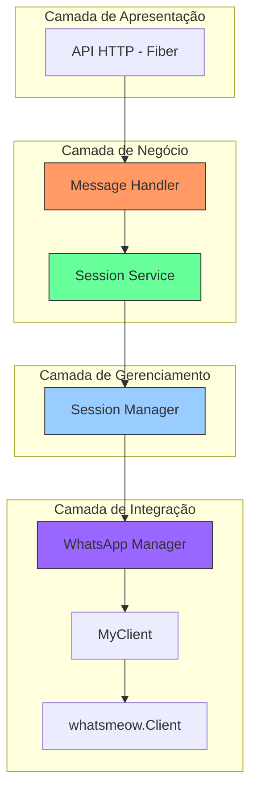
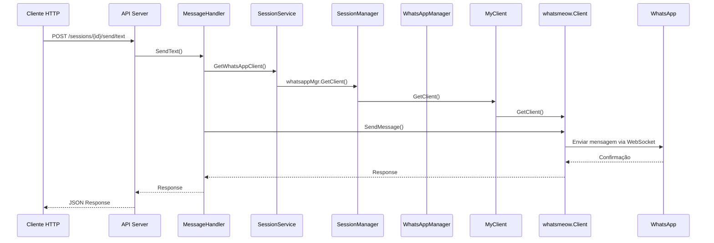

# Integração de Mensagens em Tempo Real - ZeMeow

## 1. Visão Geral

Este documento descreve a implementação de integração de mensagens em tempo real para o sistema ZeMeow, que permitirá o envio e recebimento de mensagens através da API RESTful integrada com o cliente WhatsApp whatsmeow. A solução centraliza as rotas de mensagens em um único arquivo e implementa a funcionalidade completa de envio de mensagens.

A implementação segue a arquitetura em camadas do sistema, integrando-se adequadamente com o SessionService, SessionManager e WhatsAppManager para garantir acesso ao cliente whatsmeow subjacente através da cadeia correta de dependências.

## 2. Arquitetura Atual

### 2.1 Estrutura de Componentes



### 2.2 Fluxo de Envio de Mensagens



## 3. Centralização de Rotas

### 3.1 Estrutura de Rotas Unificada

Todas as rotas de mensagens serão centralizadas no arquivo `internal/api/routes/message_routes.go`:

```go
// internal/api/routes/message_routes.go
package routes

import (
    "github.com/gofiber/fiber/v2"
    "github.com/felipe/zemeow/internal/api/dto"
)

// setupMessageRoutes configura todas as rotas relacionadas a mensagens
func (r *Router) setupMessageRoutes() {
    // Grupo principal de mensagens
    messages := r.app.Group("/sessions/:sessionId")
    
    // Middleware para validar API Key (global ou session)
    messageRoutes := messages.Group("/",
        r.authMiddleware.RequireAPIKey(),
        r.validationMiddleware.ValidateParams(),
    )
    
    // === ROTAS DE ENVIO DE MENSAGENS ===
    
    // POST /sessions/:sessionId/send/text - Envio de texto
    messageRoutes.Post("/send/text",
        r.validationMiddleware.ValidateSessionAccess(),
        r.validationMiddleware.ValidateJSON(&dto.SendTextRequest{}),
        r.messageHandler.SendText,
    )
    
    // POST /sessions/:sessionId/send/media - Envio unificado de mídia
    messageRoutes.Post("/send/media",
        r.validationMiddleware.ValidateSessionAccess(),
        r.validationMiddleware.ValidateJSON(&dto.SendMediaRequest{}),
        r.messageHandler.SendMedia,
    )
    
    // POST /sessions/:sessionId/send/location - Envio de localização
    messageRoutes.Post("/send/location",
        r.validationMiddleware.ValidateSessionAccess(),
        r.validationMiddleware.ValidateJSON(&dto.SendLocationRequest{}),
        r.messageHandler.SendLocation,
    )
    
    // POST /sessions/:sessionId/send/contact - Envio de contato
    messageRoutes.Post("/send/contact",
        r.validationMiddleware.ValidateSessionAccess(),
        r.validationMiddleware.ValidateJSON(&dto.SendContactRequest{}),
        r.messageHandler.SendContact,
    )
}
```

### 3.2 Integração com Router Principal

O router principal será atualizado para incluir as rotas de mensagens:

```go
// internal/api/routes/router.go
func (r *Router) SetupRoutes() {
    // Configurar rotas de health check
    r.setupHealthRoutes()
    
    // Configurar rotas de sessão (incluindo mensagens)
    r.setupSessionRoutes()
    
    // Outras rotas...
}
```

## 4. Implementação de Envio de Mensagens

### 4.1 MessageHandler Completo

O MessageHandler será implementado com todos os métodos necessários para envio de mensagens:

```go
// internal/api/handlers/message.go
package handlers

import (
    "context"
    "fmt"
    "mime"
    "net/http"
    "strings"
    "time"

    "github.com/gofiber/fiber/v2"
    "github.com/vincent-petithory/dataurl"
    "go.mau.fi/whatsmeow"
    waE2E "go.mau.fi/whatsmeow/binary/proto"
    "go.mau.fi/whatsmeow/types"
    "google.golang.org/protobuf/proto"

    "github.com/felipe/zemeow/internal/api/dto"
    "github.com/felipe/zemeow/internal/api/middleware"
    "github.com/felipe/zemeow/internal/service/session"
)

type MessageHandler struct {
    sessionService session.Service
}

func NewMessageHandler(sessionService session.Service) *MessageHandler {
    return &MessageHandler{
        sessionService: sessionService,
    }
}

// SendText envia mensagem de texto
func (h *MessageHandler) SendText(c *fiber.Ctx) error {
    sessionID := c.Params("sessionId")
    
    // Verificar acesso à sessão
    if !h.hasSessionAccess(c, sessionID) {
        return h.sendError(c, "Access denied", "ACCESS_DENIED", fiber.StatusForbidden)
    }

    // Parsear request
    var req dto.SendTextRequest
    if err := c.BodyParser(&req); err != nil {
        return h.sendError(c, "Invalid request body", "INVALID_JSON", fiber.StatusBadRequest)
    }

    // Validar request
    if err := h.validateTextRequest(&req); err != nil {
        return h.sendError(c, err.Error(), "VALIDATION_ERROR", fiber.StatusBadRequest)
    }

    // Obter cliente WhatsApp da sessão
    clientInterface, err := h.sessionService.GetWhatsAppClient(context.Background(), sessionID)
    if err != nil {
        return h.sendError(c, "Session not found or not connected", "SESSION_NOT_READY", fiber.StatusBadRequest)
    }

    // Converter interface para *whatsmeow.Client
    client, ok := clientInterface.(*whatsmeow.Client)
    if !ok {
        return h.sendError(c, "Invalid WhatsApp client", "INVALID_CLIENT", fiber.StatusInternalServerError)
    }

    // Preparar destinatário
    recipient, err := h.parseJID(req.To)
    if err != nil {
        return h.sendError(c, err.Error(), "INVALID_RECIPIENT", fiber.StatusBadRequest)
    }

    // Gerar ID da mensagem
    messageID := req.MessageID
    if messageID == "" {
        messageID = client.GenerateMessageID()
    }

    // Construir mensagem WhatsApp
    msg := &waE2E.Message{
        ExtendedTextMessage: &waE2E.ExtendedTextMessage{
            Text: proto.String(req.Text),
        },
    }

    // Adicionar context info se fornecido (reply/menções)
    if req.ContextInfo != nil {
        h.addContextInfo(msg, req.ContextInfo)
    }

    // Enviar mensagem
    response, err := client.SendMessage(context.Background(), recipient, msg, whatsmeow.SendRequestExtra{ID: messageID})
    if err != nil {
        return h.sendError(c, fmt.Sprintf("Failed to send message: %v", err), "SEND_FAILED", fiber.StatusInternalServerError)
    }

    // Retornar sucesso
    return c.Status(fiber.StatusOK).JSON(fiber.Map{
        "message_id": messageID,
        "status":     "sent",
        "timestamp":  response.Timestamp,
        "recipient":  req.To,
    })
}

// SendMedia envia mídia unificada
func (h *MessageHandler) SendMedia(c *fiber.Ctx) error {
    sessionID := c.Params("sessionId")
    
    // Verificar acesso à sessão
    if !h.hasSessionAccess(c, sessionID) {
        return h.sendError(c, "Access denied", "ACCESS_DENIED", fiber.StatusForbidden)
    }

    // Parsear request
    var req dto.SendMediaRequest
    if err := c.BodyParser(&req); err != nil {
        return h.sendError(c, "Invalid request body", "INVALID_JSON", fiber.StatusBadRequest)
    }

    // Validar request
    if err := h.validateMediaRequest(&req); err != nil {
        return h.sendError(c, err.Error(), "VALIDATION_ERROR", fiber.StatusBadRequest)
    }

    // Obter cliente WhatsApp
    clientInterface, err := h.sessionService.GetWhatsAppClient(context.Background(), sessionID)
    if err != nil {
        return h.sendError(c, "Session not found or not connected", "SESSION_NOT_READY", fiber.StatusBadRequest)
    }

    // Converter interface para *whatsmeow.Client
    client, ok := clientInterface.(*whatsmeow.Client)
    if !ok {
        return h.sendError(c, "Invalid WhatsApp client", "INVALID_CLIENT", fiber.StatusInternalServerError)
    }

    // Decodificar dados da mídia
    fileData, err := h.decodeBase64Media(req.Media)
    if err != nil {
        return h.sendError(c, err.Error(), "INVALID_MEDIA_DATA", fiber.StatusBadRequest)
    }

    // Determinar tipo de mídia para upload
    var mediaType whatsmeow.MediaType
    switch req.Type {
    case dto.MediaTypeImage:
        mediaType = whatsmeow.MediaImage
    case dto.MediaTypeAudio:
        mediaType = whatsmeow.MediaAudio
    case dto.MediaTypeVideo:
        mediaType = whatsmeow.MediaVideo
    case dto.MediaTypeDocument:
        mediaType = whatsmeow.MediaDocument
    case dto.MediaTypeSticker:
        mediaType = whatsmeow.MediaImage // Stickers são tratados como imagens
    default:
        return h.sendError(c, "Unsupported media type", "INVALID_MEDIA_TYPE", fiber.StatusBadRequest)
    }

    // Upload para WhatsApp
    uploaded, err := client.Upload(context.Background(), fileData, mediaType)
    if err != nil {
        return h.sendError(c, fmt.Sprintf("Failed to upload media: %v", err), "UPLOAD_FAILED", fiber.StatusInternalServerError)
    }

    // Preparar destinatário
    recipient, err := h.parseJID(req.To)
    if err != nil {
        return h.sendError(c, err.Error(), "INVALID_RECIPIENT", fiber.StatusBadRequest)
    }

    // Gerar ID da mensagem
    messageID := req.MessageID
    if messageID == "" {
        messageID = client.GenerateMessageID()
    }

    // Construir mensagem de mídia
    msg, err := h.buildMediaMessage(req, fileData, uploaded)
    if err != nil {
        return h.sendError(c, err.Error(), "BUILD_MESSAGE_FAILED", fiber.StatusInternalServerError)
    }

    // Adicionar context info se fornecido
    if req.ContextInfo != nil {
        h.addContextInfo(msg, req.ContextInfo)
    }

    // Enviar mensagem
    response, err := client.SendMessage(context.Background(), recipient, msg, whatsmeow.SendRequestExtra{ID: messageID})
    if err != nil {
        return h.sendError(c, fmt.Sprintf("Failed to send media: %v", err), "SEND_FAILED", fiber.StatusInternalServerError)
    }

    // Retornar sucesso
    return c.Status(fiber.StatusOK).JSON(fiber.Map{
        "message_id": messageID,
        "status":     "sent",
        "timestamp":  response.Timestamp,
        "recipient":  req.To,
        "media_type": req.Type,
        "file_size":  len(fileData),
    })
}
```

### 4.2 Métodos Auxiliares

Os métodos auxiliares para validação e construção de mensagens:

```go
// hasSessionAccess verifica se o usuário tem acesso à sessão
func (h *MessageHandler) hasSessionAccess(c *fiber.Ctx, sessionID string) bool {
    authCtx := middleware.GetAuthContext(c)
    if authCtx == nil {
        return false
    }

    // Global key tem acesso a todas as sessões
    if authCtx.IsGlobalKey {
        return true
    }

    // Verificar se a sessão pertence ao usuário autenticado
    return authCtx.SessionID == sessionID
}

// sendError envia uma resposta de erro JSON
func (h *MessageHandler) sendError(c *fiber.Ctx, message, code string, status int) error {
    return c.Status(status).JSON(fiber.Map{
        "error":   code,
        "message": message,
        "status":  status,
    })
}

// parseJID converte número de telefone para JID do WhatsApp
func (h *MessageHandler) parseJID(phone string) (types.JID, error) {
    // Remover caracteres não numéricos
    phone = strings.Map(func(r rune) rune {
        if r >= '0' && r <= '9' {
            return r
        }
        return -1
    }, phone)

    // Verificar se é um número válido
    if len(phone) < 10 || len(phone) > 15 {
        return types.JID{}, fmt.Errorf("invalid phone number length")
    }

    // Construir JID no formato WhatsApp
    jid := types.NewJID(phone, types.DefaultUserServer)
    return jid, nil
}

// validateTextRequest valida requisição de texto
func (h *MessageHandler) validateTextRequest(req *dto.SendTextRequest) error {
    if req.To == "" {
        return fmt.Errorf("recipient 'to' is required")
    }
    
    if req.Text == "" {
        return fmt.Errorf("text content is required")
    }
    
    if len(req.Text) > 4096 {
        return fmt.Errorf("text content exceeds maximum length of 4096 characters")
    }
    
    return nil
}

// validateMediaRequest valida requisição de mídia
func (h *MessageHandler) validateMediaRequest(req *dto.SendMediaRequest) error {
    if req.To == "" {
        return fmt.Errorf("recipient 'to' is required")
    }
    
    if req.Media == "" {
        return fmt.Errorf("media data is required")
    }
    
    // Verificar se é uma data URL válida
    if !strings.HasPrefix(req.Media, "data:") {
        return fmt.Errorf("media must be a valid data URL (data:mime/type;base64,...)")
    }
    
    // Validar caption se fornecido
    if req.Caption != "" && len(req.Caption) > 1024 {
        return fmt.Errorf("caption exceeds maximum length of 1024 characters")
    }
    
    // Validar filename se fornecido
    if req.Filename != "" && len(req.Filename) > 255 {
        return fmt.Errorf("filename exceeds maximum length of 255 characters")
    }
    
    return nil
}

// decodeBase64Media decodifica dados de mídia em Base64
func (h *MessageHandler) decodeBase64Media(dataURL string) ([]byte, error) {
    if !strings.HasPrefix(dataURL, "data:") {
        return nil, fmt.Errorf("invalid data URL format")
    }
    
    dataURLStruct, err := dataurl.DecodeString(dataURL)
    if err != nil {
        return nil, fmt.Errorf("failed to decode base64 data: %v", err)
    }
    
    return dataURLStruct.Data, nil
}

// buildMediaMessage constrói mensagem de mídia baseada no tipo
func (h *MessageHandler) buildMediaMessage(req dto.SendMediaRequest, filedata []byte, uploaded whatsmeow.UploadResponse) (*waE2E.Message, error) {
    switch req.Type {
    case dto.MediaTypeImage:
        mimeType := req.MimeType
        if mimeType == "" {
            mimeType = http.DetectContentType(filedata)
        }
        
        return &waE2E.Message{
            ImageMessage: &waE2E.ImageMessage{
                Caption:       &req.Caption,
                URL:           proto.String(uploaded.URL),
                DirectPath:    proto.String(uploaded.DirectPath),
                MediaKey:      uploaded.MediaKey,
                Mimetype:      &mimeType,
                FileEncSHA256: uploaded.FileEncSHA256,
                FileSHA256:    uploaded.FileSHA256,
                FileLength:    proto.Uint64(uint64(len(filedata))),
            },
        }, nil
        
    case dto.MediaTypeAudio:
        mimeType := req.MimeType
        if mimeType == "" {
            mimeType = "audio/ogg; codecs=opus"
        }
        
        ptt := true // Áudio como mensagem de voz
        
        return &waE2E.Message{
            AudioMessage: &waE2E.AudioMessage{
                URL:           proto.String(uploaded.URL),
                DirectPath:    proto.String(uploaded.DirectPath),
                MediaKey:      uploaded.MediaKey,
                Mimetype:      &mimeType,
                FileEncSHA256: uploaded.FileEncSHA256,
                FileSHA256:    uploaded.FileSHA256,
                FileLength:    proto.Uint64(uint64(len(filedata))),
                PTT:           &ptt,
            },
        }, nil
        
    case dto.MediaTypeVideo:
        mimeType := req.MimeType
        if mimeType == "" {
            mimeType = http.DetectContentType(filedata)
        }
        
        return &waE2E.Message{
            VideoMessage: &waE2E.VideoMessage{
                Caption:       &req.Caption,
                URL:           proto.String(uploaded.URL),
                DirectPath:    proto.String(uploaded.DirectPath),
                MediaKey:      uploaded.MediaKey,
                Mimetype:      &mimeType,
                FileEncSHA256: uploaded.FileEncSHA256,
                FileSHA256:    uploaded.FileSHA256,
                FileLength:    proto.Uint64(uint64(len(filedata))),
            },
        }, nil
        
    case dto.MediaTypeDocument:
        mimeType := req.MimeType
        if mimeType == "" {
            if req.Filename != "" {
                mimeType = mime.TypeByExtension(strings.ToLower(req.Filename[strings.LastIndex(req.Filename, "."):]))
            }
            if mimeType == "" {
                mimeType = http.DetectContentType(filedata)
            }
        }
        
        return &waE2E.Message{
            DocumentMessage: &waE2E.DocumentMessage{
                FileName:      &req.Filename,
                Caption:       &req.Caption,
                URL:           proto.String(uploaded.URL),
                DirectPath:    proto.String(uploaded.DirectPath),
                MediaKey:      uploaded.MediaKey,
                Mimetype:      &mimeType,
                FileEncSHA256: uploaded.FileEncSHA256,
                FileSHA256:    uploaded.FileSHA256,
                FileLength:    proto.Uint64(uint64(len(filedata))),
            },
        }, nil
        
    case dto.MediaTypeSticker:
        mimeType := req.MimeType
        if mimeType == "" {
            mimeType = http.DetectContentType(filedata)
        }
        
        return &waE2E.Message{
            StickerMessage: &waE2E.StickerMessage{
                URL:           proto.String(uploaded.URL),
                DirectPath:    proto.String(uploaded.DirectPath),
                MediaKey:      uploaded.MediaKey,
                Mimetype:      &mimeType,
                FileEncSHA256: uploaded.FileEncSHA256,
                FileSHA256:    uploaded.FileSHA256,
                FileLength:    proto.Uint64(uint64(len(filedata))),
            },
        }, nil
        
    default:
        return nil, fmt.Errorf("unsupported media type: %s", req.Type)
    }
}

// addContextInfo adiciona informações de contexto (replies, menções) à mensagem
func (h *MessageHandler) addContextInfo(msg *waE2E.Message, contextInfo *dto.ContextInfo) {
    if contextInfo == nil {
        return
    }
    
    // Adicionar reply info
    if contextInfo.StanzaID != nil && contextInfo.Participant != nil {
        // Para mensagens de texto
        if msg.ExtendedTextMessage != nil {
            if msg.ExtendedTextMessage.ContextInfo == nil {
                msg.ExtendedTextMessage.ContextInfo = &waE2E.ContextInfo{}
            }
            msg.ExtendedTextMessage.ContextInfo.StanzaID = contextInfo.StanzaID
            msg.ExtendedTextMessage.ContextInfo.Participant = contextInfo.Participant
            msg.ExtendedTextMessage.ContextInfo.QuotedMessage = &waE2E.Message{Conversation: proto.String("")}
        }
        
        // Para mensagens de mídia
        if msg.ImageMessage != nil {
            if msg.ImageMessage.ContextInfo == nil {
                msg.ImageMessage.ContextInfo = &waE2E.ContextInfo{}
            }
            msg.ImageMessage.ContextInfo.StanzaID = contextInfo.StanzaID
            msg.ImageMessage.ContextInfo.Participant = contextInfo.Participant
            msg.ImageMessage.ContextInfo.QuotedMessage = &waE2E.Message{Conversation: proto.String("")}
        }
        
        if msg.AudioMessage != nil {
            if msg.AudioMessage.ContextInfo == nil {
                msg.AudioMessage.ContextInfo = &waE2E.ContextInfo{}
            }
            msg.AudioMessage.ContextInfo.StanzaID = contextInfo.StanzaID
            msg.AudioMessage.ContextInfo.Participant = contextInfo.Participant
            msg.AudioMessage.ContextInfo.QuotedMessage = &waE2E.Message{Conversation: proto.String("")}
        }
        
        if msg.VideoMessage != nil {
            if msg.VideoMessage.ContextInfo == nil {
                msg.VideoMessage.ContextInfo = &waE2E.ContextInfo{}
            }
            msg.VideoMessage.ContextInfo.StanzaID = contextInfo.StanzaID
            msg.VideoMessage.ContextInfo.Participant = contextInfo.Participant
            msg.VideoMessage.ContextInfo.QuotedMessage = &waE2E.Message{Conversation: proto.String("")}
        }
        
        if msg.DocumentMessage != nil {
            if msg.DocumentMessage.ContextInfo == nil {
                msg.DocumentMessage.ContextInfo = &waE2E.ContextInfo{}
            }
            msg.DocumentMessage.ContextInfo.StanzaID = contextInfo.StanzaID
            msg.DocumentMessage.ContextInfo.Participant = contextInfo.Participant
            msg.DocumentMessage.ContextInfo.QuotedMessage = &waE2E.Message{Conversation: proto.String("")}
        }
        
        if msg.StickerMessage != nil {
            if msg.StickerMessage.ContextInfo == nil {
                msg.StickerMessage.ContextInfo = &waE2E.ContextInfo{}
            }
            msg.StickerMessage.ContextInfo.StanzaID = contextInfo.StanzaID
            msg.StickerMessage.ContextInfo.Participant = contextInfo.Participant
            msg.StickerMessage.ContextInfo.QuotedMessage = &waE2E.Message{Conversation: proto.String("")}
        }
    }
    
    // Adicionar menções
    if len(contextInfo.MentionedJID) > 0 {
        // Converter strings para JIDs
        var mentionedJIDs []string
        for _, jidStr := range contextInfo.MentionedJID {
            if jid, err := h.parseJID(jidStr); err == nil {
                mentionedJIDs = append(mentionedJIDs, jid.String())
            }
        }
        
        if len(mentionedJIDs) > 0 {
            // Para mensagens de texto
            if msg.ExtendedTextMessage != nil {
                if msg.ExtendedTextMessage.ContextInfo == nil {
                    msg.ExtendedTextMessage.ContextInfo = &waE2E.ContextInfo{}
                }
                msg.ExtendedTextMessage.ContextInfo.MentionedJID = mentionedJIDs
            }
            
            // Para mensagens de mídia
            if msg.ImageMessage != nil && msg.ImageMessage.ContextInfo != nil {
                msg.ImageMessage.ContextInfo.MentionedJID = mentionedJIDs
            }
            
            if msg.AudioMessage != nil && msg.AudioMessage.ContextInfo != nil {
                msg.AudioMessage.ContextInfo.MentionedJID = mentionedJIDs
            }
            
            if msg.VideoMessage != nil && msg.VideoMessage.ContextInfo != nil {
                msg.VideoMessage.ContextInfo.MentionedJID = mentionedJIDs
            }
            
            if msg.DocumentMessage != nil && msg.DocumentMessage.ContextInfo != nil {
                msg.DocumentMessage.ContextInfo.MentionedJID = mentionedJIDs
            }
            
            if msg.StickerMessage != nil && msg.StickerMessage.ContextInfo != nil {
                msg.StickerMessage.ContextInfo.MentionedJID = mentionedJIDs
            }
        }
    }
}
```

## 5. Integração com Session Service

### 5.1 Implementação do Método GetWhatsAppClient no SessionService

O método GetWhatsAppClient será implementado no SessionService para fornecer acesso ao cliente whatsmeow subjacente através da cadeia correta de dependências:

```go
// internal/service/session/service.go

// GetWhatsAppClient implementa Service.GetWhatsAppClient
func (s *SessionService) GetWhatsAppClient(ctx context.Context, sessionID string) (interface{}, error) {
    // Verificar se o manager está disponível
    if s.manager == nil {
        return nil, fmt.Errorf("session manager not available")
    }
    
    // Converter manager para SessionManager
    sessionManager, ok := s.manager.(*session.Manager)
    if !ok {
        return nil, fmt.Errorf("invalid session manager type")
    }
    
    // Obter cliente do session manager através do WhatsAppManager
    client, err := sessionManager.whatsappMgr.GetClient(sessionID)
    if err != nil {
        return nil, fmt.Errorf("whatsapp client not found for session: %s: %w", sessionID, err)
    }
    
    // Obter cliente whatsmeow subjacente
    whatsmeowClient := client.GetClient()
    if whatsmeowClient == nil {
        return nil, fmt.Errorf("whatsmeow client not available")
    }
    
    // Verificar se está conectado
    if !whatsmeowClient.IsConnected() {
        return nil, fmt.Errorf("whatsapp client not connected")
    }
    
    return whatsmeowClient, nil
}
```

### 5.2 Implementação do Método GetWhatsAppClient

Este método já foi adicionado à interface Service como parte da análise inicial.

## 6. Atualização do WhatsApp Manager

### 6.1 Método GetClient no WhatsAppManager

O método GetClient já está implementado no WhatsAppManager:

```go
// internal/service/meow/manager.go
// GetClient retorna o cliente WhatsApp de uma sessão
func (m *WhatsAppManager) GetClient(sessionID string) (*MyClient, error) {
    m.mu.RLock()
    defer m.mu.RUnlock()

    client, exists := m.clients[sessionID]
    if !exists {
        return nil, fmt.Errorf("client not found")
    }

    return client, nil
}
```

## 7. DTOs para Mensagens

### 7.1 Estruturas de Dados para Requisições

```go
// internal/api/dto/message.go
package dto

// SendTextRequest para envio de mensagem de texto
type SendTextRequest struct {
    To          string       `json:"to" validate:"required"`
    Text        string       `json:"text" validate:"required,max=4096"`
    MessageID   string       `json:"message_id,omitempty"`
    ContextInfo *ContextInfo `json:"context_info,omitempty"`
}

// SendMediaRequest para envio unificado de mídia
type SendMediaRequest struct {
    To          string       `json:"to" validate:"required"`
    Type        MediaType    `json:"type" validate:"required,oneof=image audio video document sticker"`
    Media       string       `json:"media" validate:"required"` // Base64 data URL
    Caption     string       `json:"caption,omitempty"`
    Filename    string       `json:"filename,omitempty"`
    MimeType    string       `json:"mime_type,omitempty"`
    MessageID   string       `json:"message_id,omitempty"`
    ContextInfo *ContextInfo `json:"context_info,omitempty"`
}

// MediaType enumera os tipos de mídia suportados
type MediaType string

const (
    MediaTypeImage    MediaType = "image"
    MediaTypeAudio    MediaType = "audio"
    MediaTypeVideo    MediaType = "video"
    MediaTypeDocument MediaType = "document"
    MediaTypeSticker  MediaType = "sticker"
)

// ContextInfo para replies e menções
type ContextInfo struct {
    StanzaID     *string  `json:"stanza_id,omitempty"`     // Para reply
    Participant  *string  `json:"participant,omitempty"`   // Para reply em grupo
    MentionedJID []string `json:"mentioned_jid,omitempty"` // Para menções
}
```

## 8. Exemplos de Uso

### 8.1 Envio de Mensagem de Texto

```bash
curl -X POST http://localhost:8080/sessions/sess_123/send/text \
  -H "apikey: session_api_key" \
  -H "Content-Type: application/json" \
  -d '{
    "to": "5511999999999",
    "text": "Olá! Como você está?",
    "context_info": {
      "mentioned_jid": ["5511888888888@s.whatsapp.net"]
    }
  }'
```

### 8.2 Envio de Imagem

```bash
curl -X POST http://localhost:8080/sessions/sess_123/send/media \
  -H "apikey: session_api_key" \
  -H "Content-Type: application/json" \
  -d '{
    "to": "5511999999999",
    "type": "image",
    "media": "data:image/jpeg;base64,/9j/4AAQSkZJRgABAQAAAQ...",
    "caption": "Confira esta imagem!"
  }'
```

### 8.3 Envio de Documento

```bash
curl -X POST http://localhost:8080/sessions/sess_123/send/media \
  -H "apikey: session_api_key" \
  -H "Content-Type: application/json" \
  -d '{
    "to": "5511999999999",
    "type": "document",
    "media": "data:application/pdf;base64,JVBERi0xLjQKMSAwIG9iai...",
    "filename": "documento.pdf",
    "mime_type": "application/pdf",
    "caption": "Segue o documento solicitado"
  }'
```

## 9. Considerações de Segurança

### 9.1 Validação de Entrada

- Todas as entradas são validadas antes do processamento
- Números de telefone são sanitizados e validados
- Dados Base64 são verificados antes da decodificação
- Tipos de mídia são restritos aos suportados

### 9.2 Autenticação

- Todas as rotas requerem autenticação via API Key
- Acesso restrito por sessão ou global
- Validação de contexto de autenticação

### 9.3 Rate Limiting

- Implementação de rate limiting por API Key
- Proteção contra abuso de envio de mensagens
- Limites configuráveis por tipo de operação

## 10. Monitoramento e Logging

### 10.1 Logging Estruturado

```go
// Exemplo de log para envio de mensagem
h.logger.Info().
    Str("session_id", sessionID).
    Str("message_id", messageID).
    Str("recipient", req.To).
    Msg("Text message sent successfully")
```

### 10.2 Métricas

- Contagem de mensagens enviadas
- Taxa de sucesso/falha de envio
- Tempo de resposta das operações
- Erros e exceções registrados

## 11. Tratamento de Erros

### 11.1 Códigos de Erro

| Código | Descrição | Status HTTP |
|--------|-----------|-------------|
| ACCESS_DENIED | Acesso negado à sessão | 403 |
| INVALID_JSON | JSON inválido na requisição | 400 |
| VALIDATION_ERROR | Erro de validação nos campos | 400 |
| SESSION_NOT_READY | Sessão não encontrada ou desconectada | 400 |
| INVALID_CLIENT | Cliente WhatsApp inválido | 500 |
| INVALID_RECIPIENT | Destinatário inválido | 400 |
| INVALID_MEDIA_DATA | Dados de mídia inválidos | 400 |
| INVALID_MEDIA_TYPE | Tipo de mídia não suportado | 400 |
| UPLOAD_FAILED | Falha no upload da mídia | 500 |
| BUILD_MESSAGE_FAILED | Falha na construção da mensagem | 500 |
| SEND_FAILED | Falha no envio da mensagem | 500 |

### 11.2 Respostas de Erro

```json
{
  "error": "SEND_FAILED",
  "message": "Failed to send message: connection timeout",
  "status": 500
}
```

## 12. Testes

### 12.1 Testes Unitários

- Validação de estruturas de dados
- Parsing de números de telefone
- Decodificação de dados Base64
- Construção de mensagens WhatsApp

### 12.2 Testes de Integração

- Envio de mensagens de texto
- Envio de diferentes tipos de mídia
- Tratamento de erros e exceções
- Validação de autenticação

## 14. Implantação

### 14.1 Atualizações Necessárias

1. Atualizar dependências no `go.mod`
2. Criar/migrar arquivos de rotas
3. Implementar métodos no MessageHandler
4. Implementar método GetWhatsAppClient no SessionService
5. Atualizar inicialização do MessageHandler no server.go
6. Configurar logging adequado

### 14.2 Atualização da Inicialização do Servidor

Para que o MessageHandler tenha acesso ao SessionService, é necessário atualizar a inicialização no server.go:

```go
// internal/api/server.go
func NewServer(
    cfg *config.Config,
    sessionRepo repositories.SessionRepository,
    sessionService interface{},
    authService interface{},
) *Server {
    // Configurar Fiber
    app := fiber.New(fiber.Config{
        AppName:      "ZeMeow API",
        ServerHeader: "ZeMeow/1.0",
        ReadTimeout:  30 * time.Second,
        WriteTimeout: 30 * time.Second,
        IdleTimeout:  120 * time.Second,
        ErrorHandler: func(c *fiber.Ctx, err error) error {
            code := fiber.StatusInternalServerError
            if e, ok := err.(*fiber.Error); ok {
                code = e.Code
            }

            return c.Status(code).JSON(fiber.Map{
                "error":     "INTERNAL_ERROR",
                "message":   err.Error(),
                "code":      code,
                "timestamp": time.Now().Unix(),
            })
        },
    })

    // Converter sessionService para o tipo correto
    sessionSvc, ok := sessionService.(session.Service)
    if !ok {
        panic("invalid session service type")
    }

    // Criar handlers
    sessionHandler := handlers.NewSessionHandler(sessionSvc)
    messageHandler := handlers.NewMessageHandler(sessionSvc) // Passar session service
    webhookHandler := handlers.NewWebhookHandler()

    // Criar middleware de autenticação
    authMiddleware := middleware.NewAuthMiddleware(cfg.Auth.AdminAPIKey, sessionRepo)

    // Configurar router
    routerConfig := &routes.RouterConfig{
        AuthMiddleware: authMiddleware,
        SessionHandler: sessionHandler,
        MessageHandler: messageHandler,
        WebhookHandler: webhookHandler,
    }
    router := routes.NewRouter(app, routerConfig)

    return &Server{
        app:    app,
        config: cfg,
        logger: logger.GetWithSession("api_server"),
        router: router,
    }
}
```

### 14.3 Compatibilidade

- Manter compatibilidade com APIs existentes
- Suportar formatos de dados legados
- Garantir funcionamento com clientes existentes

## 15. Conclusão

Esta implementação fornece uma solução completa para integração de mensagens em tempo real no ZeMeow, centralizando as rotas e integrando adequadamente com o cliente WhatsApp. A arquitetura modular permite fácil manutenção e extensão futura, mantendo os padrões de segurança e desempenho do sistema.