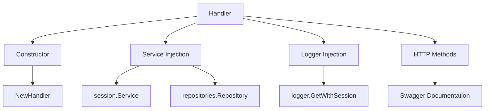
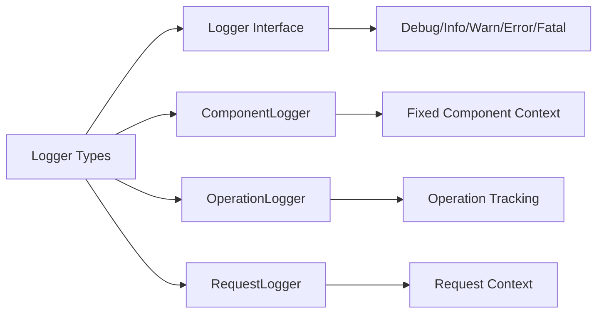
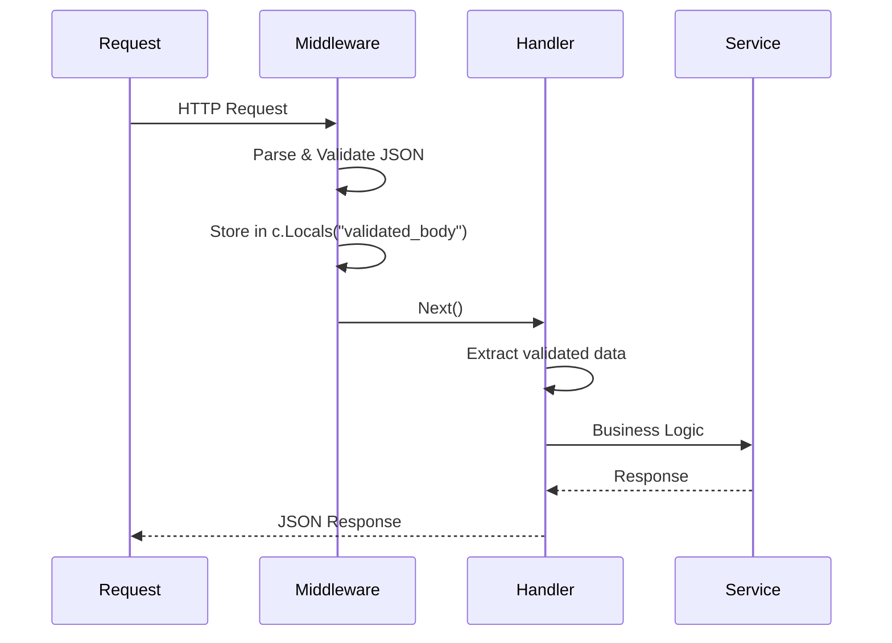
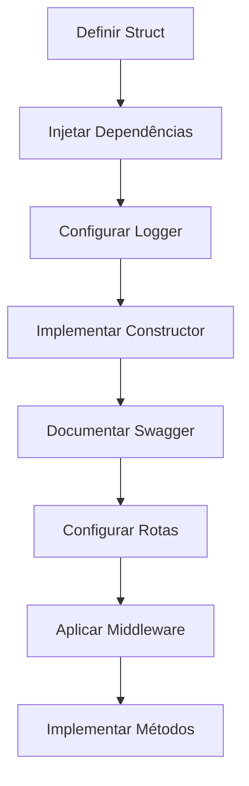
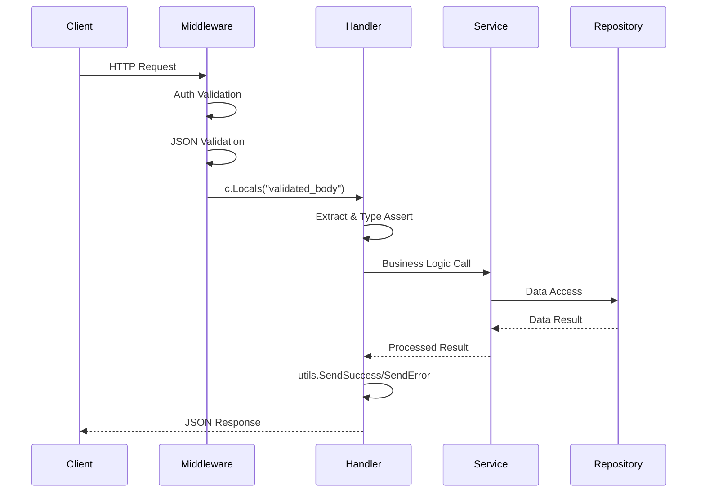

# Análise e Atualização das Regras do Especialista Go - Projeto ZeMeow

## Visão Geral

Este documento apresenta uma análise detalhada das regras atuais do especialista Go (`rule-expert-golang.md`) comparadas com a implementação real do projeto ZeMeow. Após examinar minuciosamente o código-fonte, foram identificadas discrepâncias significativas entre as regras estabelecidas e os padrões realmente implementados no projeto.

## Estrutura Real do Projeto vs. Regras Atuais

### ✅ Aspectos Corretos nas Regras Atuais

#### Estrutura de Pacotes
A estrutura definida nas regras está **correta**:
- **Handlers**: `internal/handlers/` ✓
- **Services**: `internal/services/` ✓  
- **Models**: `internal/models/` ✓
- **Repositories**: `internal/repositories/` ✓
- **DTOs**: `internal/dto/` ✓

#### Padrão de Imports
O padrão observado nas regras está **correto**:
```go
// 1. Stdlib primeiro
// 2. Dependências externas  
// 3. Pacotes internos do projeto
```

#### Nomenclatura
As convenções estão **corretas**:
- **Structs**: PascalCase (`SessionHandler`, `CreateSessionRequest`)
- **Métodos**: PascalCase (`CreateSession`, `GetSession`)
- **Variáveis**: camelCase (`sessionID`, `apiKey`)

### ❌ Discrepâncias Críticas Encontradas

#### 1. Sistema de Logger

**Regras Atuais (INCORRETAS):**
```go
// Sistema de logging não documentado adequadamente
logger.GetWithSession("session_handler")
```

**Implementação Real (CORRETA):**
```go
// Interface logger.Logger
type Logger interface {
    Debug() *zerolog.Event
    Info() *zerolog.Event
    Warn() *zerolog.Event
    Error() *zerolog.Event
    Fatal() *zerolog.Event
    With() zerolog.Context
    Level(level zerolog.Level) Logger
}

// Uso correto no projeto
logger := logger.GetWithSession("session_handler")
logger.Error().Err(err).Str("session_id", sessionID).Msg("Failed to get session")
```

#### 2. Sistema de Validação

**Regras Atuais (PARCIALMENTE CORRETAS):**
```go
validatedBody := c.Locals("validated_body")
if validatedBody == nil {
    return utils.SendError(c, "Invalid request body", "INVALID_REQUEST", fiber.StatusBadRequest)
}
```

**Implementação Real (MAIS DETALHADA):**
```go
// Middleware de validação customizado
r.validationMiddleware.ValidateJSON(&dto.CreateSessionRequest{})

// Uso nos handlers
validatedBody := c.Locals("validated_body")
if validatedBody == nil {
    return utils.SendError(c, "Invalid request body", "INVALID_REQUEST", fiber.StatusBadRequest)
}

req, ok := validatedBody.(*dto.CreateSessionRequest)
if !ok {
    return utils.SendError(c, "Invalid request format", "INVALID_REQUEST", fiber.StatusBadRequest)
}
```

#### 3. Sistema de Respostas HTTP

**Implementação Real (MAIS ROBUSTA):**
```go
// Função utilitária para erros
utils.SendError(c, "Session not found", "SESSION_NOT_FOUND", fiber.StatusNotFound)

// Estrutura de resposta padronizada
response := fiber.Map{
    "success": true,
    "session": fiber.Map{
        "id":         sessionInfo.ID,
        "session_id": sessionInfo.ID,
        "name":       sessionInfo.Name,
        "status":     sessionInfo.Status,
    },
}
```

#### 4. Middleware de Autenticação

**Implementação Real (NÃO DOCUMENTADA):**
```go
// Tipos de middleware disponíveis
r.authMiddleware.RequireAPIKey()           // Para API keys de sessão
r.authMiddleware.RequireGlobalAPIKey()     // Para admin API key
r.validationMiddleware.ValidateSessionAccess()  // Validação de acesso

// Contexto de autenticação
type AuthContext struct {
    APIKey          string
    IsGlobalKey     bool
    SessionID       string
    HasGlobalAccess bool
}
```

## Análise de Padrões Específicos do Projeto

### Estrutura de Handlers


### Sistema de Logging Avançado


### Fluxo de Validação


## Recomendações de Atualização

### 1. Documentação do Sistema de Logger
- Adicionar exemplos completos do uso do logger
- Documentar diferentes tipos de logger disponíveis
- Incluir padrões de logging estruturado com zerolog

### 2. Detalhamento do Sistema de Validação
- Documentar middlewares de validação específicos
- Incluir exemplos de validações customizadas
- Explicar o fluxo completo de validação

### 3. Middleware de Autenticação
- Documentar tipos de autenticação disponíveis
- Explicar diferença entre API keys globais e de sessão
- Incluir exemplos de uso do AuthContext

### 4. Padrões de Resposta HTTP
- Padronizar uso de `utils.SendError()` e variações
- Documentar estrutura completa de respostas
- Incluir códigos de erro padronizados

### 5. Estrutura de Rotas
- Documentar padrões de agrupamento de rotas
- Explicar middleware chain para diferentes tipos de endpoints
- Incluir exemplos de configuração de rotas

## Tecnologias e Dependências Específicas

### Bibliotecas Principais
- **Fiber v2.52.6**: Framework web principal
- **whatsmeow**: Cliente WhatsApp oficial
- **zerolog**: Sistema de logging estruturado
- **go-playground/validator/v10**: Validação de dados
- **sqlx**: Database toolkit
- **MinIO**: Armazenamento de mídia

### Padrões Arquiteturais
- **Repository Pattern**: Para acesso a dados
- **Service Layer**: Para lógica de negócio
- **Middleware Chain**: Para cross-cutting concerns
- **Dependency Injection**: Implícita via constructors

## Estrutura de Tipos Específicos do Projeto

### DTOs de Validação
```go
type CreateSessionRequest struct {
    Name      string         `json:"name" validate:"required,min=1,max=100"`
    SessionID string         `json:"session_id,omitempty" validate:"omitempty,alphanum,min=3,max=50"`
    APIKey    string         `json:"api_key,omitempty" validate:"omitempty,min=32"`
    Webhook   *WebhookConfig `json:"webhook,omitempty"`
    Proxy     *ProxyConfig   `json:"proxy,omitempty"`
}
```

### Modelos de Banco
```go
type Session struct {
    ID               uuid.UUID      `json:"id" db:"id"`
    Name             string         `json:"name" db:"name"`
    APIKey           string         `json:"api_key" db:"api_key"`
    Status           SessionStatus  `json:"status" db:"status"`
    // ... outros campos
}
```

## Próximos Passos

1. **Atualizar rule-expert-golang.md** com os padrões reais encontrados
2. **Adicionar seções específicas** para middleware e autenticação
3. **Incluir exemplos práticos** baseados no código real
4. **Documentar fluxos completos** de request/response
5. **Adicionar validações customizadas** específicas do projeto

## Regras Atualizadas Propostas

### 🔧 Padrões de Logger (ATUALIZADO)

```go
// SEMPRE usar o tipo logger.Logger (interface)
type Handler struct {
    logger logger.Logger
}

// Inicialização correta do logger
func NewHandler() *Handler {
    return &Handler{
        logger: logger.GetWithSession("component_name"),
    }
}

// Padrão de logging estruturado (OBRIGATÓRIO)
logger.Error().Err(err).Str("session_id", sessionID).Msg("Operational message")
logger.Info().Str("operation", "create_session").Msg("Session created successfully")
```

### 🛡️ Middleware de Autenticação (NOVO)

```go
// Tipos de middleware disponíveis
r.authMiddleware.RequireAPIKey()           // API keys de sessão
r.authMiddleware.RequireGlobalAPIKey()     // Admin API key
r.validationMiddleware.ValidateSessionAccess()  // Validação de acesso

// Extração do contexto de autenticação
auth := middleware.GetAuthContext(c)
if auth.IsGlobalKey {
    // Acesso global
} else {
    // Acesso específico da sessão
}
```

### 📋 Sistema de Validação (ATUALIZADO)

```go
// Middleware de validação nas rotas
r.validationMiddleware.ValidateJSON(&dto.CreateSessionRequest{})

// Extração no handler (PADRÃO OBRIGATÓRIO)
validatedBody := c.Locals("validated_body")
if validatedBody == nil {
    return utils.SendError(c, "Invalid request body", "INVALID_REQUEST", fiber.StatusBadRequest)
}

req, ok := validatedBody.(*dto.CreateSessionRequest)
if !ok {
    return utils.SendError(c, "Invalid request format", "INVALID_REQUEST", fiber.StatusBadRequest)
}
```

### 🔄 Respostas HTTP Padronizadas (ATUALIZADO)

```go
// Funções utilitárias obrigatórias
utils.SendError(c, message, code, status)
utils.SendSuccess(c, data, message)
utils.SendValidationError(c, message)
utils.SendAccessDeniedError(c)

// Estrutura de resposta de sucesso
response := fiber.Map{
    "success": true,
    "data": fiber.Map{
        "field1": value1,
        "field2": value2,
    },
}
return c.Status(fiber.StatusCreated).JSON(response)
```

### 🏗️ Estrutura de Handler (ATUALIZADO)

```go
type HandlerName struct {
    serviceField   service.ServiceInterface  // Service layer
    repositoryField repositories.RepositoryInterface  // Data access
    logger         logger.Logger  // Structured logging
}

func NewHandlerName(
    service service.ServiceInterface,
    repo repositories.RepositoryInterface,
) *HandlerName {
    return &HandlerName{
        serviceField:    service,
        repositoryField: repo,
        logger:          logger.GetWithSession("handler_name"),
    }
}
```

### 🛣️ Configuração de Rotas (NOVO)

```go
// Agrupamento de rotas com middleware
sessions := r.app.Group("/sessions")

// Rotas globais (admin)
globalRoutes := sessions.Group("/", r.authMiddleware.RequireGlobalAPIKey())
globalRoutes.Post("/add",
    r.validationMiddleware.ValidateJSON(&dto.CreateSessionRequest{}),
    r.sessionHandler.CreateSession,
)

// Rotas de sessão específica
sessionRoutes := sessions.Group("/",
    r.authMiddleware.RequireAPIKey(),
    r.validationMiddleware.ValidateParams(),
)
sessionRoutes.Get("/:sessionId",
    r.validationMiddleware.ValidateSessionAccess(),
    r.sessionHandler.GetSession,
)
```

### 📊 DTOs e Validação (ATUALIZADO)

```go
type CreateSessionRequest struct {
    Name      string         `json:"name" validate:"required,min=1,max=100"`
    SessionID string         `json:"session_id,omitempty" validate:"omitempty,session_id"`
    APIKey    string         `json:"api_key,omitempty" validate:"omitempty,api_key"`
    Webhook   *WebhookConfig `json:"webhook,omitempty"`
    Proxy     *ProxyConfig   `json:"proxy,omitempty"`
}

// Validações customizadas disponíveis:
// - session_id: Alfanumérico 3-50 caracteres
// - api_key: Mínimo 32 caracteres
// - e164: Formato de telefone internacional
```

## Fluxos de Trabalho Específicos

### Fluxo de Criação de Handler


### Fluxo de Request/Response


## Códigos de Erro Padronizados

```go
// Constantes definidas em utils/response.go
const (
    ErrCodeValidation      = "VALIDATION_ERROR"
    ErrCodeAuthentication  = "AUTHENTICATION_ERROR"
    ErrCodeAuthorization   = "AUTHORIZATION_ERROR"
    ErrCodeNotFound        = "NOT_FOUND"
    ErrCodeInternalError   = "INTERNAL_ERROR"
    ErrCodeBadRequest      = "BAD_REQUEST"
    ErrCodeSessionNotReady = "SESSION_NOT_READY"
    ErrCodeAccessDenied    = "ACCESS_DENIED"
    ErrCodeInvalidJSON     = "INVALID_JSON"
    ErrCodeSendFailed      = "SEND_FAILED"
)
```

## Estrutura de Testes

```go
// Padrão para testes de handler
func TestHandlerMethod(t *testing.T) {
    // Setup
    app := fiber.New()
    handler := NewHandler(mockService, mockRepo)
    
    // Test cases
    tests := []struct {
        name           string
        requestBody    interface{}
        expectedStatus int
        expectedError  string
    }{
        // casos de teste
    }
    
    for _, tt := range tests {
        t.Run(tt.name, func(t *testing.T) {
            // implementação do teste
        })
    }
}
```

Esta análise fornece a base para uma atualização completa e precisa das regras do especialista Go, garantindo que elas reflitam fielmente os padrões implementados no projeto ZeMeow.