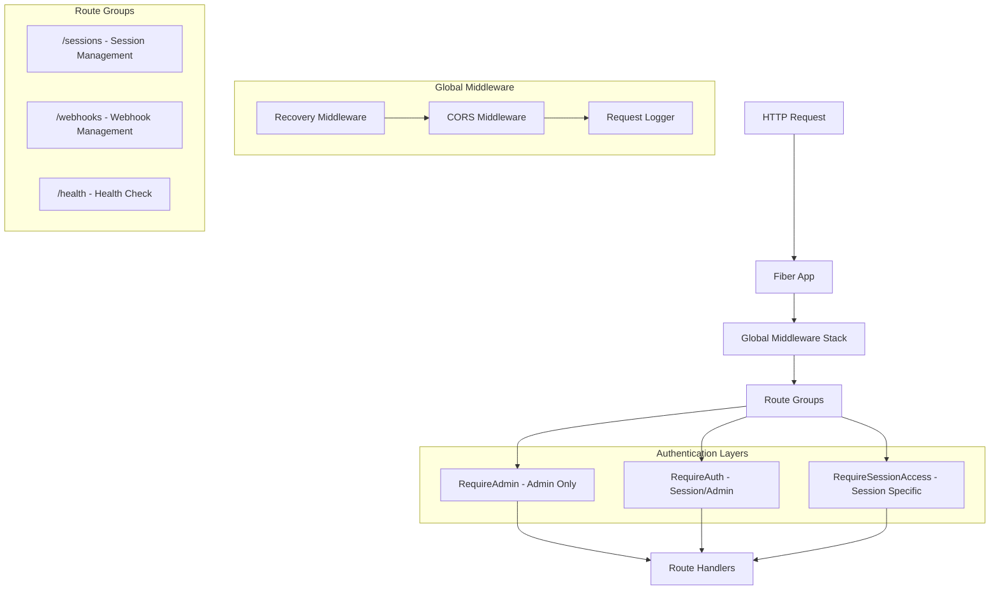
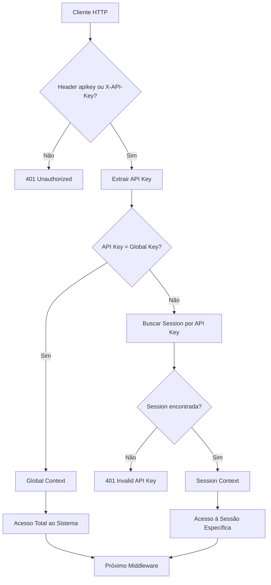
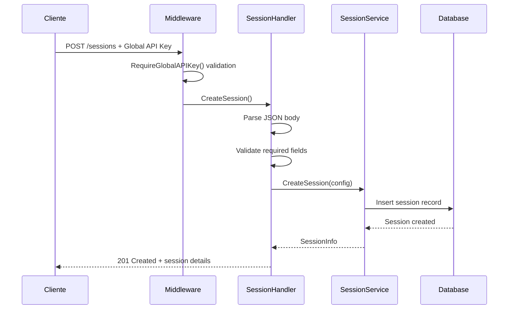
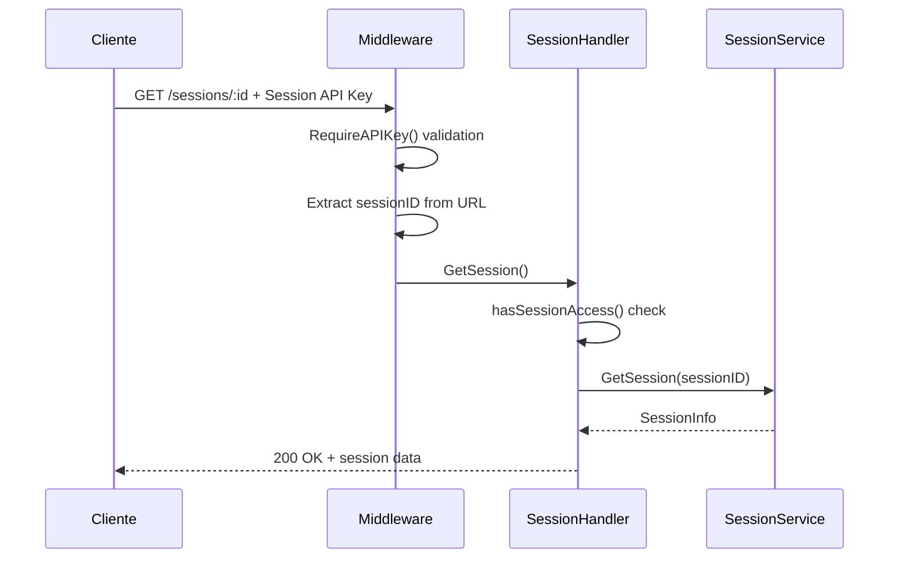
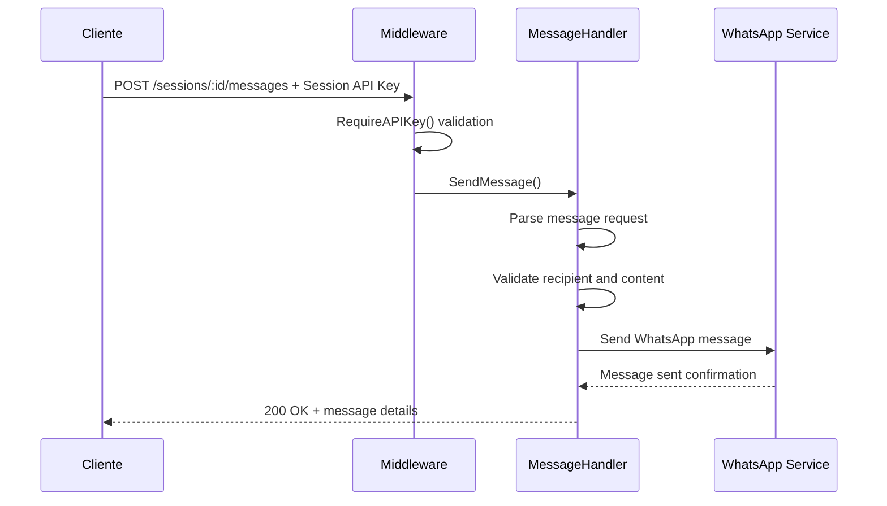

# Sistema de Construção de API Routers - zemeow

## Overview

O **zemeow** é um sistema backend robusto desenvolvido em Go para gerenciamento de múltiplas sessões do WhatsApp, utilizando uma arquitetura de API REST bem estruturada. O sistema implementa uma abordagem modular com separação clara de responsabilidades entre handlers, middleware e serviços, oferecendo uma API completa para automação de mensagens WhatsApp.

### Objetivos da Construção da API
- Implementar arquitetura de routers escalável e modular
- Configurar sistema de autenticação baseado em API keys por sessão
- Estabelecer padrões consistentes de endpoints REST
- Garantir controle de acesso granular por sessão
- Implementar tratamento de erros padronizado
- Configurar middleware stack otimizado

## Análise do Projeto Atual e Plano de Ajustes

### Estado Atual do Sistema

Após análise detalhada do código base do zemeow, identifiquei que o sistema possui uma estrutura sólida e bem organizada, mas requer ajustes específicos para alinhar com o design documentado.

#### Componentes Existentes e Status

| Componente | Status | Observações |
|------------|--------|-------------|
| **internal/config/config.go** | ✅ Completo | Configuração correta com ADMIN_API_KEY |
| **internal/service/session/** | ✅ Bem implementado | Service layer funcional e completo |
| **internal/db/** | ✅ Estruturado | Repository pattern implementado |
| **internal/api/server.go** | ⚠️ Requer ajustes | Usa middleware com nomes antigos |
| **internal/api/middleware/auth.go** | ⚠️ Requer ajustes | Não suporta header `apikey` |
| **internal/api/handlers/** | ⚠️ Requer ajustes | Terminologia inconsistente |
| **cmd/zemeow/main.go** | ❌ Ausente | Precisa ser criado |

### Gaps Identificados

#### 1. **Middleware de Autenticação**
- ❌ Método `extractAPIKey()` não suporta header `apikey`
- ❌ Usa `RequireAdmin()` em vez de `RequireGlobalAPIKey()`
- ❌ Usa `RequireAuth()` em vez de `RequireAPIKey()`
- ❌ AuthContext usa `IsAdmin` em vez de `IsGlobalKey`
- ❌ CORS não inclui header `apikey`

#### 2. **Handlers de API**
- ❌ SessionHandler verifica `authCtx.IsAdmin` em vez de `authCtx.IsGlobalKey`
- ❌ Mensagens de erro usam "ADMIN_REQUIRED" em vez de "GLOBAL_ACCESS_REQUIRED"
- ⚠️ Vários endpoints têm implementação mock (ConnectSession, QRCode, etc.)

#### 3. **Configuração de Rotas**
- ❌ Server.SetupRoutes usa `RequireAdmin()` e `RequireAuth()`
- ⚠️ Alguns grupos de middleware estão incorretos

#### 4. **Ponto de Entrada**
- ❌ Ausência de `cmd/zemeow/main.go`
- ❌ Sistema não pode ser executado atualmente

### Plano de Implementação Prioritário

#### **Fase 1: Fundação (Crítica)**
*Ajustes necessários para sistema funcionar*

##### 1.1 Atualizar AuthMiddleware
```go
// Prioridade: CRÍTICA
// Arquivo: internal/api/middleware/auth.go
// Mudanças:
- Atualizar extractAPIKey() para suportar header 'apikey'
- Renomear RequireAdmin() → RequireGlobalAPIKey()
- Renomear RequireAuth() → RequireAPIKey()  
- Atualizar AuthContext: IsAdmin → IsGlobalKey
- Atualizar mensagens de erro
- Incluir 'apikey' no CORS
```

##### 1.2 Atualizar Server.SetupRoutes
```go
// Prioridade: CRÍTICA
// Arquivo: internal/api/server.go
// Mudanças:
- sessions.Use(s.authMiddleware.RequireGlobalAPIKey())
- sessions.Use(s.authMiddleware.RequireAPIKey())
- webhooks.Use(s.authMiddleware.RequireGlobalAPIKey())
```

##### 1.3 Criar Main.go
```go
// Prioridade: CRÍTICA
// Arquivo: cmd/zemeow/main.go
// Implementar:
- Inicialização de configuração
- Setup de banco de dados
- Inicialização de serviços
- Startup do servidor HTTP
```

#### **Fase 2: Handlers (Alta)**
*Corrigir terminologia e implementar funcionalidades*

##### 2.1 Atualizar SessionHandler
```go
// Prioridade: ALTA
// Arquivo: internal/api/handlers/session.go
// Mudanças:
- authCtx.IsAdmin → authCtx.IsGlobalKey
- "ADMIN_REQUIRED" → "GLOBAL_ACCESS_REQUIRED"
- Implementar endpoints mock:
  * ConnectSession() - conectar WhatsApp
  * DisconnectSession() - desconectar
  * GetSessionQRCode() - obter QR real
  * PairPhone() - pareamento telefone
  * SetProxy() - configurar proxy
```

##### 2.2 Atualizar MessageHandler  
```go
// Prioridade: ALTA
// Arquivo: internal/api/handlers/message.go
// Mudanças:
- Implementar hasSessionAccess() corretamente
- Conectar com WhatsApp service real
- Melhorar validação de mensagens
```

##### 2.3 Atualizar WebhookHandler
```go
// Prioridade: ALTA  
// Arquivo: internal/api/handlers/webhook.go
// Mudanças:
- authCtx.IsAdmin → authCtx.IsGlobalKey
- Implementar funcionalidades reais de webhook
```

#### **Fase 3: Integrações (Média)**
*Conectar com serviços WhatsApp e melhorias*

##### 3.1 Integração WhatsApp Manager
```go
// Prioridade: MÉDIA
// Implementar:
- Conectar handlers com WhatsAppManager
- QR Code real via whatsmeow
- Status de conexão real
- Envio de mensagens real
```

##### 3.2 Sistema de Webhooks
```go
// Prioridade: MÉDIA
// Implementar:
- WebhookService funcional
- Queue de eventos
- Worker pool
- Retry mechanism
```

### Comandos de Build e Execução

#### Após Implementação da Fase 1:
```bash
# Build do projeto
go build -o zemeow cmd/zemeow/main.go

# Execução local
./zemeow

# Ou execução direta
go run cmd/zemeow/main.go
```

#### Variáveis de Ambiente Necessárias:
```bash
# Database
POSTGRES_HOST=localhost
POSTGRES_PORT=5432  
POSTGRES_DB=zemeow
POSTGRES_USER=zemeow
POSTGRES_PASSWORD=zemeow123

# Server
SERVER_PORT=8080
ENVIRONMENT=development

# Authentication (CRÍTICO)
ADMIN_API_KEY=sua_chave_global_segura

# Logging
LOG_LEVEL=info
LOG_PRETTY=true
```

### Testes de Validação Pós-Ajustes

#### 1. Testar Autenticação com Header `apikey`
```bash
# Criar sessão com Global API Key
curl -X POST http://localhost:8080/sessions \
  -H "apikey: sua_chave_global_segura" \
  -H "Content-Type: application/json" \
  -d '{"name": "teste-sessao"}'

# Deve retornar: session_id, api_key gerada
```

#### 2. Testar Operações de Sessão
```bash
# Obter detalhes com Session API Key
curl -X GET http://localhost:8080/sessions/[session_id] \
  -H "apikey: [session_api_key]"
```

#### 3. Testar Envio de Mensagem
```bash
# Enviar mensagem
curl -X POST http://localhost:8080/sessions/[session_id]/messages \
  -H "apikey: [session_api_key]" \
  -H "Content-Type: application/json" \
  -d '{
    "to": "5511999999999",
    "text": "Teste do sistema!"
  }'
```

### Estimativa de Tempo

| Fase | Tempo Estimado | Dependências |
|------|---------------|-------------|
| **Fase 1** | 4-6 horas | Nenhuma |
| **Fase 2** | 6-8 horas | Fase 1 completa |
| **Fase 3** | 8-12 horas | Fase 2 completa |
| **Total** | 18-26 horas | - |

### Riscos e Mitigações

| Risco | Probabilidade | Impacto | Mitigação |
|-------|--------------|---------|----------|
| Quebra de compatibilidade API | Baixa | Alto | Testes extensivos após Fase 1 |
| Problemas de integração WhatsApp | Média | Médio | Implementar mocks funcionais primeiro |
| Configuração de banco incorreta | Baixa | Alto | Validação na inicialização |

## Arquitetura de API Routers

### Estrutura de Rotas Implementada



### Organização de Endpoints por Grupos

#### 1. Session Management Group (`/sessions`)
```go
// Endpoints de gerenciamento global (RequireGlobalAPIKey middleware)
POST   /sessions                    // Criar nova sessão
GET    /sessions                    // Listar todas as sessões
GET    /sessions/active             // Listar conexões ativas

// Session-authenticated endpoints (RequireAPIKey middleware)  
GET    /sessions/:sessionId         // Detalhes da sessão
PUT    /sessions/:sessionId         // Atualizar sessão
DELETE /sessions/:sessionId         // Deletar sessão

// WhatsApp Connection endpoints
POST   /sessions/:sessionId/connect    // Conectar sessão
POST   /sessions/:sessionId/disconnect // Desconectar sessão
POST   /sessions/:sessionId/logout     // Logout da sessão
GET    /sessions/:sessionId/status     // Status da conexão
GET    /sessions/:sessionId/qr         // QR Code para autenticação
POST   /sessions/:sessionId/pairphone  // Pareamento por telefone
GET    /sessions/:sessionId/stats      // Estatísticas da sessão

// Proxy Configuration endpoints
POST   /sessions/:sessionId/proxy      // Configurar proxy
GET    /sessions/:sessionId/proxy      // Obter configuração proxy
POST   /sessions/:sessionId/proxy/test // Testar conectividade proxy

// Message Management endpoints
POST   /sessions/:sessionId/messages           // Enviar mensagem
GET    /sessions/:sessionId/messages           // Listar mensagens
POST   /sessions/:sessionId/messages/bulk      // Envio em lote
GET    /sessions/:sessionId/messages/:messageId/status // Status mensagem
```

#### 2. Webhook Management Group (`/webhooks`)
```go
// Endpoints de gerenciamento global (RequireGlobalAPIKey middleware)
POST   /webhooks/send               // Enviar webhook manual
GET    /webhooks/stats              // Estatísticas globais
POST   /webhooks/start              // Iniciar serviço webhook
POST   /webhooks/stop               // Parar serviço webhook
GET    /webhooks/status             // Status do serviço
GET    /webhooks/sessions/:sessionId/stats // Stats por sessão
```

#### 3. Health Check (`/health`)
```go
GET    /health                      // Health check básico
```

## Sistema de Autenticação Baseado em Sessões

### Arquitetura de API Keys



### Contexto de Autenticação

```go
type AuthContext struct {
    APIKey        string
    IsGlobalKey   bool
    SessionID     string
    HasGlobalAccess bool
}

// Métodos de extração de contexto
func GetAuthContext(c *fiber.Ctx) *AuthContext
func GetSessionInfo(c *fiber.Ctx) *SessionInfo  
func GetSessionID(c *fiber.Ctx) string
```

### Métodos de Autenticação por API Key

O sistema suporta três formas de envio da API key:

1. **Header `apikey`**: Método preferido e mais simples
   ```bash
   -H "apikey: sua_api_key_aqui"
   ```

2. **Header `X-API-Key`**: Método alternativo padrão
   ```bash
   -H "X-API-Key: sua_api_key_aqui"
   ```

3. **Header `Authorization`**: Compatibilidade com padrões REST (opcional)
   ```bash
   -H "Authorization: Bearer sua_api_key_aqui"
   ```

### Extração de API Key no Middleware

```go
// extractAPIKey extrai a API key dos headers
func (am *AuthMiddleware) extractAPIKey(c *fiber.Ctx) string {
    // Primeiro tentar header apikey (método preferido)
    if apiKey := c.Get("apikey"); apiKey != "" {
        return apiKey
    }
    
    // Segundo tentar X-API-Key header
    if apiKey := c.Get("X-API-Key"); apiKey != "" {
        return apiKey
    }
    
    // Terceiro tentar Authorization header
    token := c.Get("Authorization")
    if token != "" {
        // Remover prefixo "Bearer " se presente
        if strings.HasPrefix(token, "Bearer ") {
            return strings.TrimPrefix(token, "Bearer ")
        }
        return token
    }
    
    return ""
}
```

### Tipos de Middleware de Autenticação

#### 1. RequireGlobalAPIKey()
- **Propósito**: Endpoints de gerenciamento global do sistema
- **Validação**: Apenas Global API Key (ADMIN_API_KEY)
- **Uso**: Criação de sessões, listagem global, estatísticas globais

#### 2. RequireAPIKey()
- **Propósito**: Endpoints que requerem autenticação válida
- **Validação**: Global API Key OU Session API Key
- **Uso**: Operações de sessão, controle de conexão, mensagens

#### 3. RequireSessionAccess()
- **Propósito**: Verificação de acesso à sessão específica
- **Validação**: Global Key (acesso total) OU Session API Key correspondente
- **Uso**: Operações sensíveis por sessão

## Implementação de Handlers

### SessionHandler - Estrutura Completa

```go
type SessionHandler struct {
    sessionService session.Service
    logger         logger.Logger
}

// Métodos implementados
func (h *SessionHandler) CreateSession(c *fiber.Ctx) error
func (h *SessionHandler) GetSession(c *fiber.Ctx) error
func (h *SessionHandler) GetAllSessions(c *fiber.Ctx) error
func (h *SessionHandler) UpdateSession(c *fiber.Ctx) error
func (h *SessionHandler) DeleteSession(c *fiber.Ctx) error
func (h *SessionHandler) ConnectSession(c *fiber.Ctx) error
func (h *SessionHandler) DisconnectSession(c *fiber.Ctx) error
func (h *SessionHandler) GetSessionStatus(c *fiber.Ctx) error
func (h *SessionHandler) GetSessionQRCode(c *fiber.Ctx) error
func (h *SessionHandler) PairPhone(c *fiber.Ctx) error
func (h *SessionHandler) SetProxy(c *fiber.Ctx) error
func (h *SessionHandler) TestProxy(c *fiber.Ctx) error
func (h *SessionHandler) GetSessionStats(c *fiber.Ctx) error
```

### MessageHandler - Gerenciamento de Mensagens

```go
type MessageHandler struct {
    logger logger.Logger
}

// Estrutura de requisição padronizada
type SendMessageRequest struct {
    To      string `json:"to"`
    Type    string `json:"type"`
    Text    string `json:"text,omitempty"`
    Media   string `json:"media,omitempty"`
    Caption string `json:"caption,omitempty"`
}

// Métodos implementados
func (h *MessageHandler) SendMessage(c *fiber.Ctx) error
func (h *MessageHandler) GetMessages(c *fiber.Ctx) error
func (h *MessageHandler) GetMessageStatus(c *fiber.Ctx) error
func (h *MessageHandler) SendBulkMessages(c *fiber.Ctx) error
```

### WebhookHandler - Gerenciamento de Webhooks

```go
type WebhookHandler struct {
    logger logger.Logger
}

// Métodos implementados
func (h *WebhookHandler) SendWebhook(c *fiber.Ctx) error
func (h *WebhookHandler) GetWebhookStats(c *fiber.Ctx) error
func (h *WebhookHandler) GetSessionWebhookStats(c *fiber.Ctx) error
func (h *WebhookHandler) StartWebhookService(c *fiber.Ctx) error
func (h *WebhookHandler) StopWebhookService(c *fiber.Ctx) error
func (h *WebhookHandler) GetWebhookServiceStatus(c *fiber.Ctx) error
```

## Configuração do Servidor Fiber

### Configuração Otimizada

```go
app := fiber.New(fiber.Config{
    AppName:      "ZeMeow API",
    ServerHeader: "ZeMeow/1.0", 
    ReadTimeout:  30 * time.Second,
    WriteTimeout: 30 * time.Second,
    IdleTimeout:  120 * time.Second,
    ErrorHandler: globalErrorHandler,
})

func globalErrorHandler(c *fiber.Ctx, err error) error {
    code := fiber.StatusInternalServerError
    if e, ok := err.(*fiber.Error); ok {
        code = e.Code
    }

    return c.Status(code).JSON(fiber.Map{
        "error":     "INTERNAL_ERROR",
        "message":   err.Error(),
        "code":      code,
        "timestamp": time.Now().Unix(),
    })
}
```

### Stack de Middleware Global

```go
func (s *Server) SetupRoutes() {
    // Middleware stack ordenado por prioridade
    s.app.Use(recover.New())                    // 1. Panic recovery
    s.app.Use(s.authMiddleware.CORS())          // 2. CORS headers
    s.app.Use(s.authMiddleware.RequestLogger()) // 3. Request logging
    
    // Rate limiting pode ser adicionado aqui
    // s.app.Use(limiter.New(limiter.Config{...}))
}
```

## Padrões de Response e Tratamento de Erros

### Estrutura de Response Padronizada

#### Success Response
```json
{
    "session_id": "string",
    "status": "success|created|updated|deleted",
    "message": "Operation completed successfully",
    "data": { ... },
    "timestamp": 1672531200
}
```

#### Error Response  
```json
{
    "error": "ERROR_CODE",
    "message": "Human readable error message",
    "code": 400,
    "status": 400,
    "timestamp": 1672531200
}
```

### Códigos de Erro Padronizados

| Código HTTP | Error Code | Cenário |
|-------------|------------|---------|
| 400 | INVALID_JSON | Body JSON malformado |
| 400 | MISSING_FIELD | Campo obrigatório ausente |
| 401 | MISSING_API_KEY | API key não fornecida |
| 401 | INVALID_API_KEY | API key inválida |
| 403 | GLOBAL_ACCESS_REQUIRED | Acesso global necessário |
| 403 | ACCESS_DENIED | Acesso negado à sessão |
| 404 | SESSION_NOT_FOUND | Sessão não encontrada |
| 409 | SESSION_EXISTS | Sessão já existe |
| 500 | INTERNAL_ERROR | Erro interno do servidor |

### Helper Methods para Handlers

```go
// Método auxiliar para envio de erros
func (h *Handler) sendError(c *fiber.Ctx, message, code string, status int) error {
    errorResp := fiber.Map{
        "error":     code,
        "message":   message,
        "status":    status,
        "timestamp": time.Now().Unix(),
    }
    return c.Status(status).JSON(errorResp)
}

// Método auxiliar para verificação de acesso à sessão
func (h *Handler) hasSessionAccess(c *fiber.Ctx, sessionID string) bool {
    authCtx := middleware.GetAuthContext(c)
    if authCtx == nil {
        return false
    }
    
    // Global API Key tem acesso total
    if authCtx.IsGlobalKey {
        return true
    }
    
    // Verificar se a sessão corresponde
    return authCtx.SessionID == sessionID
}
```

## Fluxos de Implementação de Routers

### Fluxo de Criação de Sessão



### Fluxo de Operação de Sessão



### Fluxo de Envio de Mensagem



## Configuração de CORS e Rate Limiting

### CORS Configuration

```go
func (am *AuthMiddleware) CORS() fiber.Handler {
    return cors.New(cors.Config{
        AllowOrigins:     "*",
        AllowMethods:     "GET,POST,PUT,DELETE,OPTIONS",
        AllowHeaders:     "Origin,Content-Type,Accept,apikey,X-API-Key,Authorization",
        ExposeHeaders:    "Content-Length",
        AllowCredentials: false,
        MaxAge:           86400, // 24 hours
    })
}
```

### Rate Limiting Implementation

```go
func (am *AuthMiddleware) RateLimit() fiber.Handler {
    return limiter.New(limiter.Config{
        Max:               100,
        Expiration:        1 * time.Minute,
        KeyGenerator:      func(c *fiber.Ctx) string {
            // Rate limit por API Key quando disponível
            if apiKey := am.extractAPIKey(c); apiKey != "" {
                return apiKey
            }
            return c.IP()
        },
        LimitReached: func(c *fiber.Ctx) error {
            return c.Status(fiber.StatusTooManyRequests).JSON(fiber.Map{
                "error":   "RATE_LIMIT_EXCEEDED",
                "message": "Too many requests, please try again later",
            })
        },
    })
}
```

## Request Logging e Monitoramento

### Request Logger Middleware

```go
func (am *AuthMiddleware) RequestLogger() fiber.Handler {
    return func(c *fiber.Ctx) error {
        start := time.Now()
        
        // Process request
        err := c.Next()
        
        // Log request details
        am.logger.Info().
            Str("method", c.Method()).
            Str("path", c.Path()).
            Str("ip", c.IP()).
            Int("status", c.Response().StatusCode()).
            Dur("duration", time.Since(start)).
            Str("user_agent", c.Get("User-Agent")).
            Msg("HTTP request processed")
            
        return err
    }
}
```

### Health Check Endpoint

```go
func HealthCheck(c *fiber.Ctx) error {
    return c.Status(fiber.StatusOK).JSON(fiber.Map{
        "status":    "ok",
        "timestamp": time.Now().Unix(),
        "version":   "1.0.0",
        "uptime":    time.Since(startTime).Seconds(),
        "services": fiber.Map{
            "database":         "ok",
            "whatsapp_manager": "ok",
            "webhook_service":  "ok",
        },
    })
}
```

## Documentação de Endpoints Detalhada

### Session Management Endpoints

#### POST /sessions - Criar Nova Sessão
```bash
curl -X POST http://localhost:8080/sessions \
  -H "apikey: global_api_key" \
  -H "Content-Type: application/json" \
  -d '{
    "name": "minha-sessao",
    "api_key": "optional_custom_key",
    "proxy": {
      "enabled": true,
      "host": "proxy.example.com",
      "port": 8080,
      "type": "http"
    },
    "webhook": {
      "url": "https://webhook.example.com",
      "events": ["message", "status"]
    }
  }'
```

Response:
```json
{
  "session_id": "sess_abc123",
  "name": "minha-sessao", 
  "api_key": "generated_or_custom_key",
  "status": "created",
  "created_at": "2024-01-01T12:00:00Z",
  "message": "Session created successfully"
}
```

#### GET /sessions/:sessionId - Obter Detalhes da Sessão
```bash
curl -X GET http://localhost:8080/sessions/sess_abc123 \
  -H "apikey: session_api_key"
```

Response:
```json
{
  "id": "sess_abc123",
  "session_id": "sess_abc123",
  "name": "minha-sessao",
  "status": "connected",
  "jid": "5511999999999@s.whatsapp.net",
  "proxy": {
    "enabled": true,
    "status": "active"
  },
  "webhook": {
    "url": "https://webhook.example.com",
    "last_sent": "2024-01-01T12:00:00Z",
    "status": "active"
  },
  "created_at": "2024-01-01T12:00:00Z",
  "last_connected_at": "2024-01-01T12:05:00Z"
}
```

### WhatsApp Connection Endpoints

#### POST /sessions/:sessionId/connect - Conectar Sessão
```bash
curl -X POST http://localhost:8080/sessions/sess_abc123/connect \
  -H "apikey: session_api_key"
```

#### GET /sessions/:sessionId/qr - Obter QR Code
```bash
curl -X GET http://localhost:8080/sessions/sess_abc123/qr \
  -H "apikey: session_api_key"
```

### Message Endpoints

#### POST /sessions/:sessionId/messages - Enviar Mensagem
```bash
curl -X POST http://localhost:8080/sessions/sess_abc123/messages \
  -H "apikey: session_api_key" \
  -H "Content-Type: application/json" \
  -d '{
    "to": "5511999999999",
    "type": "text",
    "text": "Hello World!"
  }'
```

**Exemplo com diferentes tipos de mensagem:**
```bash
# Mensagem de texto simples
curl -X POST http://localhost:8080/sessions/sess_abc123/messages \
  -H "apikey: lsjdfkjlskdjlksjdlkjsldfk" \
  -H "Content-Type: application/json" \
  -d '{
    "to": "5511999999999",
    "text": "Hello World!"
  }'

# Mensagem com mídia
curl -X POST http://localhost:8080/sessions/sess_abc123/messages \
  -H "apikey: session_api_key" \
  -H "Content-Type: application/json" \
  -d '{
    "to": "5511999999999",
    "type": "image",
    "media": "https://example.com/image.jpg",
    "caption": "Descrição da imagem"
  }'