# Design de Refatoração do Sistema de Webhook

## Visão Geral

Este documento apresenta o design para refatorar completamente o sistema de webhook do zemeow para entregar exatamente os mesmos payloads fornecidos pela biblioteca whatsmeow, implementando suporte a todos os eventos disponíveis e garantindo compatibilidade total com as estruturas nativas da biblioteca.

## Princípios Fundamentais da Refatoração

### Zero Interferência nos Dados
O sistema refatorado segue o princípio de **zero interferência** nos dados originais da whatsmeow:

1. **Passagem Direta**: Eventos da whatsmeow são passados diretamente sem qualquer modificação
2. **Serialização Automática**: Utiliza apenas o JSON encoder nativo do Go
3. **Sem Transformações**: Nenhuma lógica de transformação ou mapeamento manual
4. **Preservação Total**: Todas as propriedades, tipos e estruturas são mantidas

### Exemplo de Fluxo Sem Interferência
```go
// Evento original da whatsmeow
messageEvent := &events.Message{
    Info: types.MessageInfo{
        ID: "msg_123",
        Timestamp: time.Now(),
        Sender: jid,
        // ... todos os campos originais
    },
    Message: &waProto.Message{
        // ... estrutura completa do protobuf
    },
}

// Criação do payload sem modificar o evento
directPayload := &DirectWebhookPayload{
    SessionID:    "session_123",
    EventType:    "*events.Message",
    RawEventData: messageEvent, // <- Evento original INALTERADO
    // ... metadados mínimos
}

// Serialização automática pelo Go
jsonBytes, err := json.Marshal(directPayload)
// O JSON resultante contém EXATAMENTE a estrutura original da whatsmeow
```

## Problemas Identificados no Sistema Atual

### 1. Cobertura Limitada de Eventos
O sistema atual suporta apenas eventos básicos:
- `connected`, `disconnected`, `message`, `receipt`, `presence`, `chat_presence`
- `undecryptable_message`, `group_info`, `call_offer`, `call_accept`, `call_terminate`
- `app_state`, `history_sync`, `qr`, `pair_success`, `stream_error`, `connect_failure`

### 2. Payload Processado Inconsistente
- Transformações manuais dos dados originais
- Perda de informações importantes dos eventos
- Estruturas customizadas diferentes dos tipos nativos do whatsmeow

### 3. Arquitetura de Evento Centralizada
- Processamento manual de cada tipo de evento
- Switch case extenso para diferentes tipos
- Dificuldade para adicionar novos eventos

## Eventos Disponíveis no whatsmeow

### Eventos de Conexão
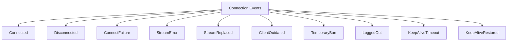

### Eventos de Mensagem
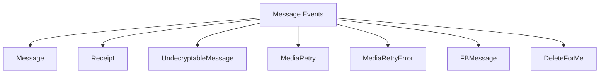

### Eventos de Autenticação
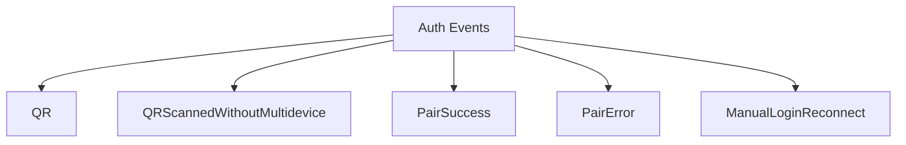

### Eventos de Presença
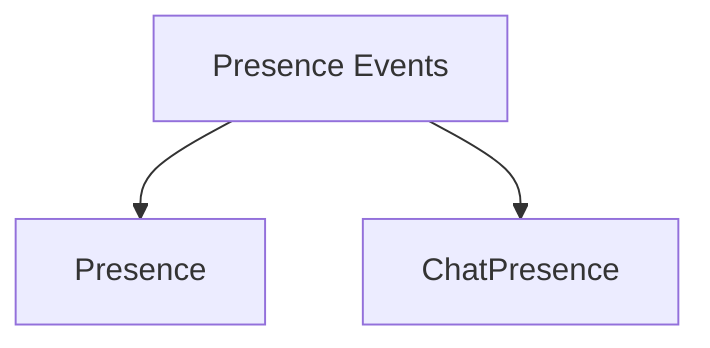

### Eventos de Chamadas
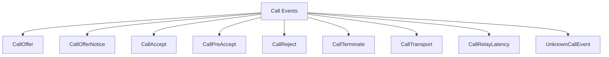

### Eventos de Grupos
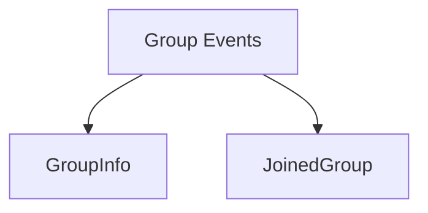

### Eventos de Configuração
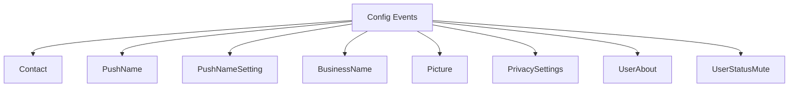

### Eventos de Estado da Aplicação
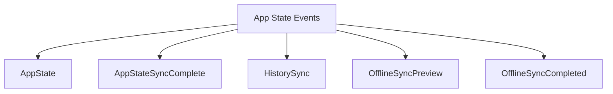

### Eventos de Chat
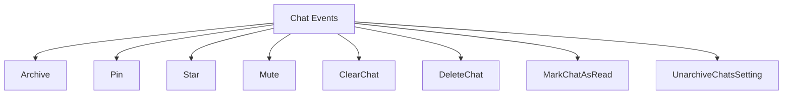

### Eventos de Newsletter
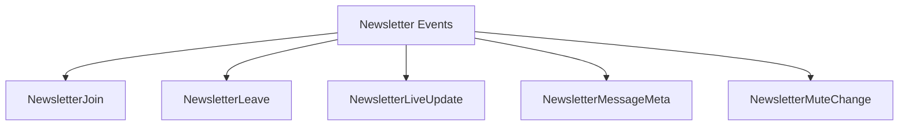

### Eventos de Bloqueio
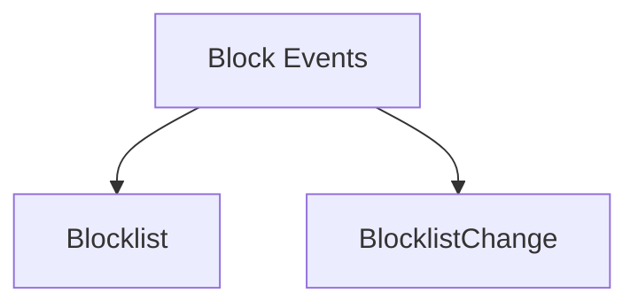

### Eventos de Etiquetas
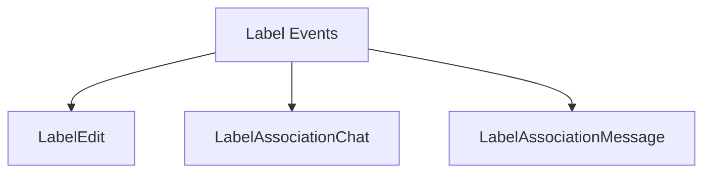

### Eventos de Identidade
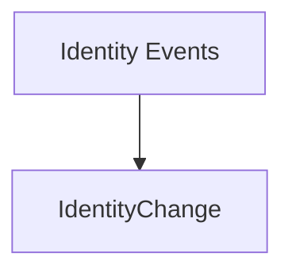

### Eventos de Erro
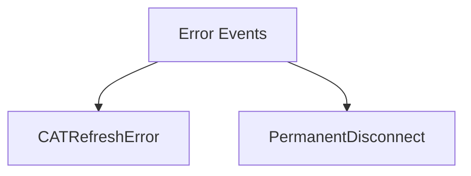

## Arquitetura Refatorada

### 1. Sistema de Reflexão para Eventos Automáticos

```mermaid
classDiagram
    class EventRegistry {
        +map[string]EventDescriptor events
        +RegisterEvent(name string, desc EventDescriptor)
        +GetAllEvents() []EventDescriptor
        +IsSupported(eventType string) bool
    }
    
    class EventDescriptor {
        +string Name
        +string Type
        +string Category
        +bool Enabled
        +string Description
    }
    
    class AutoEventHandler {
        +handleEvent(evt interface{}) 
        +getEventType(evt interface{}) string
        +createRawPayload(evt interface{}) RawWebhookPayload
    }
    
    EventRegistry --> EventDescriptor
    AutoEventHandler --> EventRegistry
```

### 2. Payload Nativo Raw

```mermaid
classDiagram
    class NativeWebhookPayload {
        +string SessionID
        +string EventType
        +json.RawMessage RawEventData
        +EventMetadata EventMeta
        +time.Time Timestamp
        +string PayloadType
    }
    
    class EventMetadata {
        +string WhatsmeowVersion
        +string ProtocolVersion
        +string SessionJID
        +string DeviceInfo
        +string GoVersion
        +string EventTypeName
        +map[string]interface{} AdditionalFields
    }
    
    NativeWebhookPayload --> EventMetadata
```

### 3. Sistema de Categorização de Eventos

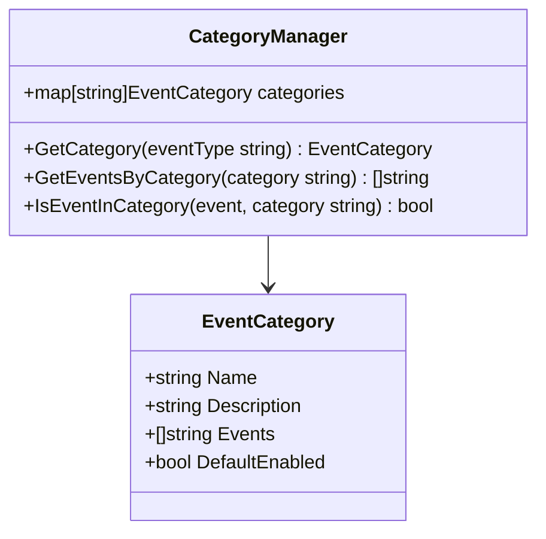

## Implementação Sem Interferência nos Dados

### 1. Registry de Eventos Completo

```go
type EventRegistry struct {
    events map[string]EventDescriptor
    categories map[string]EventCategory
    mu sync.RWMutex
}

type EventDescriptor struct {
    Name        string `json:"name"`
    Type        string `json:"type"`
    Category    string `json:"category"`
    Enabled     bool   `json:"enabled"`
    Description string `json:"description"`
    Example     string `json:"example,omitempty"`
}

func NewEventRegistry() *EventRegistry {
    registry := &EventRegistry{
        events:     make(map[string]EventDescriptor),
        categories: make(map[string]EventCategory),
    }
    
    registry.registerAllEvents()
    return registry
}

func (r *EventRegistry) registerAllEvents() {
    // Connection Events
    r.RegisterEvent("*events.Connected", EventDescriptor{
        Name: "connected", Type: "*events.Connected", Category: "connection",
        Enabled: true, Description: "Fired when WhatsApp connection is established",
    })
    
    r.RegisterEvent("*events.Disconnected", EventDescriptor{
        Name: "disconnected", Type: "*events.Disconnected", Category: "connection",
        Enabled: true, Description: "Fired when WhatsApp connection is lost",
    })
    
    // Message Events
    r.RegisterEvent("*events.Message", EventDescriptor{
        Name: "message", Type: "*events.Message", Category: "messages",
        Enabled: true, Description: "Fired when a message is received",
    })
    
    r.RegisterEvent("*events.Receipt", EventDescriptor{
        Name: "receipt", Type: "*events.Receipt", Category: "messages",
        Enabled: true, Description: "Fired when message receipt is received",
    })
    
    // Auth Events
    r.RegisterEvent("*events.QR", EventDescriptor{
        Name: "qr", Type: "*events.QR", Category: "authentication",
        Enabled: true, Description: "Fired when QR code is generated",
    })
    
    r.RegisterEvent("*events.PairSuccess", EventDescriptor{
        Name: "pair_success", Type: "*events.PairSuccess", Category: "authentication",
        Enabled: true, Description: "Fired when pairing is successful",
    })
    
    // Call Events
    r.RegisterEvent("*events.CallOffer", EventDescriptor{
        Name: "call_offer", Type: "*events.CallOffer", Category: "calls",
        Enabled: true, Description: "Fired when incoming call is received",
    })
    
    // Group Events
    r.RegisterEvent("*events.GroupInfo", EventDescriptor{
        Name: "group_info", Type: "*events.GroupInfo", Category: "groups",
        Enabled: true, Description: "Fired when group information changes",
    })
    
    // [Continuar com todos os eventos...]
}
```

### 2. Handler Direto Sem Transformações

```go
type DirectEventHandler struct {
    registry     *EventRegistry
    webhookChan  chan<- DirectWebhookPayload
    sessionID    string
    sessionMeta  EventMetadata
    logger       logger.Logger
}

func (h *DirectEventHandler) HandleEvent(evt interface{}) {
    eventType := h.getEventTypeName(evt)
    
    if !h.registry.IsSupported(eventType) {
        h.logger.Debug().Str("event_type", eventType).Msg("Unsupported event type")
        return
    }
    
    descriptor := h.registry.GetEvent(eventType)
    if !descriptor.Enabled {
        h.logger.Debug().Str("event_type", eventType).Msg("Event type disabled")
        return
    }
    
    // Criar payload direto com evento original sem modificações
    directPayload := CreateDirectPayload(
        h.sessionID,
        eventType,
        descriptor.Name,
        descriptor.Category,
        evt, // Evento exato da whatsmeow sem qualquer transformação
        h.sessionMeta,
    )
    
    // Enviar diretamente para canal de webhook
    select {
    case h.webhookChan <- *directPayload:
        h.logger.Debug().
            Str("event_type", eventType).
            Str("event_name", descriptor.Name).
            Msg("Direct native event sent")
    default:
        h.logger.Warn().Str("event_type", eventType).Msg("Webhook channel full")
    }
}

func (h *DirectEventHandler) getEventTypeName(evt interface{}) string {
    return fmt.Sprintf("%T", evt)
}
```

### 3. Payload Nativo Sem Serialização

```go
type NativeWebhookEvent struct {
    SessionID     string      `json:"session_id"`
    EventType     string      `json:"event_type"`
    EventName     string      `json:"event_name"`
    Category      string      `json:"category"`
    RawEventData  interface{} `json:"raw_event_data"` // Dados exatos da whatsmeow sem modificação
    EventMeta     EventMetadata `json:"event_meta"`
    Timestamp     time.Time   `json:"timestamp"`
    PayloadType   string      `json:"payload_type"`
}

// Sem serialização - o JSON encoder do Go irá serializar automaticamente
// mantendo a estrutura exata da whatsmeow
type DirectWebhookPayload = NativeWebhookEvent

// Função para criar payload direto sem transformações
func CreateDirectPayload(sessionID, eventType, eventName, category string, rawEvent interface{}, meta EventMetadata) *DirectWebhookPayload {
    return &DirectWebhookPayload{
        SessionID:    sessionID,
        EventType:    eventType,
        EventName:    eventName,
        Category:     category,
        RawEventData: rawEvent, // Estrutura original da whatsmeow sem alterações
        EventMeta:    meta,
        Timestamp:    time.Now(),
        PayloadType:  "native_raw",
    }
}
```

### 4. Metadados Mínimos

```go
type EventMetadata struct {
    WhatsmeowVersion string `json:"whatsmeow_version"`
    SessionJID       string `json:"session_jid"`
    ServerTimestamp  string `json:"server_timestamp"`
    SessionName      string `json:"session_name"`
}

func (s *WebhookService) createMinimalEventMetadata(session *models.Session) EventMetadata {
    var sessionJID string
    if session.JID != nil {
        sessionJID = *session.JID
    }
    
    return EventMetadata{
        WhatsmeowVersion: "v0.0.0-20250611130243",
        SessionJID:       sessionJID,
        ServerTimestamp:  time.Now().UTC().Format(time.RFC3339),
        SessionName:      session.Name,
    }
}
```

### 5. Estrutura de Banco de Dados Simplificada

```sql
-- Tabela webhooks separada para configurações
CREATE TABLE webhooks (
    id UUID PRIMARY KEY DEFAULT gen_random_uuid(),
    session_id VARCHAR(255) NOT NULL UNIQUE,
    webhook_url TEXT NOT NULL,
    events TEXT[] NOT NULL, -- Array de eventos habilitados
    raw_mode BOOLEAN NOT NULL DEFAULT true, -- true = native_raw, false = processed
    created_at TIMESTAMP WITH TIME ZONE DEFAULT NOW(),
    updated_at TIMESTAMP WITH TIME ZONE DEFAULT NOW(),
    
    -- Índices para performance
    CONSTRAINT fk_webhooks_session FOREIGN KEY (session_id) REFERENCES sessions(id) ON DELETE CASCADE
);

-- Índice para busca rápida por session_id
CREATE INDEX idx_webhooks_session_id ON webhooks(session_id);

-- Trigger para atualizar updated_at automaticamente
CREATE OR REPLACE FUNCTION update_webhook_updated_at()
RETURNS TRIGGER AS $$
BEGIN
    NEW.updated_at = NOW();
    RETURN NEW;
END;
$$ language 'plpgsql';

CREATE TRIGGER trigger_update_webhook_updated_at
    BEFORE UPDATE ON webhooks
    FOR EACH ROW
    EXECUTE FUNCTION update_webhook_updated_at();
```

### 6. Modelo Go para Webhook

```go
type Webhook struct {
    ID         uuid.UUID         `json:"id" db:"id"`
    SessionID  string            `json:"session_id" db:"session_id"`
    WebhookURL string            `json:"webhook_url" db:"webhook_url"`
    Events     pq.StringArray    `json:"events" db:"events"`
    RawMode    bool              `json:"raw_mode" db:"raw_mode"`
    CreatedAt  time.Time         `json:"created_at" db:"created_at"`
    UpdatedAt  time.Time         `json:"updated_at" db:"updated_at"`
}

// WebhookRepository interface
type WebhookRepository interface {
    Create(webhook *Webhook) error
    GetBySessionID(sessionID string) (*Webhook, error)
    Update(webhook *Webhook) error
    Delete(sessionID string) error
    Exists(sessionID string) (bool, error)
}

// WebhookCreateRequest DTO
type WebhookCreateRequest struct {
    WebhookURL string   `json:"webhook_url" validate:"required,url"`
    Events     []string `json:"events" validate:"required,min=1"`
    RawMode    bool     `json:"raw_mode"`
}
```

### 7. Implementação do Repository

```go
type webhookRepository struct {
    db     *sqlx.DB
    logger logger.Logger
}

func NewWebhookRepository(db *sqlx.DB) WebhookRepository {
    return &webhookRepository{
        db:     db,
        logger: logger.GetWithSession("webhook_repository"),
    }
}

func (r *webhookRepository) Create(webhook *Webhook) error {
    query := `
        INSERT INTO webhooks (session_id, webhook_url, events, raw_mode)
        VALUES ($1, $2, $3, $4)
        RETURNING id, created_at, updated_at`
    
    err := r.db.QueryRow(query, webhook.SessionID, webhook.WebhookURL, 
                        pq.Array(webhook.Events), webhook.RawMode).
                        Scan(&webhook.ID, &webhook.CreatedAt, &webhook.UpdatedAt)
    
    if err != nil {
        r.logger.Error().Err(err).Str("session_id", webhook.SessionID).Msg("Failed to create webhook")
        return fmt.Errorf("failed to create webhook: %w", err)
    }
    
    r.logger.Info().Str("webhook_id", webhook.ID.String()).Str("session_id", webhook.SessionID).Msg("Webhook created successfully")
    return nil
}

func (r *webhookRepository) GetBySessionID(sessionID string) (*Webhook, error) {
    webhook := &Webhook{}
    query := `
        SELECT id, session_id, webhook_url, events, raw_mode, created_at, updated_at
        FROM webhooks 
        WHERE session_id = $1`
    
    err := r.db.Get(webhook, query, sessionID)
    if err != nil {
        if err == sql.ErrNoRows {
            return nil, nil // Não encontrado
        }
        r.logger.Error().Err(err).Str("session_id", sessionID).Msg("Failed to get webhook")
        return nil, fmt.Errorf("failed to get webhook: %w", err)
    }
    
    return webhook, nil
}

func (r *webhookRepository) Update(webhook *Webhook) error {
    query := `
        UPDATE webhooks 
        SET webhook_url = $2, events = $3, raw_mode = $4, updated_at = NOW()
        WHERE session_id = $1
        RETURNING updated_at`
    
    err := r.db.QueryRow(query, webhook.SessionID, webhook.WebhookURL,
                        pq.Array(webhook.Events), webhook.RawMode).
                        Scan(&webhook.UpdatedAt)
    
    if err != nil {
        r.logger.Error().Err(err).Str("session_id", webhook.SessionID).Msg("Failed to update webhook")
        return fmt.Errorf("failed to update webhook: %w", err)
    }
    
    r.logger.Info().Str("session_id", webhook.SessionID).Msg("Webhook updated successfully")
    return nil
}

func (r *webhookRepository) Delete(sessionID string) error {
    query := `DELETE FROM webhooks WHERE session_id = $1`
    
    result, err := r.db.Exec(query, sessionID)
    if err != nil {
        r.logger.Error().Err(err).Str("session_id", sessionID).Msg("Failed to delete webhook")
        return fmt.Errorf("failed to delete webhook: %w", err)
    }
    
    rowsAffected, _ := result.RowsAffected()
    if rowsAffected == 0 {
        return fmt.Errorf("webhook not found for session: %s", sessionID)
    }
    
    r.logger.Info().Str("session_id", sessionID).Msg("Webhook deleted successfully")
    return nil
}

func (r *webhookRepository) Exists(sessionID string) (bool, error) {
    var count int
    query := `SELECT COUNT(*) FROM webhooks WHERE session_id = $1`
    
    err := r.db.Get(&count, query, sessionID)
    if err != nil {
        r.logger.Error().Err(err).Str("session_id", sessionID).Msg("Failed to check webhook existence")
        return false, fmt.Errorf("failed to check webhook existence: %w", err)
    }
    
    return count > 0, nil
}
```

### 8. Handler Simplificado

```go
type WebhookHandler struct {
    logger           logger.Logger
    webhookRepo      WebhookRepository
    sessionRepo      repositories.SessionRepository
    eventRegistry    *EventRegistry
}

func NewWebhookHandler(webhookRepo WebhookRepository, sessionRepo repositories.SessionRepository, eventRegistry *EventRegistry) *WebhookHandler {
    return &WebhookHandler{
        logger:        logger.GetWithSession("webhook_handler"),
        webhookRepo:   webhookRepo,
        sessionRepo:   sessionRepo,
        eventRegistry: eventRegistry,
    }
}

// @Summary Listar eventos disponíveis
// @Description Retorna todos os eventos disponíveis para configuração de webhooks
// @Tags webhooks
// @Accept json
// @Produce json
// @Security ApiKeyAuth
// @Param sessionId path string true "ID da sessão"
// @Success 200 {object} map[string]interface{} "Lista de eventos disponíveis"
// @Router /sessions/{sessionId}/webhooks/events [get]
func (h *WebhookHandler) GetAvailableEvents(c *fiber.Ctx) error {
    sessionID := c.Params("sessionId")
    
    if !utils.HasSessionAccess(c, sessionID) {
        return utils.SendAccessDeniedError(c)
    }
    
    events := h.eventRegistry.GetAllEvents()
    categories := h.eventRegistry.GetCategories()
    
    return utils.SendSuccess(c, fiber.Map{
        "events": events,
        "categories": categories,
        "payload_modes": fiber.Map{
            "native_raw": fiber.Map{
                "description": "Payload nativo idêntico à estrutura whatsmeow",
                "format": "Estrutura original exata sem qualquer modificação",
                "compatibility": "100% idêntico à whatsmeow",
                "serialization": "JSON automático do Go sem interferência manual",
            },
            "processed": fiber.Map{
                "description": "Payload processado (modo legado)",
                "format": "Estrutura customizada simplificada",
                "compatibility": "Compatibilidade com versões anteriores",
            },
        },
        "total_events": len(events),
        "total_categories": len(categories),
    })
}

// @Summary Configurar webhook
// @Description Configura webhook para uma sessão
// @Tags webhooks
// @Accept json
// @Produce json
// @Security ApiKeyAuth
// @Param sessionId path string true "ID da sessão"
// @Param request body WebhookCreateRequest true "Configuração do webhook"
// @Success 200 {object} map[string]interface{} "Webhook configurado com sucesso"
// @Router /sessions/{sessionId}/webhooks/set [post]
func (h *WebhookHandler) SetWebhook(c *fiber.Ctx) error {
    sessionID := c.Params("sessionId")
    
    if !utils.HasSessionAccess(c, sessionID) {
        return utils.SendAccessDeniedError(c)
    }
    
    var req WebhookCreateRequest
    if err := c.BodyParser(&req); err != nil {
        return utils.SendInvalidJSONError(c)
    }
    
    // Validar eventos
    for _, event := range req.Events {
        if !h.eventRegistry.IsSupported(event) {
            return utils.SendError(c, fmt.Sprintf("Invalid event: %s", event), "INVALID_EVENT", fiber.StatusBadRequest)
        }
    }
    
    // Verificar se sessão existe
    _, err := h.sessionRepo.GetByIdentifier(sessionID)
    if err != nil {
        return utils.SendError(c, "Session not found", "SESSION_NOT_FOUND", fiber.StatusNotFound)
    }
    
    // Verificar se já existe webhook
    existingWebhook, err := h.webhookRepo.GetBySessionID(sessionID)
    if err != nil {
        return utils.SendError(c, "Failed to check existing webhook", "DATABASE_ERROR", fiber.StatusInternalServerError)
    }
    
    webhook := &Webhook{
        SessionID:  sessionID,
        WebhookURL: req.WebhookURL,
        Events:     pq.StringArray(req.Events),
        RawMode:    req.RawMode,
    }
    
    if existingWebhook != nil {
        // Atualizar webhook existente
        webhook.ID = existingWebhook.ID
        webhook.CreatedAt = existingWebhook.CreatedAt
        err = h.webhookRepo.Update(webhook)
    } else {
        // Criar novo webhook
        err = h.webhookRepo.Create(webhook)
    }
    
    if err != nil {
        h.logger.Error().Err(err).Str("session_id", sessionID).Msg("Failed to save webhook")
        return utils.SendError(c, "Failed to save webhook configuration", "WEBHOOK_SAVE_FAILED", fiber.StatusInternalServerError)
    }
    
    h.logger.Info().
        Str("session_id", sessionID).
        Str("webhook_url", req.WebhookURL).
        Strs("events", req.Events).
        Bool("raw_mode", req.RawMode).
        Msg("Webhook configured successfully")
    
    return utils.SendSuccess(c, fiber.Map{
        "message": "Webhook configured successfully",
        "webhook": webhook,
    })
}

// @Summary Buscar webhook configurado
// @Description Retorna a configuração atual do webhook da sessão
// @Tags webhooks
// @Accept json
// @Produce json
// @Security ApiKeyAuth
// @Param sessionId path string true "ID da sessão"
// @Success 200 {object} map[string]interface{} "Configuração do webhook"
// @Router /sessions/{sessionId}/webhooks/find [get]
func (h *WebhookHandler) FindWebhook(c *fiber.Ctx) error {
    sessionID := c.Params("sessionId")
    
    if !utils.HasSessionAccess(c, sessionID) {
        return utils.SendAccessDeniedError(c)
    }
    
    webhook, err := h.webhookRepo.GetBySessionID(sessionID)
    if err != nil {
        return utils.SendError(c, "Failed to get webhook configuration", "DATABASE_ERROR", fiber.StatusInternalServerError)
    }
    
    if webhook == nil {
        return utils.SendSuccess(c, fiber.Map{
            "webhook": nil,
            "message": "No webhook configured for this session",
        })
    }
    
    return utils.SendSuccess(c, fiber.Map{
        "webhook": webhook,
    })
}
```

## Migração do Sistema Atual

### Remoção de Colunas da Tabela Sessions

```sql
-- Remover colunas webhook da tabela sessions
ALTER TABLE sessions 
DROP COLUMN IF EXISTS webhook_url,
DROP COLUMN IF EXISTS webhook_events,
DROP COLUMN IF EXISTS webhook_payload_mode;
```

### Migração de Dados Existentes

```sql
-- Migrar dados existentes da tabela sessions para a nova tabela webhooks
INSERT INTO webhooks (session_id, webhook_url, events, raw_mode)
SELECT 
    id as session_id,
    webhook_url,
    COALESCE(webhook_events, ARRAY[]::TEXT[]) as events,
    CASE 
        WHEN webhook_payload_mode = 'raw' OR webhook_payload_mode = 'native_raw' THEN true
        ELSE false
    END as raw_mode
FROM sessions 
WHERE webhook_url IS NOT NULL AND webhook_url != '';
```

### Fluxo de Dados Simplificado

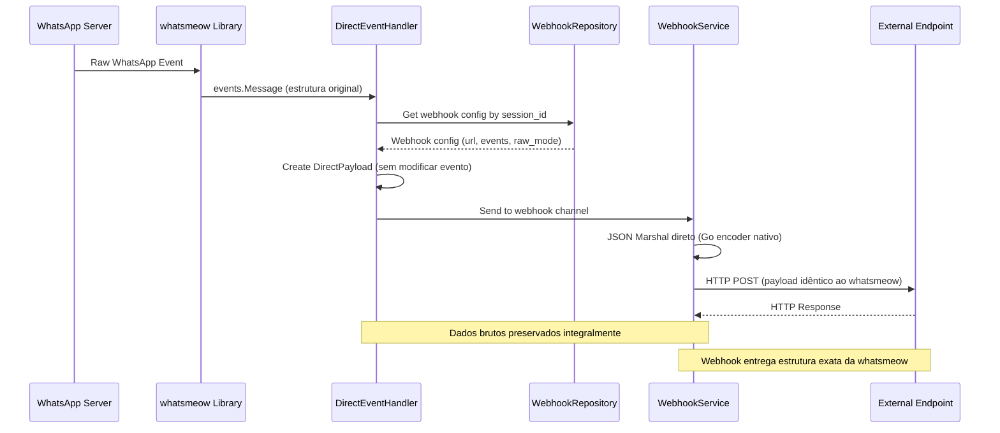

## API Endpoints Simplificados

### 1. Listar Eventos Disponíveis
```
GET /sessions/{sessionId}/webhooks/events
```

Retorna todos os eventos disponíveis para configuração de webhooks:

```json
{
  "events": [
    {
      "name": "message",
      "type": "*events.Message",
      "category": "messages",
      "enabled": true,
      "description": "Fired when a message is received"
    },
    {
      "name": "receipt",
      "type": "*events.Receipt",
      "category": "messages",
      "enabled": true,
      "description": "Fired when message receipt is received"
    },
    {
      "name": "connected",
      "type": "*events.Connected",
      "category": "connection",
      "enabled": true,
      "description": "Fired when WhatsApp connection is established"
    }
    // ... todos os outros eventos
  ],
  "categories": {
    "connection": ["connected", "disconnected", "connect_failure"],
    "messages": ["message", "receipt", "undecryptable_message"],
    "authentication": ["qr", "pair_success", "pair_error"],
    "calls": ["call_offer", "call_accept", "call_terminate"],
    "groups": ["group_info", "joined_group"],
    "presence": ["presence", "chat_presence"],
    "app_state": ["app_state", "history_sync"],
    "chat_management": ["archive", "pin", "star", "mute"],
    "newsletters": ["newsletter_join", "newsletter_leave"],
    "blocking": ["blocklist", "blocklist_change"],
    "labels": ["label_edit", "label_association"],
    "media": ["media_retry", "picture"],
    "identity": ["identity_change"],
    "errors": ["stream_error", "permanent_disconnect"]
  },
  "payload_modes": {
    "native_raw": {
      "description": "Payload nativo idêntico à estrutura whatsmeow",
      "format": "Estrutura original exata sem qualquer modificação",
      "compatibility": "100% idêntico à whatsmeow",
      "serialization": "JSON automático do Go sem interferência manual"
    },
    "processed": {
      "description": "Payload processado (modo legado)",
      "format": "Estrutura customizada simplificada",
      "compatibility": "Compatibilidade com versões anteriores"
    }
  },
  "total_events": 45,
  "total_categories": 12
}
```

### 2. Configurar Webhook
```
POST /sessions/{sessionId}/webhooks/set
```

Configura webhook para a sessão:

**Request:**
```json
{
  "webhook_url": "https://api.exemplo.com/webhook",
  "events": ["message", "receipt", "connected"],
  "raw_mode": true
}
```

**Response:**
```json
{
  "success": true,
  "message": "Webhook configured successfully",
  "webhook": {
    "id": "uuid-generated",
    "session_id": "session_123",
    "webhook_url": "https://api.exemplo.com/webhook",
    "events": ["message", "receipt", "connected"],
    "raw_mode": true,
    "created_at": "2024-01-15T10:00:00Z",
    "updated_at": "2024-01-15T10:00:00Z"
  },
  "timestamp": "2024-01-15T10:00:00Z"
}
```

### 3. Buscar Configuração de Webhook
```
GET /sessions/{sessionId}/webhooks/find
```

Retorna a configuração atual do webhook da sessão:

**Response:**
```json
{
  "success": true,
  "webhook": {
    "id": "uuid-generated",
    "session_id": "session_123",
    "webhook_url": "https://api.exemplo.com/webhook",
    "events": ["message", "receipt", "connected"],
    "raw_mode": true,
    "created_at": "2024-01-15T10:00:00Z",
    "updated_at": "2024-01-15T10:00:00Z"
  },
  "timestamp": "2024-01-15T10:00:00Z"
}
```

**Response quando não há webhook configurado:**
```json
{
  "success": true,
  "webhook": null,
  "message": "No webhook configured for this session",
  "timestamp": "2024-01-15T10:00:00Z"
}
```

## Integração com o Sistema Existente

### Atualização do WebhookService

```go
type WebhookService struct {
    mu           sync.RWMutex
    client       *http.Client
    webhookRepo  WebhookRepository
    config       *config.Config
    logger       logger.Logger
    ctx          context.Context
    cancel       context.CancelFunc
    queue        chan DirectWebhookPayload
    retryQueue   chan DirectWebhookPayload
    workers      int
    stats        WebhookServiceStats
}

func (s *WebhookService) processEvent(event meow.WebhookEvent) error {
    webhook, err := s.webhookRepo.GetBySessionID(event.SessionID)
    if err != nil {
        return fmt.Errorf("failed to get webhook config: %w", err)
    }
    
    if webhook == nil {
        s.logger.Debug().Str("session_id", event.SessionID).Msg("No webhook configured")
        return nil
    }
    
    if !s.isEventEnabled(event.Event, webhook.Events) {
        s.logger.Debug().Str("session_id", event.SessionID).Str("event", event.Event).Msg("Event not enabled")
        return nil
    }
    
    // Criar payload direto baseado no modo configurado
    if webhook.RawMode {
        return s.processEventRaw(event, webhook)
    } else {
        return s.processEventProcessed(event, webhook)
    }
}

func (s *WebhookService) processEventRaw(event meow.WebhookEvent, webhook *Webhook) error {
    // Criar payload direto com dados originais da whatsmeow
    directPayload := DirectWebhookPayload{
        SessionID:    event.SessionID,
        EventType:    event.EventType,
        EventName:    event.Event,
        Category:     s.getEventCategory(event.EventType),
        RawEventData: event.RawEventData, // Dados exatos da whatsmeow
        EventMeta: EventMetadata{
            WhatsmeowVersion: "v0.0.0-20250611130243",
            SessionJID:       webhook.SessionID,
            ServerTimestamp:  time.Now().UTC().Format(time.RFC3339),
            SessionName:      webhook.SessionID,
        },
        Timestamp:   event.Timestamp,
        PayloadType: "native_raw",
        URL:         webhook.WebhookURL,
    }
    
    return s.SendDirectWebhook(directPayload)
}

func (s *WebhookService) SendDirectWebhook(payload DirectWebhookPayload) error {
    select {
    case s.queue <- payload:
        s.logger.Debug().
            Str("session_id", payload.SessionID).
            Str("event_type", payload.EventType).
            Msg("Direct webhook queued")
        return nil
    default:
        return fmt.Errorf("webhook queue is full")
    }
}

func (s *WebhookService) sendHTTPWebhook(payload DirectWebhookPayload) error {
    // Serialização automática pelo JSON encoder do Go
    // Mantém estrutura exata da whatsmeow em RawEventData
    jsonData, err := json.Marshal(payload)
    if err != nil {
        return fmt.Errorf("failed to marshal payload: %w", err)
    }
    
    req, err := http.NewRequestWithContext(s.ctx, "POST", payload.URL, bytes.NewBuffer(jsonData))
    if err != nil {
        return fmt.Errorf("failed to create request: %w", err)
    }
    
    req.Header.Set("Content-Type", "application/json")
    req.Header.Set("User-Agent", "ZeMeow-Webhook/2.0")
    req.Header.Set("X-Webhook-Event", payload.EventName)
    req.Header.Set("X-Session-ID", payload.SessionID)
    req.Header.Set("X-Event-Type", payload.EventType)
    req.Header.Set("X-Payload-Type", payload.PayloadType)
    
    start := time.Now()
    resp, err := s.client.Do(req)
    if err != nil {
        return fmt.Errorf("failed to send request: %w", err)
    }
    defer resp.Body.Close()
    
    duration := time.Since(start)
    
    if resp.StatusCode < 200 || resp.StatusCode >= 300 {
        return fmt.Errorf("webhook returned status %d", resp.StatusCode)
    }
    
    s.logger.Info().
        Str("session_id", payload.SessionID).
        Str("event_type", payload.EventType).
        Str("url", payload.URL).
        Int("status", resp.StatusCode).
        Dur("duration", duration).
        Msg("Direct webhook sent successfully")
    
    return nil
}
```

## Benefícios da Refatoração

### 1. Compatibilidade Total com Zero Interferência
- Payloads 100% idênticos aos fornecidos pela whatsmeow
- Nenhuma serialização manual ou transformação
- JSON gerado automaticamente pelo encoder nativo do Go
- Estruturas de dados preservadas exatamente como na biblioteca original

### 2. Escalabilidade
- Suporte automático a novos eventos da whatsmeow
- Sistema de registro dinâmico
- Configuração flexível por categoria

### 3. Manutenibilidade
- Redução significativa de código personalizado
- Handler único para todos os eventos
- Eliminação de lógica de serialização manual

### 4. Performance Máxima
- Eliminação total de transformações desnecessárias
- Passagem direta dos objetos nativos
- Menor latência no processamento
- Zero overhead de serialização manual

### 5. Observabilidade
- Metadados mínimos necessários
- Categorização clara dos eventos
- Estatísticas de uso por tipo de evento