# Design de Refatoração do Sistema de Webhook

## Visão Geral

Este documento apresenta o design para refatorar completamente o sistema de webhook do zemeow para entregar exatamente os mesmos payloads fornecidos pela biblioteca whatsmeow, implementando suporte a todos os eventos disponíveis e garantindo compatibilidade total com as estruturas nativas da biblioteca.

## Princípios Fundamentais da Refatoração

### Zero Interferência nos Dados
O sistema refatorado segue o princípio de **zero interferência** nos dados originais da whatsmeow:

1. **Passagem Direta**: Eventos da whatsmeow são passados diretamente sem qualquer modificação
2. **Serialização Automática**: Utiliza apenas o JSON encoder nativo do Go
3. **Sem Transformações**: Nenhuma lógica de transformação ou mapeamento manual
4. **Preservação Total**: Todas as propriedades, tipos e estruturas são mantidas

### Exemplo de Fluxo Sem Interferência
```go
// Evento original da whatsmeow
messageEvent := &events.Message{
    Info: types.MessageInfo{
        ID: "msg_123",
        Timestamp: time.Now(),
        Sender: jid,
        // ... todos os campos originais
    },
    Message: &waProto.Message{
        // ... estrutura completa do protobuf
    },
}

// Criação do payload sem modificar o evento
directPayload := &DirectWebhookPayload{
    SessionID:    "session_123",
    EventType:    "*events.Message",
    RawEventData: messageEvent, // <- Evento original INALTERADO
    // ... metadados mínimos
}

// Serialização automática pelo Go
jsonBytes, err := json.Marshal(directPayload)
// O JSON resultante contém EXATAMENTE a estrutura original da whatsmeow
```

## Problemas Identificados no Sistema Atual

### 1. Cobertura Limitada de Eventos
O sistema atual suporta apenas eventos básicos:
- `connected`, `disconnected`, `message`, `receipt`, `presence`, `chat_presence`
- `undecryptable_message`, `group_info`, `call_offer`, `call_accept`, `call_terminate`
- `app_state`, `history_sync`, `qr`, `pair_success`, `stream_error`, `connect_failure`

### 2. Payload Processado Inconsistente
- Transformações manuais dos dados originais
- Perda de informações importantes dos eventos
- Estruturas customizadas diferentes dos tipos nativos do whatsmeow

### 3. Arquitetura de Evento Centralizada
- Processamento manual de cada tipo de evento
- Switch case extenso para diferentes tipos
- Dificuldade para adicionar novos eventos

## Eventos Disponíveis no whatsmeow

### Eventos de Conexão
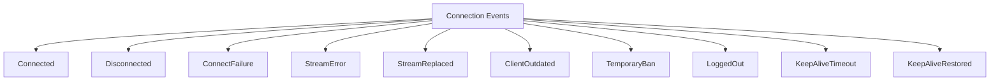

### Eventos de Mensagem
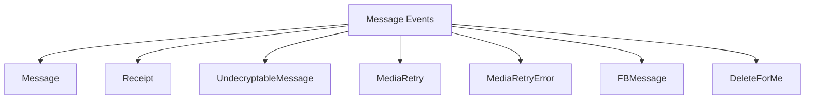

### Eventos de Autenticação
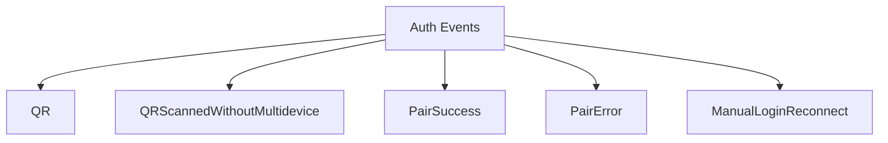

### Eventos de Presença
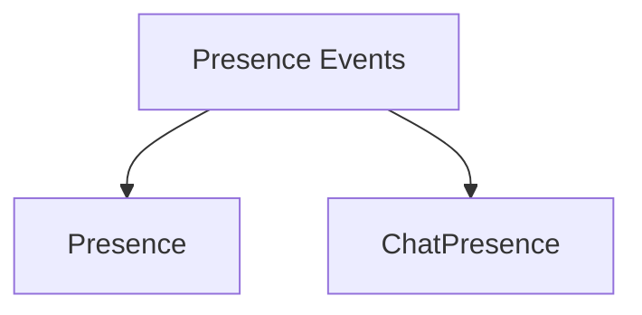

### Eventos de Chamadas
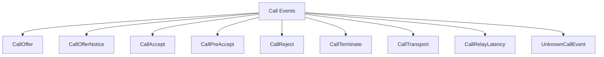

### Eventos de Grupos
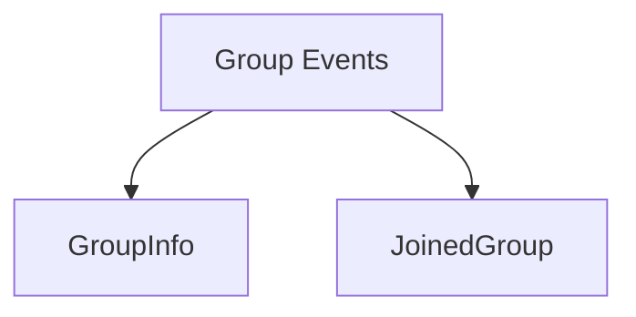

### Eventos de Configuração
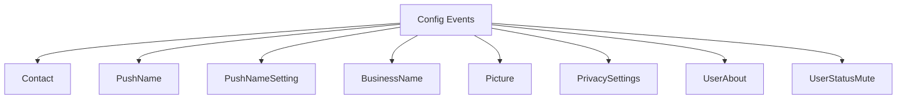

### Eventos de Estado da Aplicação
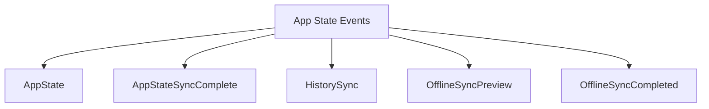

### Eventos de Chat
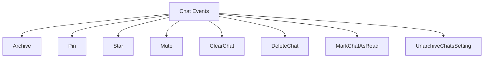

### Eventos de Newsletter
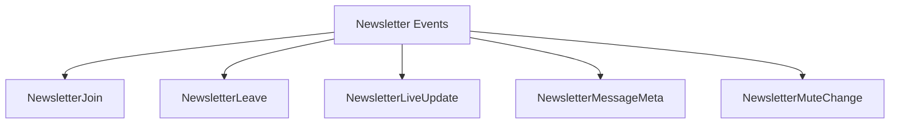

### Eventos de Bloqueio
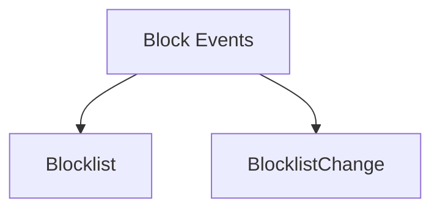

### Eventos de Etiquetas
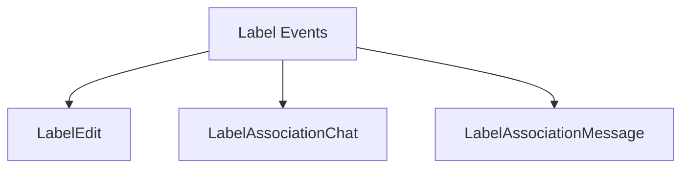

### Eventos de Identidade
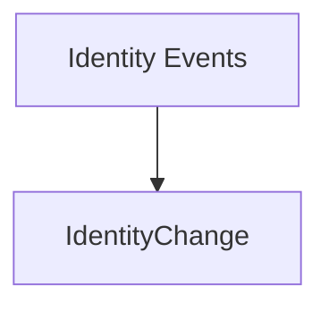

### Eventos de Erro
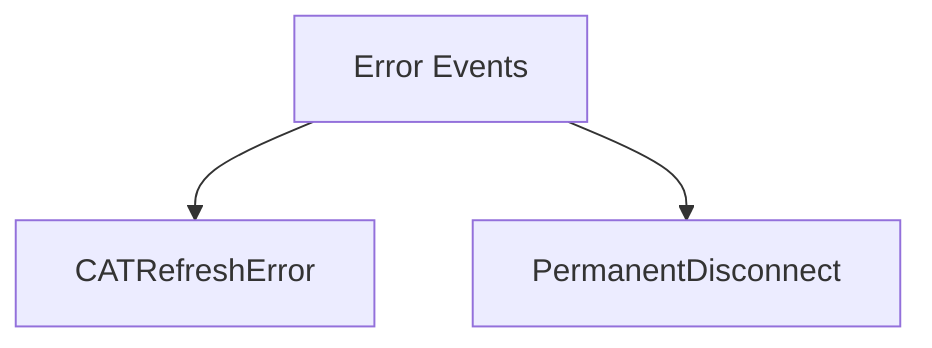

## Arquitetura Refatorada

### 1. Sistema de Reflexão para Eventos Automáticos

```mermaid
classDiagram
    class EventRegistry {
        +map[string]EventDescriptor events
        +RegisterEvent(name string, desc EventDescriptor)
        +GetAllEvents() []EventDescriptor
        +IsSupported(eventType string) bool
    }
    
    class EventDescriptor {
        +string Name
        +string Type
        +string Category
        +bool Enabled
        +string Description
    }
    
    class AutoEventHandler {
        +handleEvent(evt interface{}) 
        +getEventType(evt interface{}) string
        +createRawPayload(evt interface{}) RawWebhookPayload
    }
    
    EventRegistry --> EventDescriptor
    AutoEventHandler --> EventRegistry
```

### 2. Payload Nativo Raw

```mermaid
classDiagram
    class NativeWebhookPayload {
        +string SessionID
        +string EventType
        +json.RawMessage RawEventData
        +EventMetadata EventMeta
        +time.Time Timestamp
        +string PayloadType
    }
    
    class EventMetadata {
        +string WhatsmeowVersion
        +string ProtocolVersion
        +string SessionJID
        +string DeviceInfo
        +string GoVersion
        +string EventTypeName
        +map[string]interface{} AdditionalFields
    }
    
    NativeWebhookPayload --> EventMetadata
```

### 3. Sistema de Categorização de Eventos

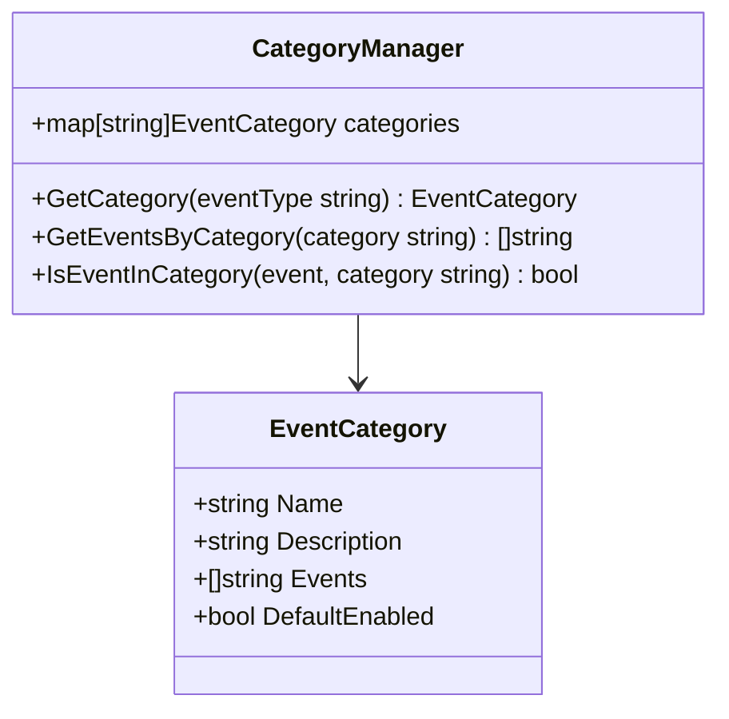

## Implementação Sem Interferência nos Dados

### 1. Registry de Eventos Completo

```go
type EventRegistry struct {
    events map[string]EventDescriptor
    categories map[string]EventCategory
    mu sync.RWMutex
}

type EventDescriptor struct {
    Name        string `json:"name"`
    Type        string `json:"type"`
    Category    string `json:"category"`
    Enabled     bool   `json:"enabled"`
    Description string `json:"description"`
    Example     string `json:"example,omitempty"`
}

func NewEventRegistry() *EventRegistry {
    registry := &EventRegistry{
        events:     make(map[string]EventDescriptor),
        categories: make(map[string]EventCategory),
    }
    
    registry.registerAllEvents()
    return registry
}

func (r *EventRegistry) registerAllEvents() {
    // Connection Events
    r.RegisterEvent("*events.Connected", EventDescriptor{
        Name: "connected", Type: "*events.Connected", Category: "connection",
        Enabled: true, Description: "Fired when WhatsApp connection is established",
    })
    
    r.RegisterEvent("*events.Disconnected", EventDescriptor{
        Name: "disconnected", Type: "*events.Disconnected", Category: "connection",
        Enabled: true, Description: "Fired when WhatsApp connection is lost",
    })
    
    // Message Events
    r.RegisterEvent("*events.Message", EventDescriptor{
        Name: "message", Type: "*events.Message", Category: "messages",
        Enabled: true, Description: "Fired when a message is received",
    })
    
    r.RegisterEvent("*events.Receipt", EventDescriptor{
        Name: "receipt", Type: "*events.Receipt", Category: "messages",
        Enabled: true, Description: "Fired when message receipt is received",
    })
    
    // Auth Events
    r.RegisterEvent("*events.QR", EventDescriptor{
        Name: "qr", Type: "*events.QR", Category: "authentication",
        Enabled: true, Description: "Fired when QR code is generated",
    })
    
    r.RegisterEvent("*events.PairSuccess", EventDescriptor{
        Name: "pair_success", Type: "*events.PairSuccess", Category: "authentication",
        Enabled: true, Description: "Fired when pairing is successful",
    })
    
    // Call Events
    r.RegisterEvent("*events.CallOffer", EventDescriptor{
        Name: "call_offer", Type: "*events.CallOffer", Category: "calls",
        Enabled: true, Description: "Fired when incoming call is received",
    })
    
    // Group Events
    r.RegisterEvent("*events.GroupInfo", EventDescriptor{
        Name: "group_info", Type: "*events.GroupInfo", Category: "groups",
        Enabled: true, Description: "Fired when group information changes",
    })
    
    // [Continuar com todos os eventos...]
}
```

### 2. Handler Direto Sem Transformações

```go
type DirectEventHandler struct {
    registry     *EventRegistry
    webhookChan  chan<- DirectWebhookPayload
    sessionID    string
    sessionMeta  EventMetadata
    logger       logger.Logger
}

func (h *DirectEventHandler) HandleEvent(evt interface{}) {
    eventType := h.getEventTypeName(evt)
    
    if !h.registry.IsSupported(eventType) {
        h.logger.Debug().Str("event_type", eventType).Msg("Unsupported event type")
        return
    }
    
    descriptor := h.registry.GetEvent(eventType)
    if !descriptor.Enabled {
        h.logger.Debug().Str("event_type", eventType).Msg("Event type disabled")
        return
    }
    
    // Criar payload direto com evento original sem modificações
    directPayload := CreateDirectPayload(
        h.sessionID,
        eventType,
        descriptor.Name,
        descriptor.Category,
        evt, // Evento exato da whatsmeow sem qualquer transformação
        h.sessionMeta,
    )
    
    // Enviar diretamente para canal de webhook
    select {
    case h.webhookChan <- *directPayload:
        h.logger.Debug().
            Str("event_type", eventType).
            Str("event_name", descriptor.Name).
            Msg("Direct native event sent")
    default:
        h.logger.Warn().Str("event_type", eventType).Msg("Webhook channel full")
    }
}

func (h *DirectEventHandler) getEventTypeName(evt interface{}) string {
    return fmt.Sprintf("%T", evt)
}
```

### 3. Payload Nativo Sem Serialização

```go
type NativeWebhookEvent struct {
    SessionID     string      `json:"session_id"`
    EventType     string      `json:"event_type"`
    EventName     string      `json:"event_name"`
    Category      string      `json:"category"`
    RawEventData  interface{} `json:"raw_event_data"` // Dados exatos da whatsmeow sem modificação
    EventMeta     EventMetadata `json:"event_meta"`
    Timestamp     time.Time   `json:"timestamp"`
    PayloadType   string      `json:"payload_type"`
}

// Sem serialização - o JSON encoder do Go irá serializar automaticamente
// mantendo a estrutura exata da whatsmeow
type DirectWebhookPayload = NativeWebhookEvent

// Função para criar payload direto sem transformações
func CreateDirectPayload(sessionID, eventType, eventName, category string, rawEvent interface{}, meta EventMetadata) *DirectWebhookPayload {
    return &DirectWebhookPayload{
        SessionID:    sessionID,
        EventType:    eventType,
        EventName:    eventName,
        Category:     category,
        RawEventData: rawEvent, // Estrutura original da whatsmeow sem alterações
        EventMeta:    meta,
        Timestamp:    time.Now(),
        PayloadType:  "native_raw",
    }
}
```

### 4. Metadados Mínimos

```go
type EventMetadata struct {
    WhatsmeowVersion string `json:"whatsmeow_version"`
    SessionJID       string `json:"session_jid"`
    ServerTimestamp  string `json:"server_timestamp"`
    SessionName      string `json:"session_name"`
}

func (s *WebhookService) createMinimalEventMetadata(session *models.Session) EventMetadata {
    var sessionJID string
    if session.JID != nil {
        sessionJID = *session.JID
    }
    
    return EventMetadata{
        WhatsmeowVersion: "v0.0.0-20250611130243",
        SessionJID:       sessionJID,
        ServerTimestamp:  time.Now().UTC().Format(time.RFC3339),
        SessionName:      session.Name,
    }
}
```

### 5. Configuração Simplificada

```go
type WebhookConfiguration struct {
    URL              string   `json:"url"`
    Active           bool     `json:"active"`
    PayloadMode      string   `json:"payload_mode"` // "native_raw", "processed", "both"
    EnabledEvents    []string `json:"enabled_events"`
    EnabledCategories []string `json:"enabled_categories"`
}

// Modos de payload disponíveis
const (
    PayloadModeNativeRaw = "native_raw"  // Estrutura exata da whatsmeow
    PayloadModeProcessed = "processed"    // Formato legado processado
    PayloadModeBoth      = "both"         // Ambos os formatos
)

// Configuração de retry permanece a mesma do sistema atual
type RetryConfiguration struct {
    MaxRetries      int           `json:"max_retries"`
    BackoffStrategy string        `json:"backoff_strategy"`
    BaseDelay       time.Duration `json:"base_delay"`
    MaxDelay        time.Duration `json:"max_delay"`
    JitterEnabled   bool          `json:"jitter_enabled"`
}
```

## Fluxo de Dados Direto

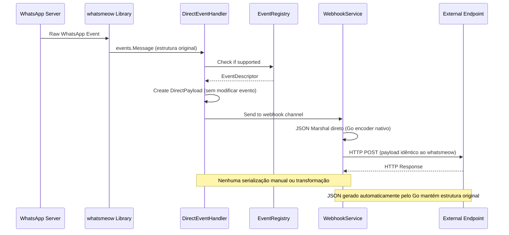

## Compatibilidade com Modo Legado

```go
// Camada de compatibilidade apenas para modo legado
// O modo nativo não usa esta camada - envia diretamente
func (c *CompatibilityLayer) ConvertToLegacyFormat(directEvent DirectWebhookPayload) WebhookPayload {
    // Esta função só é chamada quando payload_mode = "processed" ou "both"
    // Para payload_mode = "native_raw", o DirectWebhookPayload é enviado sem conversão
    
    switch directEvent.EventType {
    case "*events.Message":
        msg := directEvent.RawEventData.(*events.Message)
        return WebhookPayload{
            SessionID: directEvent.SessionID,
            Event:     "message",
            Data: map[string]interface{}{
                "session_id": directEvent.SessionID,
                "message_id": msg.Info.ID,
                "from":       msg.Info.Sender.String(),
                "chat":       msg.Info.Chat.String(),
                "timestamp":  msg.Info.Timestamp.Unix(),
                "message":    msg.Message,
            },
            Timestamp: directEvent.Timestamp,
        }
    // [Outros eventos apenas para compatibilidade legada...]
    default:
        // Para eventos não mapeados, usar estrutura original
        return WebhookPayload{
            SessionID: directEvent.SessionID,
            Event:     directEvent.EventName,
            Data:      directEvent.RawEventData, // Estrutura whatsmeow original
            Timestamp: directEvent.Timestamp,
        }
    }
}
```

## API Endpoints Atualizados

### 1. Listar Eventos Disponíveis
```
GET /webhooks/events
```

Resposta expandida:
```json
{
  "events": [
    {
      "name": "message",
      "type": "*events.Message",
      "category": "messages",
      "enabled": true,
      "description": "Fired when a message is received",
      "example": "Webhook sent when user receives any message"
    }
  ],
  "categories": {
    "connection": ["connected", "disconnected", "connect_failure"],
    "messages": ["message", "receipt", "undecryptable_message"],
    "authentication": ["qr", "pair_success", "pair_error"],
    "calls": ["call_offer", "call_accept", "call_terminate"],
    "groups": ["group_info", "joined_group"],
    "presence": ["presence", "chat_presence"],
    "app_state": ["app_state", "history_sync"],
    "chat_management": ["archive", "pin", "star", "mute"],
    "newsletters": ["newsletter_join", "newsletter_leave"],
    "blocking": ["blocklist", "blocklist_change"],
    "labels": ["label_edit", "label_association"],
    "media": ["media_retry", "picture"],
    "identity": ["identity_change"],
    "errors": ["stream_error", "permanent_disconnect"]
  },
  "payload_modes": {
    "native_raw": {
      "description": "Payload nativo idêntico à estrutura whatsmeow",
      "format": "Estrutura original exata sem qualquer modificação",
      "compatibility": "100% idêntico à whatsmeow",
      "serialization": "JSON automático do Go sem interferência manual"
    },
    "processed": {
      "description": "Payload processado (modo legado)",
      "format": "Estrutura customizada simplificada",
      "compatibility": "Compatibilidade com versões anteriores"
    },
    "both": {
      "description": "Ambos os formatos enviados",
      "format": "Dois webhooks separados",
      "compatibility": "Máxima e legado"
    }
  },
  "statistics": {
    "total_events": 45,
    "total_categories": 12,
    "enabled_by_default": 25
  }
}
```

### 2. Configurar Webhook Avançado
```
POST /webhooks/sessions/{sessionId}/configure
```

Request expandido:
```json
{
  "url": "https://api.exemplo.com/webhook",
  "active": true,
  "payload_mode": "native_raw",
  "configuration": {
    "enabled_events": ["message", "receipt"],
    "enabled_categories": ["messages", "calls"],
    "filters": {
      "include_categories": ["messages"],
      "exclude_events": ["history_sync"],
      "custom_filters": {
        "min_importance": "high"
      }
    },
    "retry_config": {
      "max_retries": 5,
      "backoff_strategy": "exponential",
      "base_delay": "2s",
      "max_delay": "60s",
      "jitter_enabled": true
    }
  }
}
```

## Migração Gradual

### Fase 1: Implementação Paralela
- Manter sistema atual funcionando
- Implementar novo sistema em paralelo
- Adicionar flag `use_native_webhooks` na configuração

### Fase 2: Modo Híbrido
- Permitir configuração por sessão do modo de payload
- Suporte a ambos os formatos simultaneamente
- Documentação clara das diferenças

### Fase 3: Migração Completa
- Deprecar modo legado
- Mover todas as sessões para modo nativo
- Remover código legado após período de transição

## Benefícios da Refatoração

### 1. Compatibilidade Total com Zero Interferência
- Payloads 100% idênticos aos fornecidos pela whatsmeow
- Nenhuma serialização manual ou transformação
- JSON gerado automaticamente pelo encoder nativo do Go
- Estruturas de dados preservadas exatamente como na biblioteca original

### 2. Escalabilidade
- Suporte automático a novos eventos da whatsmeow
- Sistema de registro dinâmico
- Configuração flexível por categoria

### 3. Manutenibilidade
- Redução significativa de código personalizado
- Handler único para todos os eventos
- Eliminação de lógica de serialização manual

### 4. Performance Máxima
- Eliminação total de transformações desnecessárias
- Passagem direta dos objetos nativos
- Menor latência no processamento
- Zero overhead de serialização manual

### 5. Observabilidade
- Metadados mínimos necessários
- Categorização clara dos eventos
- Estatísticas de uso por tipo de evento