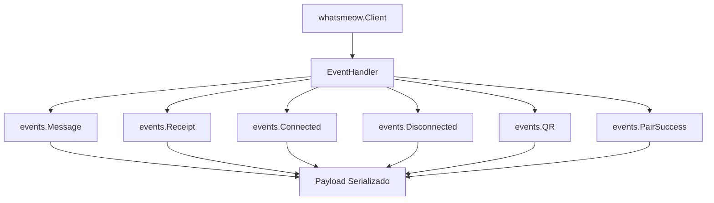
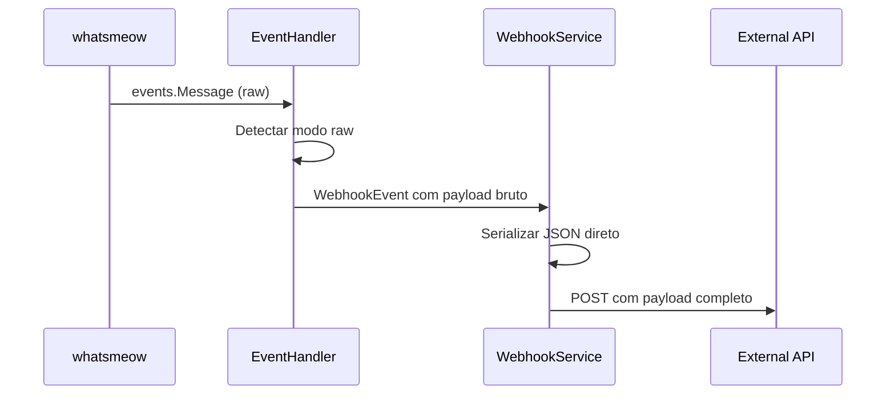

# Pesquisa: Payload WhatsmeOw e Implementação de Webhook com Dados Brutos

## Overview

Este documento detalha a pesquisa sobre a estrutura de payload da biblioteca `whatsmeow` e como implementar webhooks que recebam dados brutos (sem serialização interna) dos eventos do WhatsApp. O objetivo é permitir que aplicações externas recebam os payloads originais da `whatsmeow` através de webhooks, mantendo a estrutura completa dos dados sem transformações intermediárias.

## Arquitetura Atual do Sistema

### Estrutura de Eventos da WhatsmeOw

A biblioteca `whatsmeow` emite eventos através do tipo `events.Event`, que contém diferentes tipos de eventos do WhatsApp:



### Tipos de Eventos Principais

| Evento | Descrição | Payload Principal |
|--------|-----------|-------------------|
| `events.Message` | Mensagem recebida/enviada | `v.Message` (estrutura completa) |
| `events.Receipt` | Confirmação de entrega/leitura | `v.MessageInfo` + `v.Receipt` |
| `events.Connected` | Conexão estabelecida | Status de conexão |
| `events.Disconnected` | Conexão perdida | Motivo da desconexão |
| `events.QR` | Código QR gerado | `v.Codes` (array de strings) |
| `events.PairSuccess` | Pareamento bem-sucedido | `v.ID`, `v.BusinessName`, `v.Platform` |

### Estrutura Atual de Payload do Sistema

O sistema atual serializa os eventos em uma estrutura personalizada:

```go
type WebhookEvent struct {
    SessionID string      `json:"session_id"`
    Event     string      `json:"event"`
    Data      interface{} `json:"data"`
    Timestamp time.Time   `json:"timestamp"`
}

type WebhookPayload struct {
    SessionID   string                 `json:"session_id"`
    Event       string                 `json:"event"`
    Data        interface{}            `json:"data,omitempty"`
    Timestamp   time.Time              `json:"timestamp"`
    Metadata    map[string]interface{} `json:"metadata,omitempty"`
}
```

## Limitações da Abordagem Atual

### Serialização Interna
A implementação atual aplica transformações nos dados originais:

```go
// Exemplo da serialização atual (events.Message)
c.sendWebhookEvent("message", map[string]interface{}{
    "session_id": c.sessionID,
    "message_id": v.Info.ID,
    "from":       v.Info.Sender.String(),
    "chat":       v.Info.Chat.String(),
    "timestamp":  v.Info.Timestamp.Unix(),
    "message":    v.Message, // Estrutura complexa simplificada
})
```

### Problemas Identificados

1. **Perda de Dados**: Informações detalhadas são omitidas na serialização
2. **Estrutura Simplificada**: Campos aninhados são "achatados"
3. **Tipos Convertidos**: Tipos específicos (JID, Timestamp) são convertidos para strings/números
4. **Metadados Perdidos**: Informações de contexto da `whatsmeow` são descartadas

## Estrutura Completa do Payload WhatsmeOw

### events.Message - Estrutura Completa

```go
type Message struct {
    Info types.MessageInfo // Metadados completos da mensagem
    Message *waProto.Message // Payload bruto do protocolo WhatsApp
    RawMessage *waProto.WebMessageInfo // Mensagem completa não processada
}

type MessageInfo struct {
    MessageSource
    ID        string
    Type      string
    PushName  string
    Timestamp time.Time
    Category  string
    Multicast bool
    MediaType string
    Edit      EditInfo
}

type MessageSource struct {
    Chat     types.JID // JID do chat
    Sender   types.JID // JID do remetente  
    IsFromMe bool
    IsGroup  bool
}
```

### Campos Críticos Não Serializados

| Campo | Tipo | Descrição | Status Atual |
|-------|------|-----------|--------------|
| `v.RawMessage` | `*waProto.WebMessageInfo` | Mensagem bruta do protocolo | ❌ Não incluído |
| `v.Info.Edit` | `EditInfo` | Informações de edição | ❌ Perdido |
| `v.Info.Category` | `string` | Categoria da mensagem | ❌ Perdido |
| `v.Info.Multicast` | `bool` | Se é multicast | ❌ Perdido |
| `v.Info.MediaType` | `string` | Tipo de mídia detalhado | ❌ Perdido |

## Proposta de Implementação: Webhook com Payload Bruto

### Arquitetura Proposta



### Estrutura de Webhook Raw

```go
type RawWebhookPayload struct {
    SessionID    string          `json:"session_id"`
    EventType    string          `json:"event_type"`
    RawData      json.RawMessage `json:"raw_data"`
    EventMeta    EventMetadata   `json:"event_meta"`
    Timestamp    time.Time       `json:"timestamp"`
    PayloadType  string          `json:"payload_type"` // "raw" | "processed"
}

type EventMetadata struct {
    WhatsmeowVersion string `json:"whatsmeow_version"`
    ProtocolVersion  string `json:"protocol_version"`
    SessionJID       string `json:"session_jid,omitempty"`
    DeviceInfo       string `json:"device_info,omitempty"`
}
```

### Implementação do Handler Raw

```go
func (c *MyClient) handleEventRaw(evt interface{}) {
    // Serializar o evento completo sem transformações
    rawBytes, err := json.Marshal(evt)
    if err != nil {
        c.logger.Error().Err(err).Msg("Failed to marshal raw event")
        return
    }
    
    eventType := getEventTypeName(evt)
    
    rawPayload := RawWebhookPayload{
        SessionID:   c.sessionID,
        EventType:   eventType,
        RawData:     json.RawMessage(rawBytes),
        EventMeta:   c.getEventMetadata(),
        Timestamp:   time.Now(),
        PayloadType: "raw",
    }
    
    c.sendRawWebhookEvent(rawPayload)
}

func getEventTypeName(evt interface{}) string {
    switch evt.(type) {
    case *events.Message:
        return "events.Message"
    case *events.Receipt:
        return "events.Receipt"
    case *events.Connected:
        return "events.Connected"
    // ... outros tipos
    default:
        return fmt.Sprintf("%T", evt)
    }
}
```

### Configuração de Modo Raw

```go
type WebhookConfig struct {
    URL          string   `json:"url"`
    Events       []string `json:"events"`
    Active       bool     `json:"active"`
    PayloadMode  string   `json:"payload_mode"` // "processed" | "raw" | "both"
    Secret       string   `json:"secret,omitempty"`
    RetryCount   int      `json:"retry_count"`
    Timeout      int      `json:"timeout"`
}
```

## Estruturas de Payload por Tipo de Evento

### events.Message (Payload Raw)

```json
{
  "session_id": "session_123",
  "event_type": "events.Message",
  "raw_data": {
    "Info": {
      "MessageSource": {
        "Chat": "551199999999@s.whatsapp.net",
        "Sender": "551188888888@s.whatsapp.net",
        "IsFromMe": false,
        "IsGroup": false
      },
      "ID": "3EB0C7675F85F44B1F",
      "Type": "text",
      "PushName": "João Silva",
      "Timestamp": "2024-01-15T14:30:00Z",
      "Category": "",
      "Multicast": false,
      "MediaType": ""
    },
    "Message": {
      "conversation": "Olá, como você está?"
    },
    "RawMessage": {
      // Estrutura completa do waProto.WebMessageInfo
    }
  },
  "event_meta": {
    "whatsmeow_version": "v0.0.0-20250611130243",
    "protocol_version": "2.24.6",
    "session_jid": "551199999999@s.whatsapp.net"
  },
  "timestamp": "2024-01-15T14:30:01Z",
  "payload_type": "raw"
}
```

### events.Receipt (Payload Raw)

```json
{
  "session_id": "session_123",
  "event_type": "events.Receipt",
  "raw_data": {
    "MessageSource": {
      "Chat": "551199999999@s.whatsapp.net",
      "Sender": "551199999999@s.whatsapp.net",
      "IsFromMe": false,
      "IsGroup": false
    },
    "MessageIDs": ["3EB0C7675F85F44B1F"],
    "Timestamp": "2024-01-15T14:30:05Z",
    "Type": "read"
  },
  "event_meta": {
    "whatsmeow_version": "v0.0.0-20250611130243"
  },
  "timestamp": "2024-01-15T14:30:05Z",
  "payload_type": "raw"
}
```

## Implementação no Sistema Existente

### Modificações no WebhookService

```go
func (s *WebhookService) processEventRaw(event meow.WebhookEvent, config WebhookConfig) error {
    if config.PayloadMode == "raw" || config.PayloadMode == "both" {
        rawPayload := s.createRawPayload(event)
        return s.sendRawWebhook(rawPayload, config.URL)
    }
    return nil
}

func (s *WebhookService) createRawPayload(event meow.WebhookEvent) RawWebhookPayload {
    // Serializar evento completo preservando estrutura original
    rawBytes, _ := json.Marshal(event.RawEventData)
    
    return RawWebhookPayload{
        SessionID:   event.SessionID,
        EventType:   event.EventType,
        RawData:     json.RawMessage(rawBytes),
        EventMeta:   event.Metadata,
        Timestamp:   event.Timestamp,
        PayloadType: "raw",
    }
}
```

### Atualização do MyClient

```go
func (c *MyClient) handleEvent(evt interface{}) {
    // Manter handler atual para compatibilidade
    c.handleEventProcessed(evt)
    
    // Adicionar handler raw se configurado
    if c.isRawModeEnabled() {
        c.handleEventRaw(evt)
    }
}

func (c *MyClient) sendRawWebhookEvent(payload RawWebhookPayload) {
    select {
    case c.webhookChan <- WebhookEvent{
        SessionID:    payload.SessionID,
        Event:        payload.EventType,
        RawEventData: payload.RawData,
        Timestamp:    payload.Timestamp,
        PayloadMode:  "raw",
    }:
    default:
        c.logger.Warn().Msg("Webhook channel full, dropping raw event")
    }
}
```

## Vantagens da Implementação Raw

### Completude dos Dados
- **Preserva Estrutura Original**: Mantém todos os campos da `whatsmeow`
- **Sem Perda de Informação**: Todos os metadados ficam disponíveis
- **Compatibilidade Futura**: Novos campos são automaticamente incluídos

### Flexibilidade
- **Processamento External**: Cliente decide como processar os dados
- **Múltiplos Formatos**: Suporte a modo "both" (processado + raw)
- **Versionamento**: Metadados permitem compatibilidade entre versões

### Performance
- **Menos Transformações**: Reduz overhead de serialização customizada
- **Streaming Direto**: JSON direto sem mapeamento intermediário

## Considerações de Implementação

### Compatibilidade
- Manter modo "processed" como padrão
- Configuração por sessão de webhook
- Versionamento de payload

### Segurança
- Validação de payload size
- Rate limiting por tipo de evento
- Filtros de eventos sensíveis

### Monitoramento
- Métricas por modo de payload
- Alertas para payloads grandes
- Logs de performance

## Testing Strategy

### Testes de Payload
```go
func TestRawPayloadSerialization(t *testing.T) {
    // Criar evento mock
    msgEvent := &events.Message{
        Info: types.MessageInfo{
            ID: "test_message",
            MessageSource: types.MessageSource{
                Chat: types.NewJID("5511999999999", "s.whatsapp.net"),
            },
        },
        Message: &waProto.Message{
            Conversation: proto.String("Test message"),
        },
    }
    
    // Testar serialização raw
    rawBytes, err := json.Marshal(msgEvent)
    assert.NoError(t, err)
    
    // Verificar que todos os campos estão presentes
    var deserialized map[string]interface{}
    err = json.Unmarshal(rawBytes, &deserialized)
    assert.NoError(t, err)
    
    assert.Contains(t, deserialized, "Info")
    assert.Contains(t, deserialized, "Message")
}
```

### Testes de Integração
```go
func TestWebhookRawMode(t *testing.T) {
    // Setup webhook mock server
    server := httptest.NewServer(http.HandlerFunc(func(w http.ResponseWriter, r *http.Request) {
        var payload RawWebhookPayload
        err := json.NewDecoder(r.Body).Decode(&payload)
        assert.NoError(t, err)
        assert.Equal(t, "raw", payload.PayloadType)
        w.WriteHeader(200)
    }))
    defer server.Close()
    
    // Configurar webhook em modo raw
    config := WebhookConfig{
        URL:         server.URL,
        PayloadMode: "raw",
        Events:      []string{"message"},
    }
    
    // Simular evento e verificar webhook
    // ...
}
```
