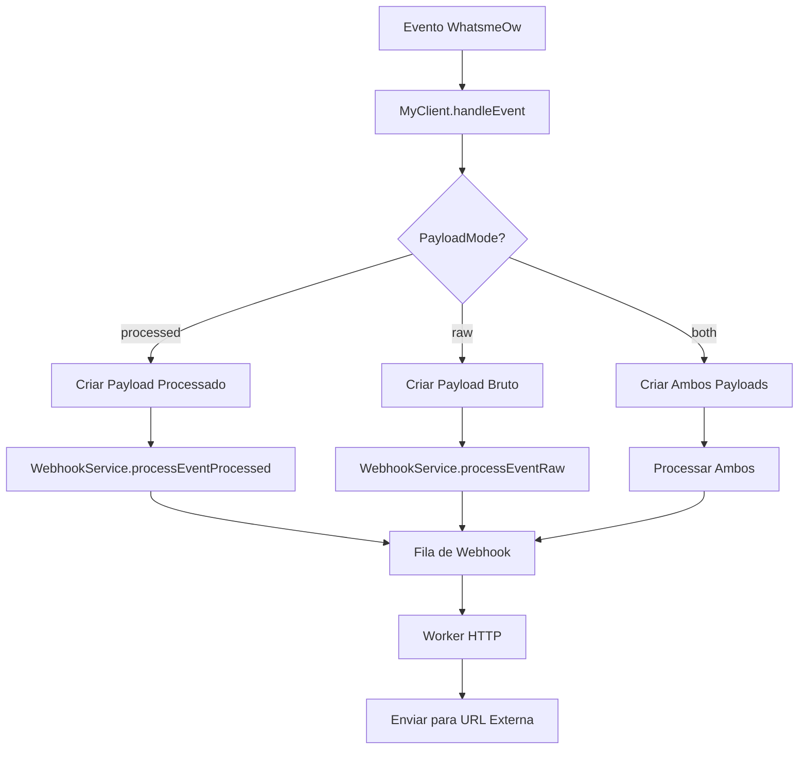

# Implementação de Webhook com Payload Bruto - Resumo Técnico

## Visão Geral

Esta implementação adiciona suporte a webhooks com payload bruto da biblioteca WhatsmeOw ao sistema ZeMeow, permitindo que aplicações externas recebam os dados originais dos eventos sem transformações intermediárias.

## Principais Mudanças Implementadas

### 1. Estruturas de Dados

#### WebhookEvent Estendido (`internal/service/meow/client.go`)
```go
type WebhookEvent struct {
    SessionID    string      `json:"session_id"`
    Event        string      `json:"event"`
    Data         interface{} `json:"data"`
    Timestamp    time.Time   `json:"timestamp"`
    // Novos campos para payload bruto
    RawEventData interface{} `json:"-"`
    PayloadMode  string      `json:"-"`
    EventType    string      `json:"-"`
}
```

#### RawWebhookPayload (`internal/service/webhook/service.go`)
```go
type RawWebhookPayload struct {
    SessionID    string          `json:"session_id"`
    EventType    string          `json:"event_type"`
    RawData      json.RawMessage `json:"raw_data"`
    EventMeta    EventMetadata   `json:"event_meta"`
    Timestamp    time.Time       `json:"timestamp"`
    PayloadType  string          `json:"payload_type"`
    // Campos internos para retry
    Retries      int             `json:"-"`
    URL          string          `json:"-"`
    NextRetryAt  time.Time       `json:"-"`
    LastError    string          `json:"-"`
    CreatedAt    time.Time       `json:"-"`
}
```

#### EventMetadata
```go
type EventMetadata struct {
    WhatsmeowVersion string `json:"whatsmeow_version,omitempty"`
    ProtocolVersion  string `json:"protocol_version,omitempty"`
    SessionJID       string `json:"session_jid,omitempty"`
    DeviceInfo       string `json:"device_info,omitempty"`
    GoVersion        string `json:"go_version,omitempty"`
}
```

### 2. Banco de Dados

#### Migração 006 - Adição do Campo `webhook_payload_mode`
```sql
ALTER TABLE sessions 
ADD COLUMN webhook_payload_mode VARCHAR(10) DEFAULT 'processed' 
CHECK (webhook_payload_mode IN ('processed', 'raw', 'both'));
```

#### Modelo Session Atualizado
```go
type Session struct {
    // ... campos existentes
    WebhookPayloadMode *string `json:"webhook_payload_mode,omitempty" db:"webhook_payload_mode"`
}
```

### 3. API Endpoints

#### Configuração de Webhook com PayloadMode
```go
type WebhookConfigRequest struct {
    URL         string   `json:"url" validate:"required,url"`
    Events      []string `json:"events" validate:"required,min=1"`
    Active      bool     `json:"active"`
    PayloadMode string   `json:"payload_mode" validate:"omitempty,oneof=processed raw both"`
}
```

### 4. Processamento de Eventos

#### MyClient - Handlers de Evento
```go
// Métodos adicionados:
func (c *MyClient) sendWebhookEventRaw(evt interface{}, eventType string)
func (c *MyClient) getEventTypeName(evt interface{}) string
func (c *MyClient) handleEventWithMode(evt interface{}, payloadMode string)
func (c *MyClient) getEventName(evt interface{}) string
```

#### WebhookService - Processamento por Modo
```go
// Métodos adicionados:
func (s *WebhookService) processEventProcessed(event meow.WebhookEvent, session *models.Session) error
func (s *WebhookService) processEventRaw(event meow.WebhookEvent, session *models.Session) error
func (s *WebhookService) createEventMetadata(session *models.Session) EventMetadata
func (s *WebhookService) SendRawWebhook(payload RawWebhookPayload) error
```

## Modos de Payload Suportados

### 1. Processado ("processed") - Padrão
- Payload customizado e simplificado
- Compatível com implementação anterior
- Menor tamanho de dados
- Campos principais extraídos e formatados

### 2. Bruto ("raw")
- Payload original da WhatsmeOw sem modificações
- Estrutura completa com todos os campos
- Usando `json.RawMessage` para preservar dados originais
- Metadados adicionais sobre versão e contexto

### 3. Ambos ("both")
- Envia tanto payload processado quanto bruto
- Dois webhooks separados para cada evento
- Útil para migração e comparação
- Maior uso de recursos

## Fluxo de Processamento



## Exemplos de Payload

### Payload Processado
```json
{
  "session_id": "sessionabc123",
  "event": "message",
  "data": {
    "message_id": "3EB0C7675F85F44B1F",
    "from": "5511987654321@s.whatsapp.net",
    "chat": "5511987654321@s.whatsapp.net",
    "timestamp": 1698408300,
    "message": {
      "conversation": "Olá!"
    }
  },
  "timestamp": "2024-01-15T14:30:01Z",
  "metadata": {
    "payload_type": "processed"
  }
}
```

### Payload Bruto
```json
{
  "session_id": "sessionabc123",
  "event_type": "*events.Message",
  "raw_data": {
    "Info": {
      "MessageSource": {
        "Chat": "5511987654321@s.whatsapp.net",
        "Sender": "5511987654321@s.whatsapp.net",
        "IsFromMe": false,
        "IsGroup": false
      },
      "ID": "3EB0C7675F85F44B1F",
      "Type": "text",
      "PushName": "João Silva",
      "Timestamp": "2024-01-15T14:30:00Z",
      "Category": "",
      "Multicast": false,
      "MediaType": "",
      "Edit": {
        "EditedTimestamp": null,
        "EditedMessageID": ""
      }
    },
    "Message": {
      "conversation": "Olá!"
    },
    "RawMessage": {
      // Estrutura completa do waProto.WebMessageInfo
    }
  },
  "event_meta": {
    "whatsmeow_version": "v0.0.0-20250611130243",
    "protocol_version": "2.24.6",
    "session_jid": "5511999999999@s.whatsapp.net"
  },
  "timestamp": "2024-01-15T14:30:01Z",
  "payload_type": "raw"
}
```

## Headers HTTP Diferenciados

### Payload Processado
```
Content-Type: application/json
X-Webhook-Event: message
X-Session-ID: sessionabc123
```

### Payload Bruto
```
Content-Type: application/json
X-Webhook-Event: *events.Message
X-Session-ID: sessionabc123
X-Payload-Type: raw
X-Event-Type: *events.Message
```

## Configuração via API

### Configurar Webhook em Modo Raw
```bash
curl -X POST http://localhost:8080/webhooks/sessions/sessionabc123/set \
  -H "Content-Type: application/json" \
  -H "Authorization: Bearer SEU_API_KEY" \
  -d '{
    "url": "https://seu-servidor.com/webhook",
    "events": ["message", "receipt"],
    "payload_mode": "raw",
    "active": true
  }'
```

### Listar Eventos e Modos Disponíveis
```bash
curl -X GET http://localhost:8080/webhooks/events \
  -H "Authorization: Bearer SEU_API_KEY"
```

## Arquivos Modificados/Criados

### Arquivos Modificados
1. `internal/service/meow/client.go` - Adicionado suporte a payload bruto
2. `internal/service/webhook/service.go` - Processamento de payloads brutos
3. `internal/api/handlers/webhook.go` - Endpoints com PayloadMode
4. `internal/api/dto/webhook.go` - DTOs com payload_mode
5. `internal/db/models/session.go` - Modelo com webhook_payload_mode

### Arquivos Criados
1. `internal/db/migrations/006_add_webhook_payload_mode_up.sql`
2. `internal/db/migrations/006_add_webhook_payload_mode_down.sql`
3. `internal/service/webhook/service_test.go` - Testes unitários
4. `internal/service/meow/client_test.go` - Testes do cliente
5. `docs/webhook-raw-payload-examples.md` - Documentação completa

## Compatibilidade

### Retrocompatibilidade
- Webhooks existentes continuam funcionando no modo "processed"
- Campo `payload_mode` é opcional (padrão: "processed")
- API mantém compatibilidade com implementação anterior

### Migração
1. Executar migração de banco: `006_add_webhook_payload_mode`
2. Atualizar configurações de webhook conforme necessário
3. Implementar processamento de payload bruto no cliente

## Testes Implementados

### Testes Unitários
- `TestWebhookService_ProcessEventProcessed`
- `TestWebhookService_ProcessEventRaw`
- `TestWebhookService_ProcessEvent_BothMode`
- `TestMyClient_GetEventTypeName`
- `TestMyClient_SendWebhookEventRaw`
- `TestRawWebhookPayload_JSONSerialization`

### Casos de Teste Cobertos
- Serialização/deserialização de payloads
- Processamento por modo de payload
- Envio de webhooks HTTP
- Tratamento de canal de webhook cheio
- Criação de metadados de evento

## Considerações de Performance

### Tamanho dos Payloads
- Payload processado: ~500-1000 bytes
- Payload bruto: ~2000-5000 bytes
- Modo "both": 2x o tráfego de rede

### Processamento
- Modo "raw" tem menos overhead de transformação
- Modo "both" dobra o número de webhooks enviados
- Cliente deve implementar caching se necessário

### Recomendações
- Use modo "raw" apenas quando dados completos são necessários
- Use modo "both" apenas para debugging ou migração
- Filtre eventos para reduzir tráfego desnecessário

## Próximos Passos

1. **Monitoramento**: Adicionar métricas por modo de payload
2. **Compressão**: Implementar compressão gzip para payloads grandes
3. **Filtros Avançados**: Permitir filtros por tipo de evento específico
4. **Cache**: Implementar cache de payloads para reenvios
5. **Documentação**: Expandir documentação com mais exemplos de uso

## Vantagens da Implementação

1. **Dados Completos**: Acesso a todos os campos da WhatsmeOw
2. **Compatibilidade Futura**: Novos campos automaticamente incluídos
3. **Flexibilidade**: Cliente decide como processar os dados
4. **Debugging**: Facilita identificação de problemas
5. **Sem Breaking Changes**: Implementação totalmente compatível

## Conclusão

A implementação de webhook com payload bruto oferece acesso completo aos dados originais da WhatsmeOw mantendo total compatibilidade com a implementação anterior. Isso permite que aplicações clientes tenham controle total sobre o processamento de eventos do WhatsApp, acessando informações que antes eram perdidas na serialização processada.